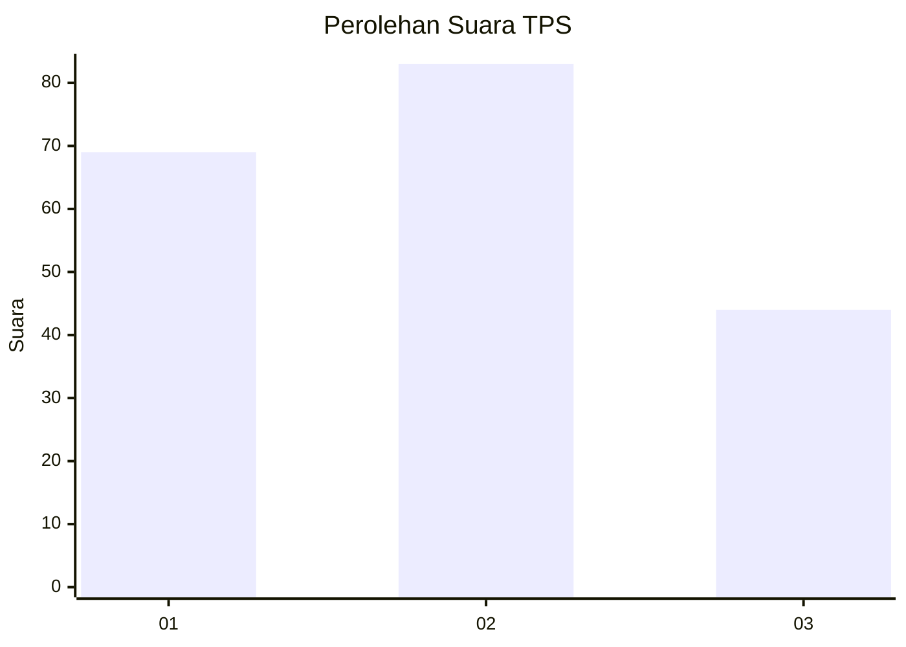
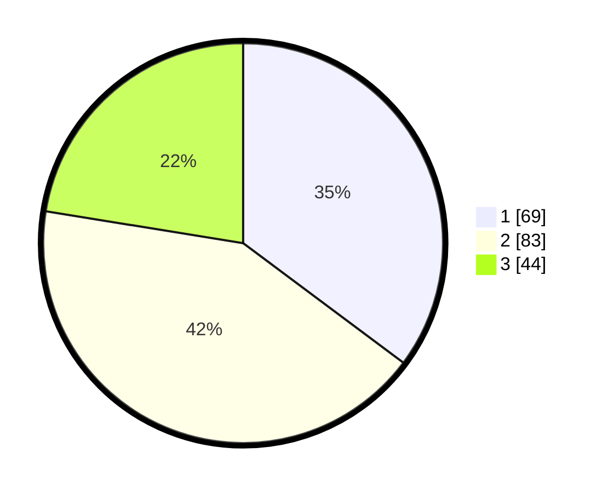

# Hasil

## Grafik

## Tabel

| No. | Nama Paslon    | Suara | Suara (raw) | Persentase |
|:--- |:-------------- | -----:| -----------:| ----------:|
| 1   | ANIES MUHAIMIN | 69    | [69][p-1]   | 35,20      |
| 2   | PRABOWO GIBRAN | 83    | [83][p-2]   | 42,35      |
| 3   | GANJAR MAHFUD  | 44    | [44][p-3]   | 22,45      |

[p-1]: https://github.com/gigit-pemilu/pemilu-2024/blob/main/pilpres/hitung-suara/sub/35-jawa-timur/sub/09-jember/sub/28-ledokombo/sub/2008-sumbersalak/sub/009-tps/sub/paslon-1.txt
[p-2]: https://github.com/gigit-pemilu/pemilu-2024/blob/main/pilpres/hitung-suara/sub/35-jawa-timur/sub/09-jember/sub/28-ledokombo/sub/2008-sumbersalak/sub/009-tps/sub/paslon-2.txt
[p-3]: https://github.com/gigit-pemilu/pemilu-2024/blob/main/pilpres/hitung-suara/sub/35-jawa-timur/sub/09-jember/sub/28-ledokombo/sub/2008-sumbersalak/sub/009-tps/sub/paslon-3.txt

## Foto C Plano

https://sirekap-obj-formc.kpu.go.id/be0b/pemilu/ppwp/35/09/28/20/08/3509282008009-20240215-195021--0038ee4f-5934-426d-80b2-b1bb0573764e.jpg

https://sirekap-obj-formc.kpu.go.id/be0b/pemilu/ppwp/35/09/28/20/08/3509282008009-20240215-194026--f438d359-19fd-4883-a826-561eef0afffc.jpg

https://sirekap-obj-formc.kpu.go.id/be0b/pemilu/ppwp/35/09/28/20/08/3509282008009-20240215-194402--51ea6a91-1be7-49df-a922-90268c70fb2c.jpg

## Metadata

| Key        | Value               |
| ---------- | ------------------- |
| Time Stamp | 2024-02-24 22:31:28 |

