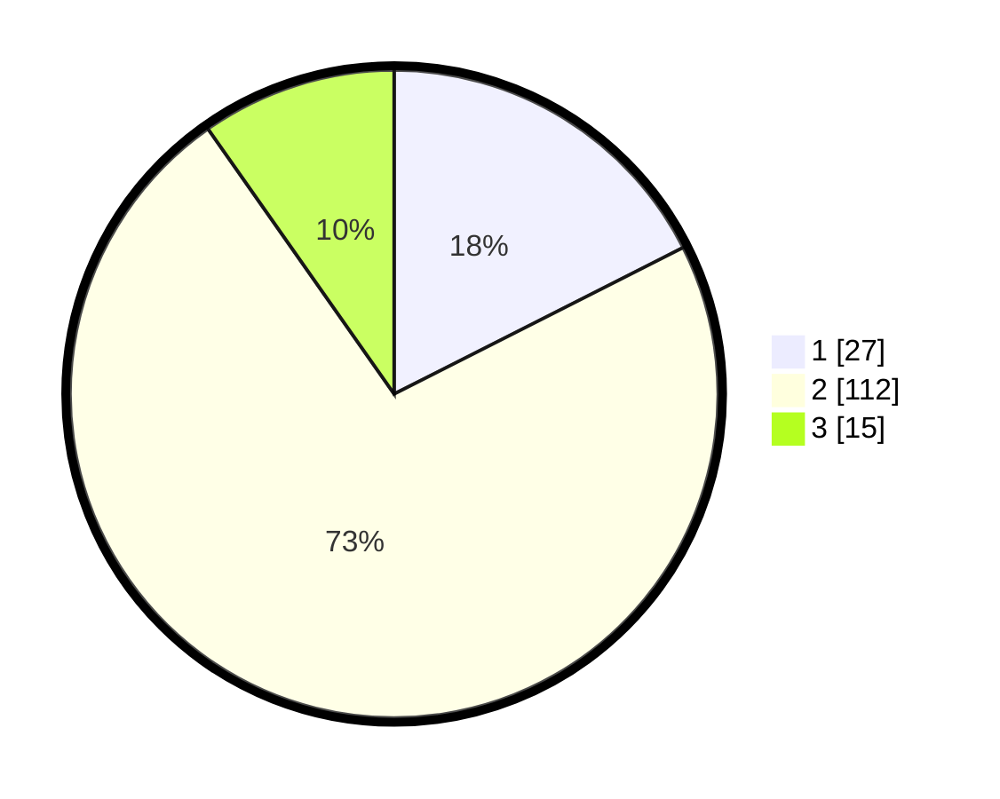

# Hasil

## Grafik

## Tabel

| No. | Nama Paslon    | Suara | Suara (raw) | Persentase |
|:--- |:-------------- | -----:| -----------:| ----------:|
| 1   | ANIES MUHAIMIN | 27    | [27][p-1]   | 17,53      |
| 2   | PRABOWO GIBRAN | 112   | [112][p-2]  | 72,73      |
| 3   | GANJAR MAHFUD  | 15    | [15][p-3]   | 9,74       |

[p-1]: https://github.com/gigit-pemilu/pemilu-2024/blob/main/pilpres/hitung-suara/sub/35-jawa-timur/sub/09-jember/sub/28-ledokombo/sub/2008-sumbersalak/sub/018-tps/sub/paslon-1.txt
[p-2]: https://github.com/gigit-pemilu/pemilu-2024/blob/main/pilpres/hitung-suara/sub/35-jawa-timur/sub/09-jember/sub/28-ledokombo/sub/2008-sumbersalak/sub/018-tps/sub/paslon-2.txt
[p-3]: https://github.com/gigit-pemilu/pemilu-2024/blob/main/pilpres/hitung-suara/sub/35-jawa-timur/sub/09-jember/sub/28-ledokombo/sub/2008-sumbersalak/sub/018-tps/sub/paslon-3.txt

## Foto C Plano

https://sirekap-obj-formc.kpu.go.id/60d6/pemilu/ppwp/35/09/28/20/08/3509282008018-20240214-211551--c49562b1-082b-4a51-8a2d-45a016e74a03.jpg

https://sirekap-obj-formc.kpu.go.id/60d6/pemilu/ppwp/35/09/28/20/08/3509282008018-20240214-230224--87c7f68c-1ca7-4440-af6e-2c6e0c59771d.jpg

https://sirekap-obj-formc.kpu.go.id/60d6/pemilu/ppwp/35/09/28/20/08/3509282008018-20240214-230410--7de33c11-d125-4a6c-aedc-b79b9619acab.jpg

## Metadata

| Key        | Value               |
| ---------- | ------------------- |
| Time Stamp | 2024-02-15 17:30:25 |

