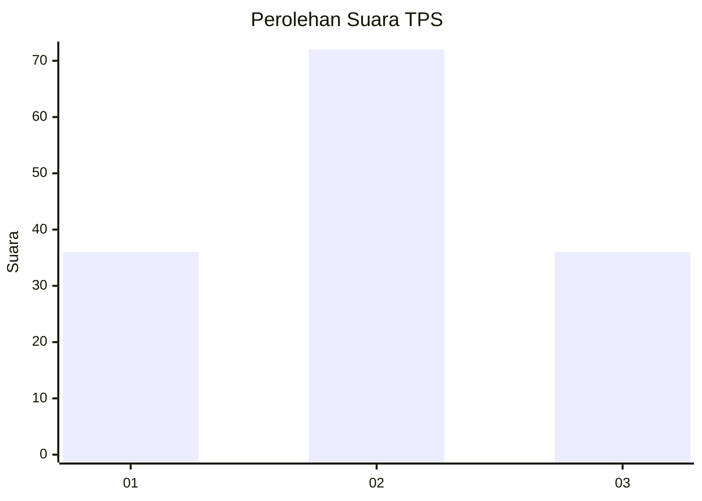
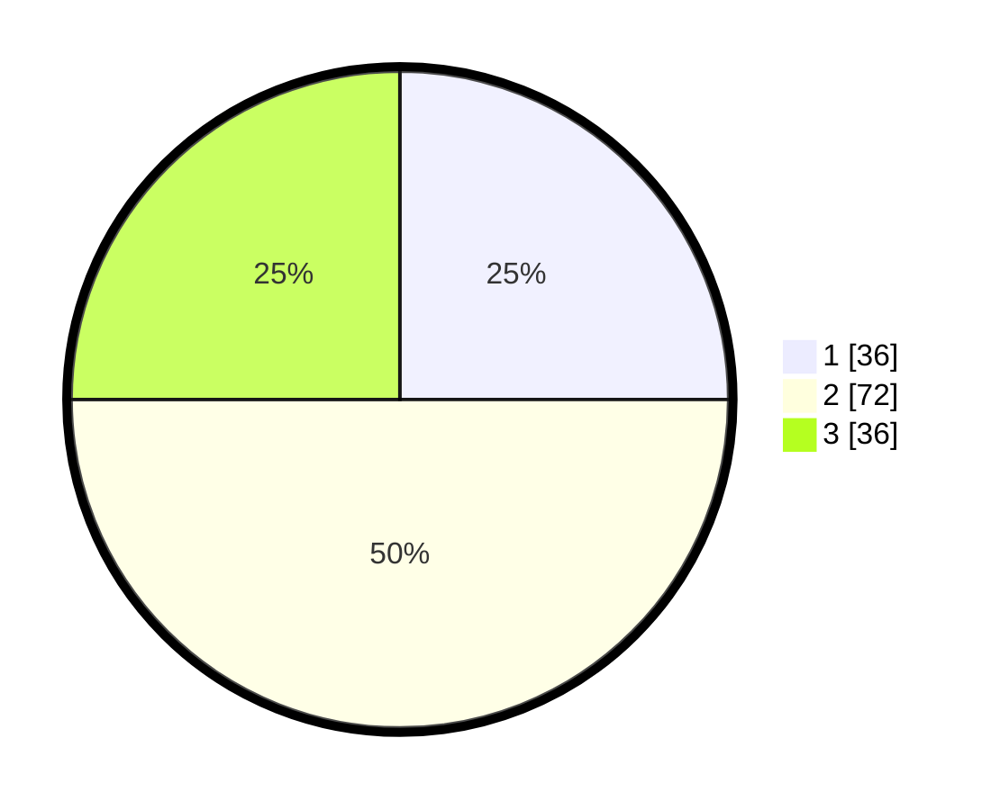

# Hasil

## Grafik

## Tabel

| No. | Nama Paslon    | Suara | Suara (raw) | Persentase |
|:--- |:-------------- | -----:| -----------:| ----------:|
| 1   | ANIES MUHAIMIN | 36    | [36][p-1]   | 25,00      |
| 2   | PRABOWO GIBRAN | 72    | [72][p-2]   | 50,00      |
| 3   | GANJAR MAHFUD  | 36    | [36][p-3]   | 25,00      |

[p-1]: https://github.com/gigit-pemilu/pemilu-2024-35-jawa-timur/blob/main/pilpres/hitung-suara/sub/35-jawa-timur/sub/09-jember/sub/28-ledokombo/sub/2008-sumbersalak/sub/024-tps/sub/paslon-1.txt
[p-2]: https://github.com/gigit-pemilu/pemilu-2024-35-jawa-timur/blob/main/pilpres/hitung-suara/sub/35-jawa-timur/sub/09-jember/sub/28-ledokombo/sub/2008-sumbersalak/sub/024-tps/sub/paslon-2.txt
[p-3]: https://github.com/gigit-pemilu/pemilu-2024-35-jawa-timur/blob/main/pilpres/hitung-suara/sub/35-jawa-timur/sub/09-jember/sub/28-ledokombo/sub/2008-sumbersalak/sub/024-tps/sub/paslon-3.txt

## Foto C Plano

https://sirekap-obj-formc.kpu.go.id/8c14/pemilu/ppwp/35/09/28/20/08/3509282008024-20240214-202743--9cda61a1-9a95-4537-9937-d6387db0d01c.jpg

https://sirekap-obj-formc.kpu.go.id/8c14/pemilu/ppwp/35/09/28/20/08/3509282008024-20240214-214112--780b4fcc-e0e4-4e9d-a5bf-6c92e521b11a.jpg

https://sirekap-obj-formc.kpu.go.id/8c14/pemilu/ppwp/35/09/28/20/08/3509282008024-20240214-203059--59b88f4d-3fb7-4041-bb14-dc0b02446977.jpg

## Metadata

| Key        | Value               |
| ---------- | ------------------- |
| Time Stamp | 2024-02-15 15:00:29 |

