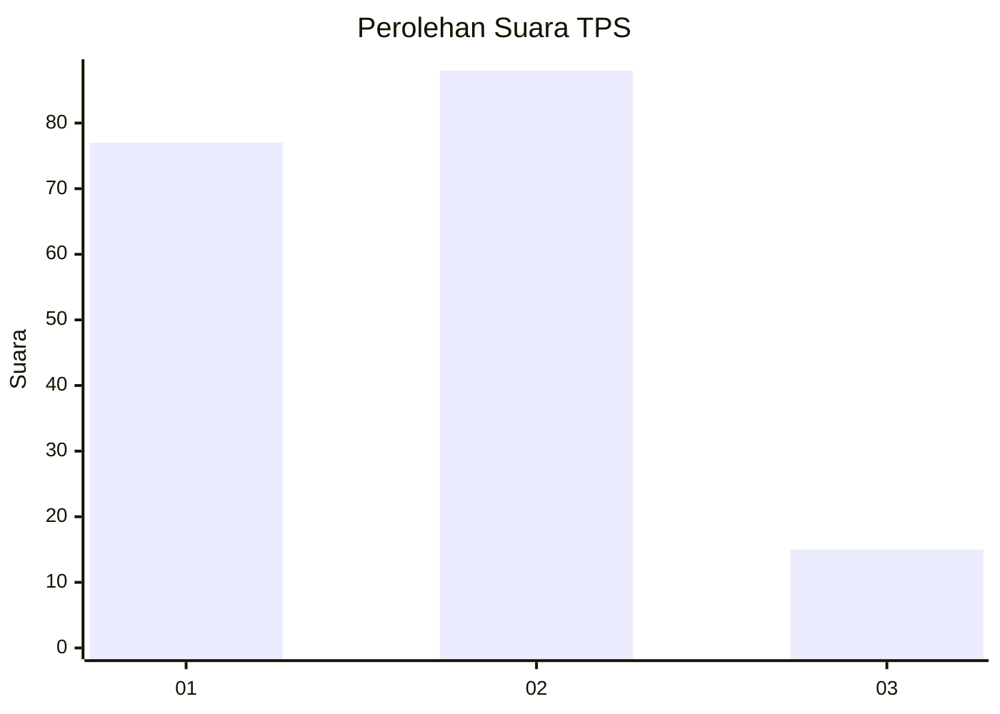
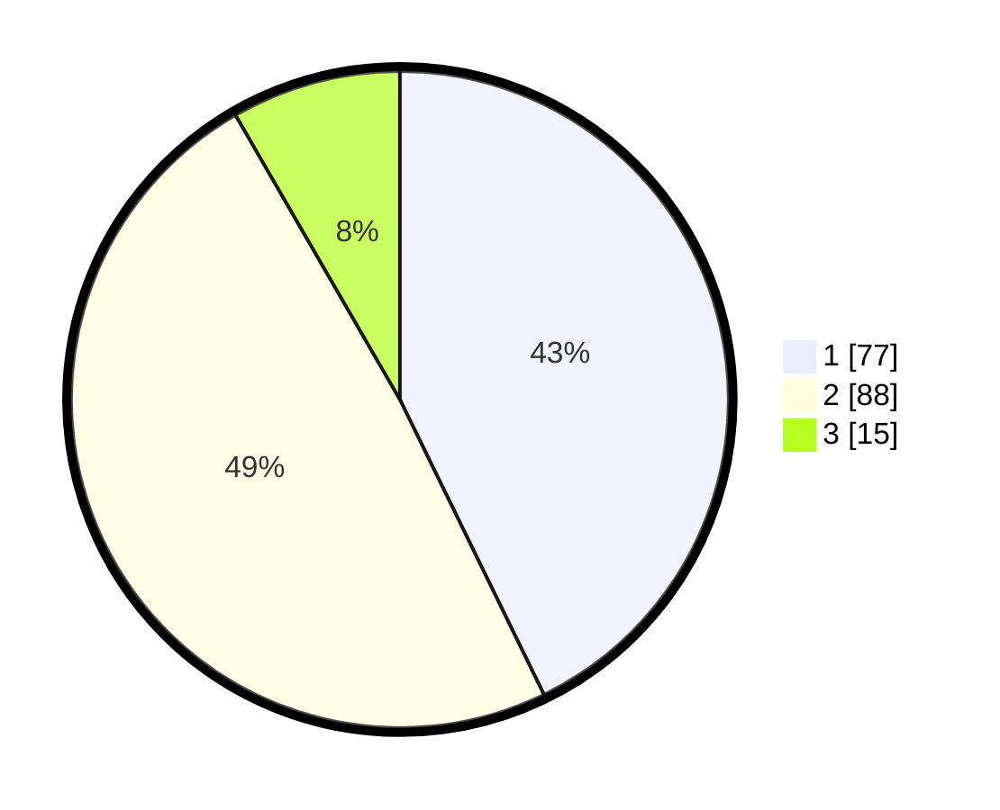

# Hasil

## Grafik

## Tabel

| No. | Nama Paslon    | Suara | Suara (raw) | Persentase |
|:--- |:-------------- | -----:| -----------:| ----------:|
| 1   | ANIES MUHAIMIN | 77    | [77][p-1]   | 42,78      |
| 2   | PRABOWO GIBRAN | 88    | [88][p-2]   | 48,89      |
| 3   | GANJAR MAHFUD  | 15    | [15][p-3]   | 8,33       |

[p-1]: https://github.com/gigit-pemilu/pemilu-2024/blob/main/pilpres/hitung-suara/sub/35-jawa-timur/sub/09-jember/sub/28-ledokombo/sub/2008-sumbersalak/sub/029-tps/sub/paslon-1.txt
[p-2]: https://github.com/gigit-pemilu/pemilu-2024/blob/main/pilpres/hitung-suara/sub/35-jawa-timur/sub/09-jember/sub/28-ledokombo/sub/2008-sumbersalak/sub/029-tps/sub/paslon-2.txt
[p-3]: https://github.com/gigit-pemilu/pemilu-2024/blob/main/pilpres/hitung-suara/sub/35-jawa-timur/sub/09-jember/sub/28-ledokombo/sub/2008-sumbersalak/sub/029-tps/sub/paslon-3.txt

## Foto C Plano

https://sirekap-obj-formc.kpu.go.id/59c6/pemilu/ppwp/35/09/28/20/08/3509282008029-20240214-224509--9ba967db-4e01-4381-bfe1-9a8296319c38.jpg

https://sirekap-obj-formc.kpu.go.id/59c6/pemilu/ppwp/35/09/28/20/08/3509282008029-20240214-201659--bd33af1e-4256-4dcb-87d0-31cf222c03b6.jpg

https://sirekap-obj-formc.kpu.go.id/59c6/pemilu/ppwp/35/09/28/20/08/3509282008029-20240214-224737--01c873fe-0111-40f7-bc32-db5e157acf35.jpg

## Metadata

| Key        | Value               |
| ---------- | ------------------- |
| Time Stamp | 2024-02-15 22:40:13 |

