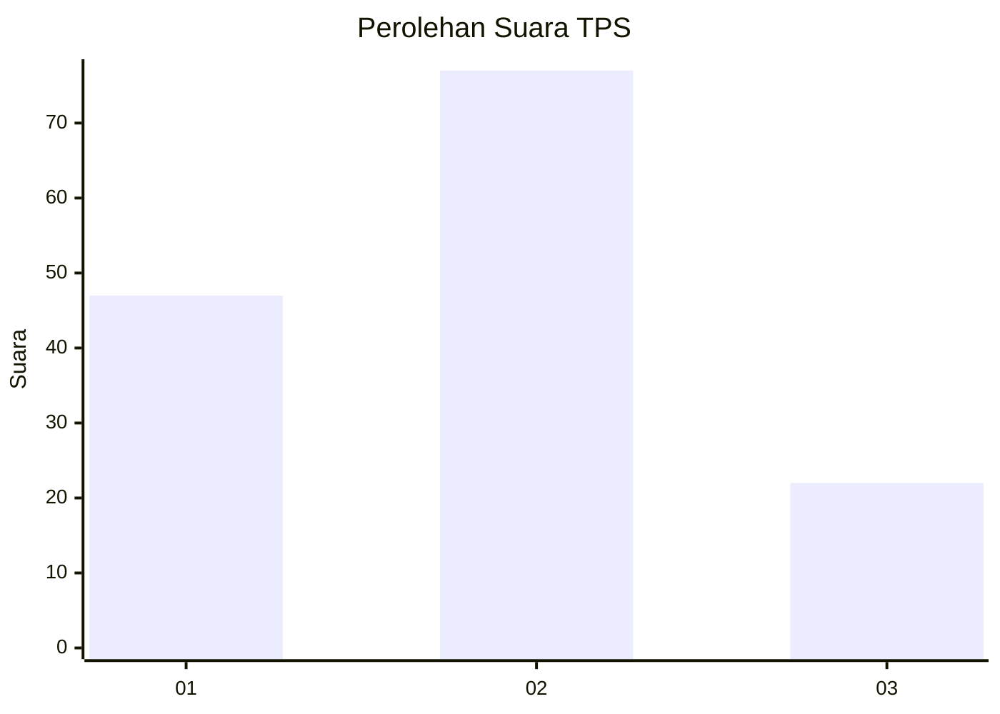
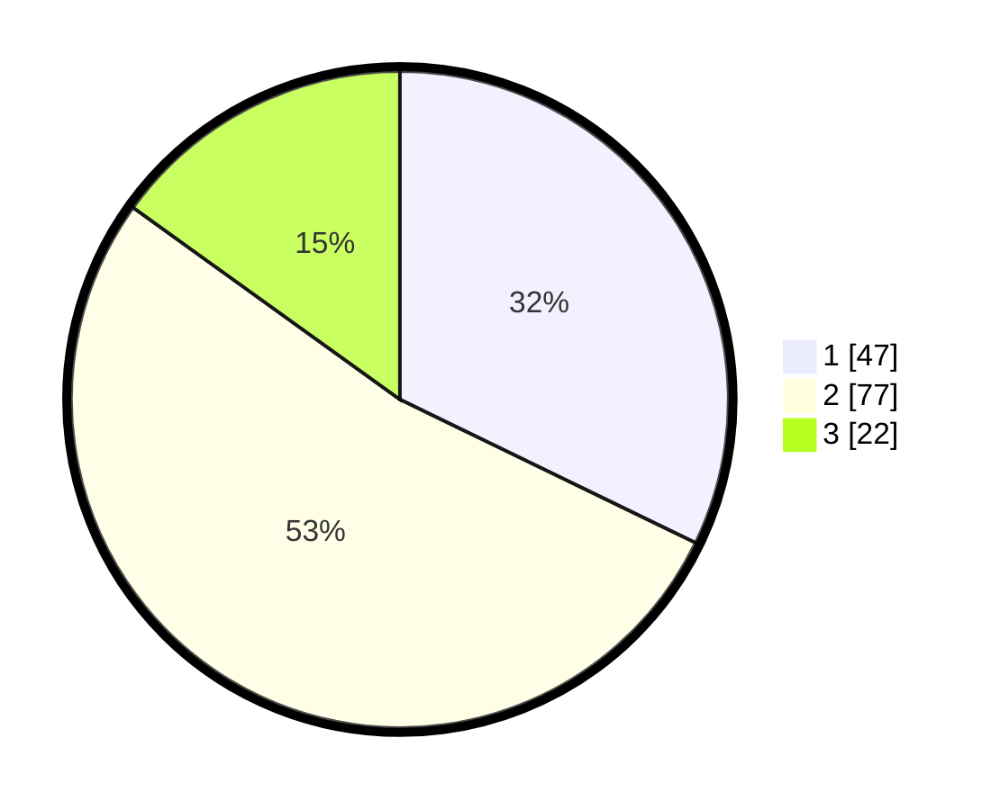

# Hasil

## Grafik

## Tabel

| No. | Nama Paslon    | Suara | Suara (raw) | Persentase |
|:--- |:-------------- | -----:| -----------:| ----------:|
| 1   | ANIES MUHAIMIN | 47    | [47][p-1]   | 32,19      |
| 2   | PRABOWO GIBRAN | 77    | [77][p-2]   | 52,74      |
| 3   | GANJAR MAHFUD  | 22    | [22][p-3]   | 15,07      |

[p-1]: https://github.com/gigit-pemilu/pemilu-2024-35-jawa-timur/blob/main/pilpres/hitung-suara/sub/35-jawa-timur/sub/09-jember/sub/28-ledokombo/sub/2009-slateng/sub/001-tps/sub/paslon-1.txt
[p-2]: https://github.com/gigit-pemilu/pemilu-2024-35-jawa-timur/blob/main/pilpres/hitung-suara/sub/35-jawa-timur/sub/09-jember/sub/28-ledokombo/sub/2009-slateng/sub/001-tps/sub/paslon-2.txt
[p-3]: https://github.com/gigit-pemilu/pemilu-2024-35-jawa-timur/blob/main/pilpres/hitung-suara/sub/35-jawa-timur/sub/09-jember/sub/28-ledokombo/sub/2009-slateng/sub/001-tps/sub/paslon-3.txt

## Foto C Plano

https://sirekap-obj-formc.kpu.go.id/f98d/pemilu/ppwp/35/09/28/20/09/3509282009001-20240214-141505--d4fb2b72-546d-4bec-a021-34086f268483.jpg

https://sirekap-obj-formc.kpu.go.id/f98d/pemilu/ppwp/35/09/28/20/09/3509282009001-20240214-141754--80f7b0be-9fb8-49cb-9754-8558cf738c5f.jpg

https://sirekap-obj-formc.kpu.go.id/f98d/pemilu/ppwp/35/09/28/20/09/3509282009001-20240214-233913--9bc03bc3-2bee-4433-b139-ee47572c60d8.jpg

## Metadata

| Key        | Value               |
| ---------- | ------------------- |
| Time Stamp | 2024-02-15 17:30:25 |

