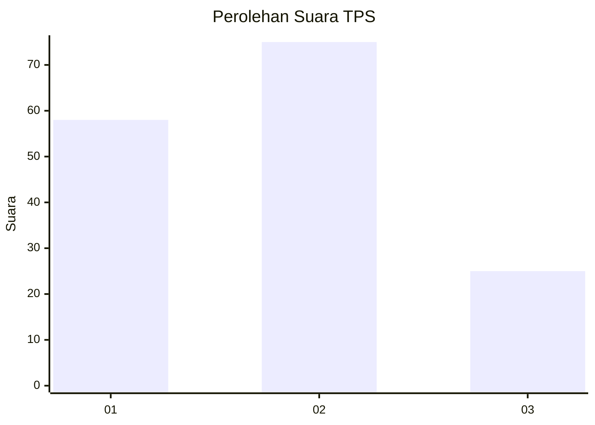
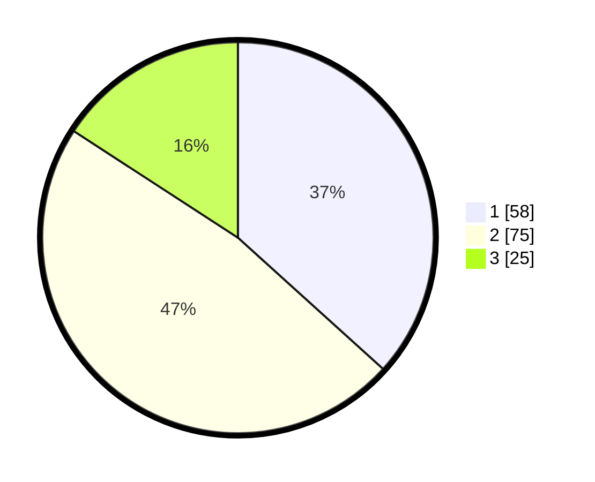

# Hasil

## Grafik

## Tabel

| No. | Nama Paslon    | Suara | Suara (raw) | Persentase |
|:--- |:-------------- | -----:| -----------:| ----------:|
| 1   | ANIES MUHAIMIN | 58    | [58][p-1]   | 36,71      |
| 2   | PRABOWO GIBRAN | 75    | [75][p-2]   | 47,47      |
| 3   | GANJAR MAHFUD  | 25    | [25][p-3]   | 15,82      |

[p-1]: https://github.com/gigit-pemilu/pemilu-2024-35-jawa-timur/blob/main/pilpres/hitung-suara/sub/35-jawa-timur/sub/09-jember/sub/28-ledokombo/sub/2009-slateng/sub/003-tps/sub/paslon-1.txt
[p-2]: https://github.com/gigit-pemilu/pemilu-2024-35-jawa-timur/blob/main/pilpres/hitung-suara/sub/35-jawa-timur/sub/09-jember/sub/28-ledokombo/sub/2009-slateng/sub/003-tps/sub/paslon-2.txt
[p-3]: https://github.com/gigit-pemilu/pemilu-2024-35-jawa-timur/blob/main/pilpres/hitung-suara/sub/35-jawa-timur/sub/09-jember/sub/28-ledokombo/sub/2009-slateng/sub/003-tps/sub/paslon-3.txt

## Foto C Plano

https://sirekap-obj-formc.kpu.go.id/d88d/pemilu/ppwp/35/09/28/20/09/3509282009003-20240215-202554--b1a0db9c-83c6-471a-beef-865000fb385d.jpg

https://sirekap-obj-formc.kpu.go.id/d88d/pemilu/ppwp/35/09/28/20/09/3509282009003-20240215-202600--c29c49a1-b4be-4e34-bcf0-1815b8e8d114.jpg

https://sirekap-obj-formc.kpu.go.id/d88d/pemilu/ppwp/35/09/28/20/09/3509282009003-20240215-202607--ffb217bd-3f40-4b56-92e2-a06fdb00c132.jpg

## Metadata

| Key        | Value               |
| ---------- | ------------------- |
| Time Stamp | 2024-02-25 16:00:00 |

