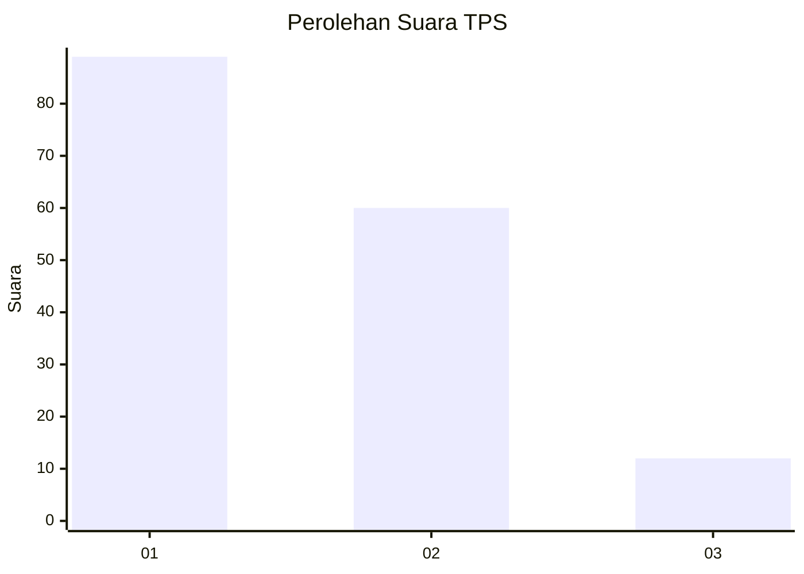
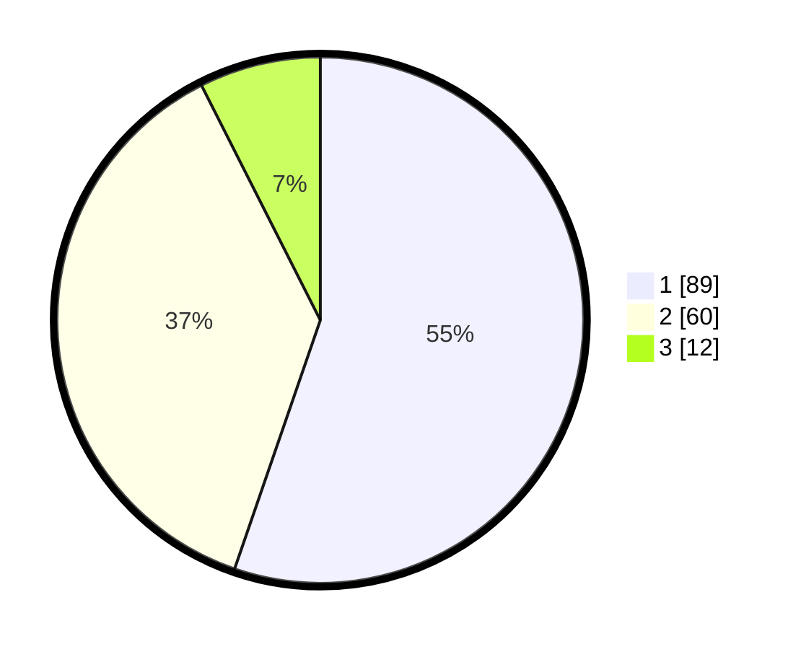

# Hasil

## Grafik

## Tabel

| No. | Nama Paslon    | Suara | Suara (raw) | Persentase |
|:--- |:-------------- | -----:| -----------:| ----------:|
| 1   | ANIES MUHAIMIN | 89    | [89][p-1]   | 55,28      |
| 2   | PRABOWO GIBRAN | 60    | [60][p-2]   | 37,27      |
| 3   | GANJAR MAHFUD  | 12    | [12][p-3]   | 7,45       |

[p-1]: https://github.com/gigit-pemilu/pemilu-2024-35-jawa-timur/blob/main/pilpres/hitung-suara/sub/35-jawa-timur/sub/09-jember/sub/28-ledokombo/sub/2009-slateng/sub/004-tps/sub/paslon-1.txt
[p-2]: https://github.com/gigit-pemilu/pemilu-2024-35-jawa-timur/blob/main/pilpres/hitung-suara/sub/35-jawa-timur/sub/09-jember/sub/28-ledokombo/sub/2009-slateng/sub/004-tps/sub/paslon-2.txt
[p-3]: https://github.com/gigit-pemilu/pemilu-2024-35-jawa-timur/blob/main/pilpres/hitung-suara/sub/35-jawa-timur/sub/09-jember/sub/28-ledokombo/sub/2009-slateng/sub/004-tps/sub/paslon-3.txt

## Foto C Plano

https://sirekap-obj-formc.kpu.go.id/efe1/pemilu/ppwp/35/09/28/20/09/3509282009004-20240214-231424--26cb7e7d-b91a-4412-8192-f0812eb50e50.jpg

https://sirekap-obj-formc.kpu.go.id/efe1/pemilu/ppwp/35/09/28/20/09/3509282009004-20240214-204339--840c5b24-459e-454e-8de7-f81fdd699303.jpg

https://sirekap-obj-formc.kpu.go.id/efe1/pemilu/ppwp/35/09/28/20/09/3509282009004-20240214-204356--d83bd792-50d4-4cba-8d7b-482ee433b72f.jpg

## Metadata

| Key        | Value               |
| ---------- | ------------------- |
| Time Stamp | 2024-02-15 17:30:25 |

