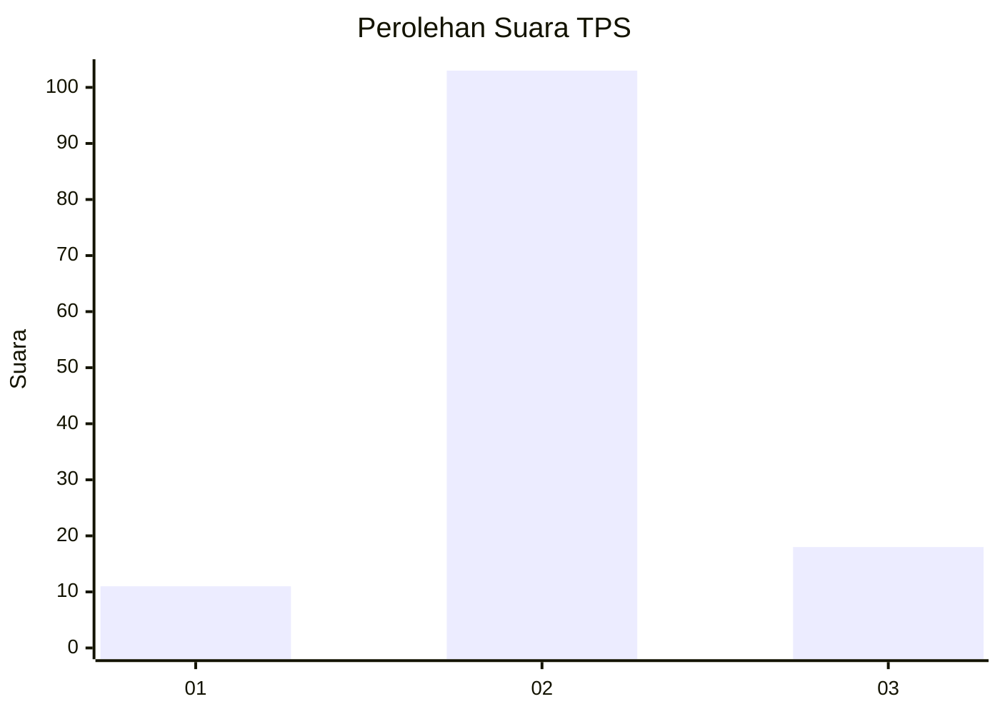
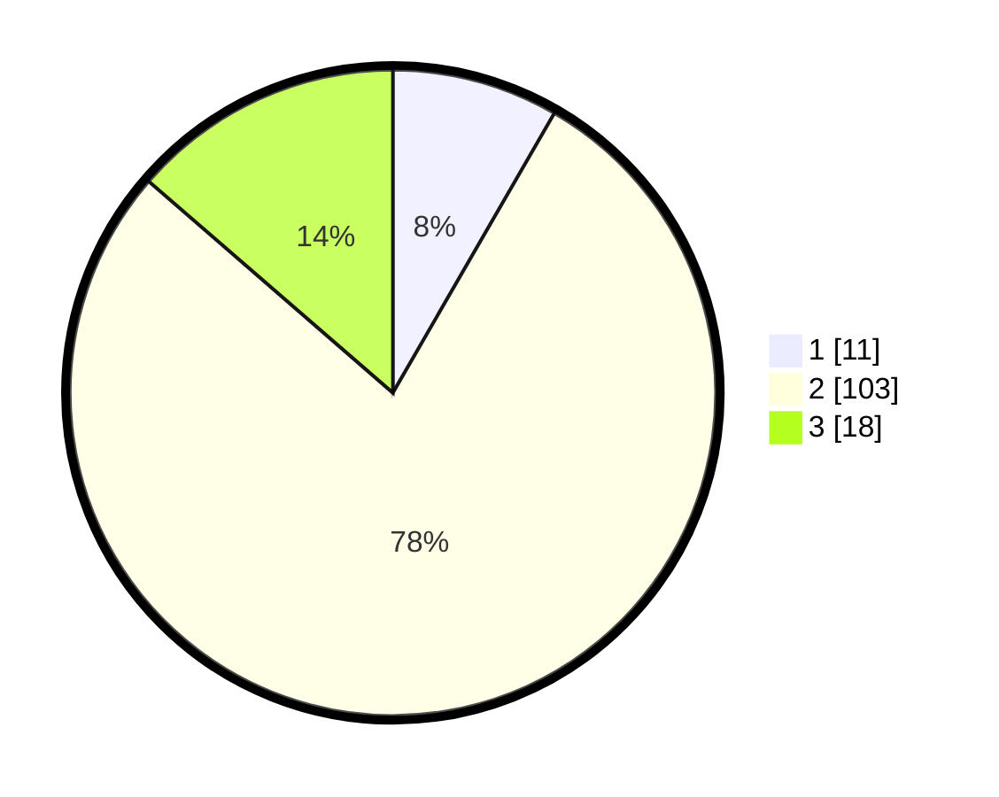

# Hasil

## Grafik

## Tabel

| No. | Nama Paslon    | Suara | Suara (raw) | Persentase |
|:--- |:-------------- | -----:| -----------:| ----------:|
| 1   | ANIES MUHAIMIN | 11    | [11][p-1]   | 8,33       |
| 2   | PRABOWO GIBRAN | 103   | [103][p-2]  | 78,03      |
| 3   | GANJAR MAHFUD  | 18    | [18][p-3]   | 13,64      |

[p-1]: https://github.com/gigit-pemilu/pemilu-2024-35-jawa-timur/blob/main/pilpres/hitung-suara/sub/35-jawa-timur/sub/09-jember/sub/28-ledokombo/sub/2009-slateng/sub/013-tps/sub/paslon-1.txt
[p-2]: https://github.com/gigit-pemilu/pemilu-2024-35-jawa-timur/blob/main/pilpres/hitung-suara/sub/35-jawa-timur/sub/09-jember/sub/28-ledokombo/sub/2009-slateng/sub/013-tps/sub/paslon-2.txt
[p-3]: https://github.com/gigit-pemilu/pemilu-2024-35-jawa-timur/blob/main/pilpres/hitung-suara/sub/35-jawa-timur/sub/09-jember/sub/28-ledokombo/sub/2009-slateng/sub/013-tps/sub/paslon-3.txt

## Foto C Plano

https://sirekap-obj-formc.kpu.go.id/abd6/pemilu/ppwp/35/09/28/20/09/3509282009013-20240214-214954--84d3f1f2-6d33-47dc-b16a-6da362c50ea7.jpg

https://sirekap-obj-formc.kpu.go.id/abd6/pemilu/ppwp/35/09/28/20/09/3509282009013-20240215-014838--7c50cc1e-b3b4-4814-beb6-f0b734e3502c.jpg

https://sirekap-obj-formc.kpu.go.id/abd6/pemilu/ppwp/35/09/28/20/09/3509282009013-20240215-014927--6e7c9a22-bcbf-449d-b39a-37e6b44b1caf.jpg

## Metadata

| Key        | Value               |
| ---------- | ------------------- |
| Time Stamp | 2024-02-15 21:01:18 |

