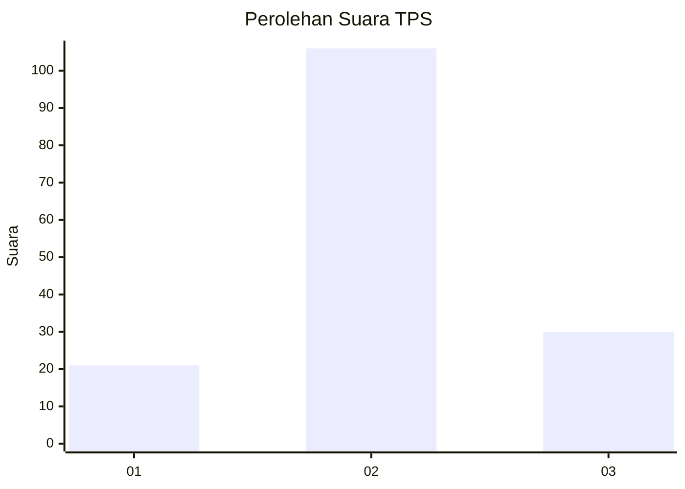
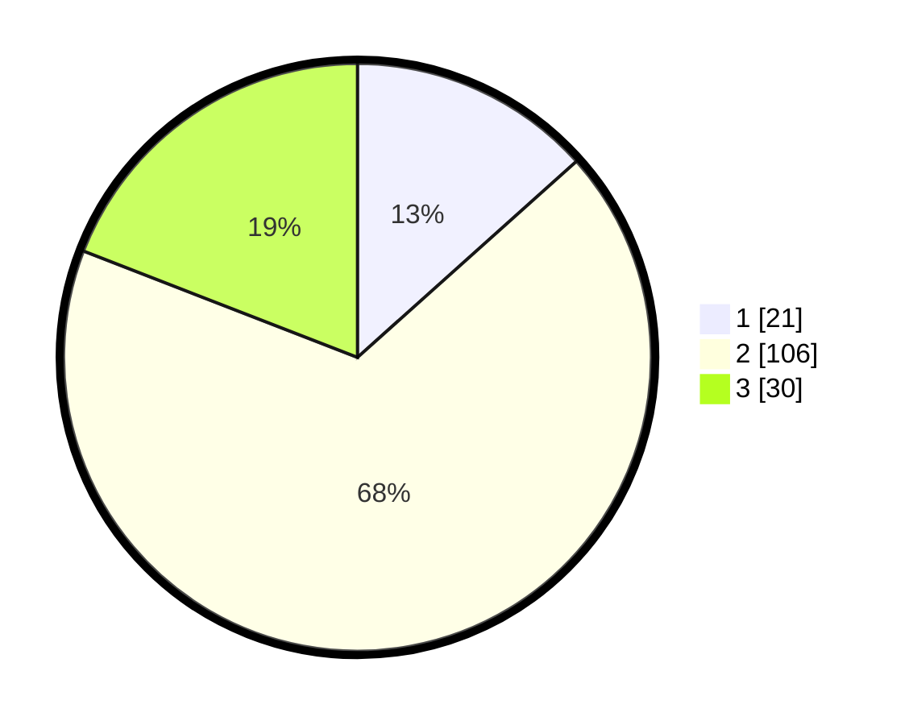

# Hasil

## Grafik

## Tabel

| No. | Nama Paslon    | Suara | Suara (raw) | Persentase |
|:--- |:-------------- | -----:| -----------:| ----------:|
| 1   | ANIES MUHAIMIN | 21    | [21][p-1]   | 13,38      |
| 2   | PRABOWO GIBRAN | 106   | [106][p-2]  | 67,52      |
| 3   | GANJAR MAHFUD  | 30    | [30][p-3]   | 19,11      |

[p-1]: https://github.com/gigit-pemilu/pemilu-2024-35-jawa-timur/blob/main/pilpres/hitung-suara/sub/35-jawa-timur/sub/09-jember/sub/28-ledokombo/sub/2009-slateng/sub/014-tps/sub/paslon-1.txt
[p-2]: https://github.com/gigit-pemilu/pemilu-2024-35-jawa-timur/blob/main/pilpres/hitung-suara/sub/35-jawa-timur/sub/09-jember/sub/28-ledokombo/sub/2009-slateng/sub/014-tps/sub/paslon-2.txt
[p-3]: https://github.com/gigit-pemilu/pemilu-2024-35-jawa-timur/blob/main/pilpres/hitung-suara/sub/35-jawa-timur/sub/09-jember/sub/28-ledokombo/sub/2009-slateng/sub/014-tps/sub/paslon-3.txt

## Foto C Plano

https://sirekap-obj-formc.kpu.go.id/d8eb/pemilu/ppwp/35/09/28/20/09/3509282009014-20240215-042309--965f9a70-2e1b-4bcf-aa74-8be0e30167be.jpg

https://sirekap-obj-formc.kpu.go.id/d8eb/pemilu/ppwp/35/09/28/20/09/3509282009014-20240215-042355--c58d3ef8-1a3b-4437-84ee-832319974a3d.jpg

https://sirekap-obj-formc.kpu.go.id/d8eb/pemilu/ppwp/35/09/28/20/09/3509282009014-20240215-042437--9e4a051e-5a7f-42b7-a44e-b217b919ea88.jpg

## Metadata

| Key        | Value               |
| ---------- | ------------------- |
| Time Stamp | 2024-02-15 15:00:29 |

