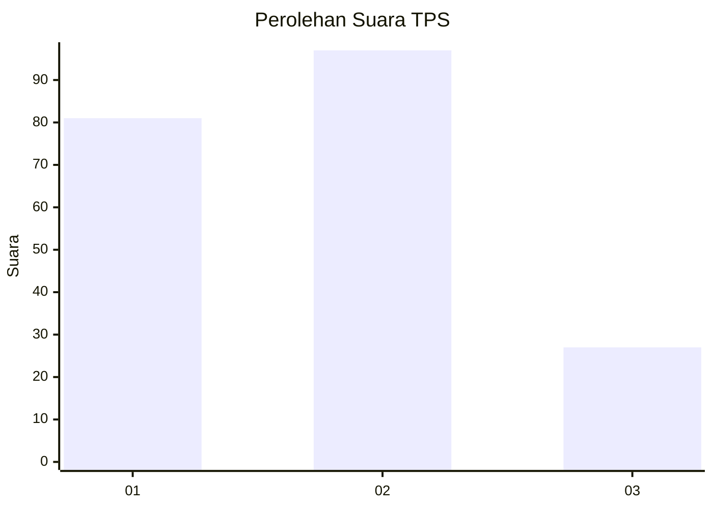
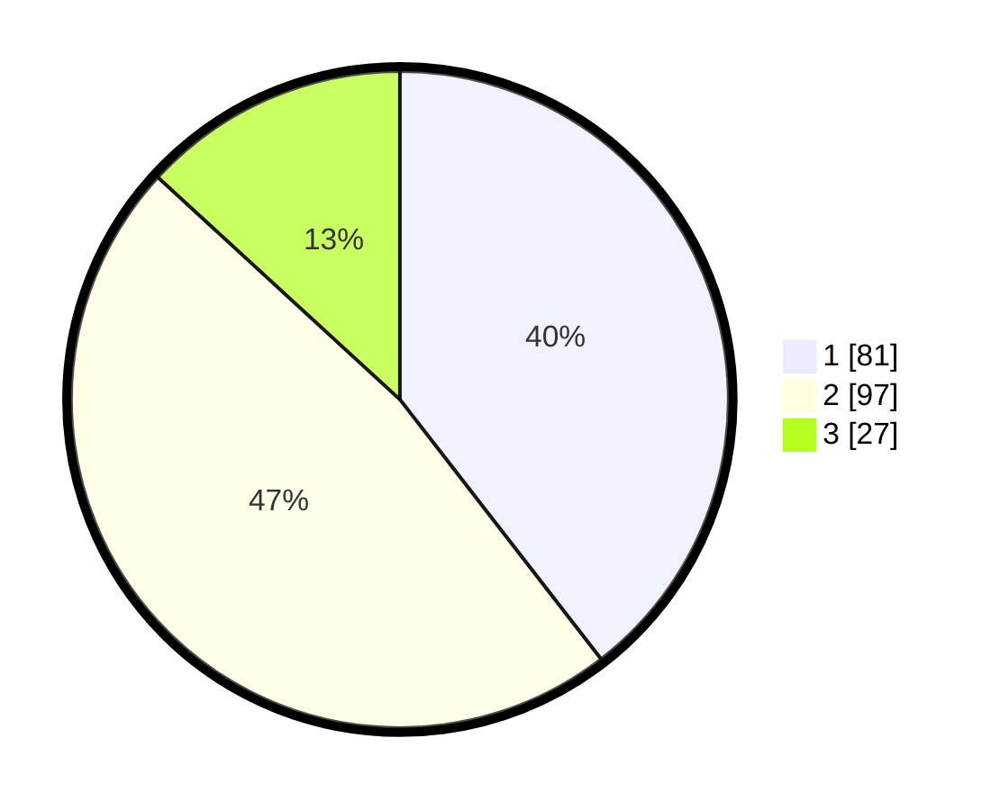

# Hasil

## Grafik

## Tabel

| No. | Nama Paslon    | Suara | Suara (raw) | Persentase |
|:--- |:-------------- | -----:| -----------:| ----------:|
| 1   | ANIES MUHAIMIN | 81    | [81][p-1]   | 39,51      |
| 2   | PRABOWO GIBRAN | 97    | [97][p-2]   | 47,32      |
| 3   | GANJAR MAHFUD  | 27    | [27][p-3]   | 13,17      |

[p-1]: https://github.com/gigit-pemilu/pemilu-2024/blob/main/pilpres/hitung-suara/sub/35-jawa-timur/sub/09-jember/sub/28-ledokombo/sub/2009-slateng/sub/025-tps/sub/paslon-1.txt
[p-2]: https://github.com/gigit-pemilu/pemilu-2024/blob/main/pilpres/hitung-suara/sub/35-jawa-timur/sub/09-jember/sub/28-ledokombo/sub/2009-slateng/sub/025-tps/sub/paslon-2.txt
[p-3]: https://github.com/gigit-pemilu/pemilu-2024/blob/main/pilpres/hitung-suara/sub/35-jawa-timur/sub/09-jember/sub/28-ledokombo/sub/2009-slateng/sub/025-tps/sub/paslon-3.txt

## Foto C Plano

https://sirekap-obj-formc.kpu.go.id/4020/pemilu/ppwp/35/09/28/20/09/3509282009025-20240214-203524--6145c61c-c3db-43dd-abbd-4a4e43b3394b.jpg

https://sirekap-obj-formc.kpu.go.id/4020/pemilu/ppwp/35/09/28/20/09/3509282009025-20240220-141742--0e581543-292b-4632-b6d2-f68588687b69.jpg

https://sirekap-obj-formc.kpu.go.id/4020/pemilu/ppwp/35/09/28/20/09/3509282009025-20240214-200335--42c9f174-f8c8-426a-b48a-68e5242362f4.jpg

## Metadata

| Key        | Value               |
| ---------- | ------------------- |
| Time Stamp | 2024-02-24 22:31:28 |

