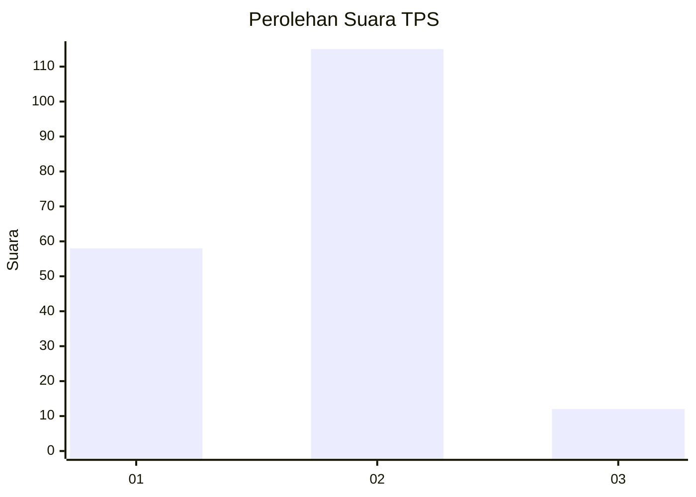
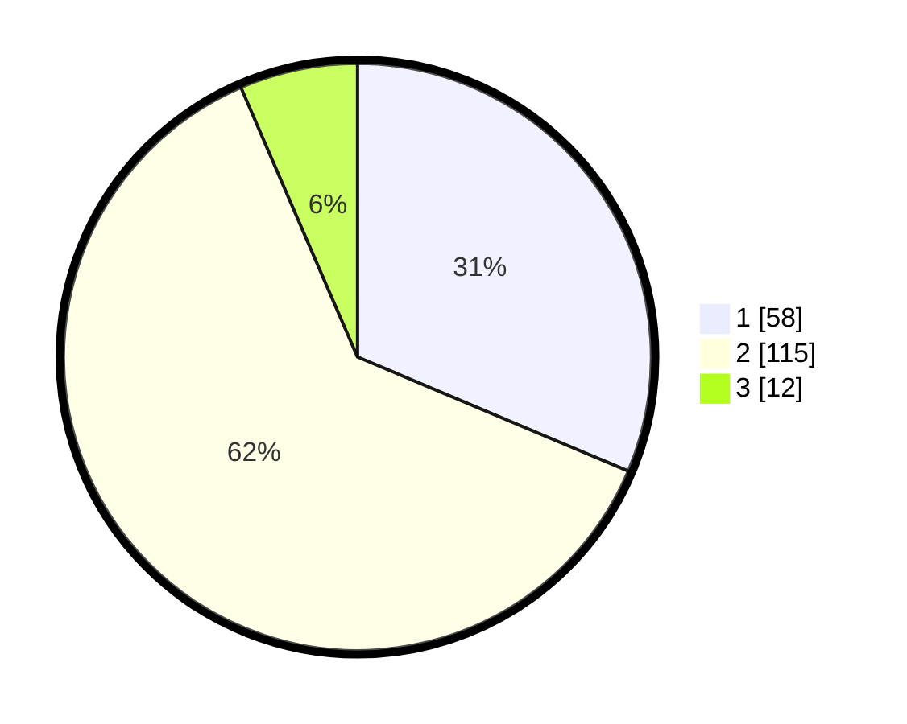

# Hasil

## Grafik

## Tabel

| No. | Nama Paslon    | Suara | Suara (raw) | Persentase |
|:--- |:-------------- | -----:| -----------:| ----------:|
| 1   | ANIES MUHAIMIN | 58    | [58][p-1]   | 31,35      |
| 2   | PRABOWO GIBRAN | 115   | [115][p-2]  | 62,16      |
| 3   | GANJAR MAHFUD  | 12    | [12][p-3]   | 6,49       |

[p-1]: https://github.com/gigit-pemilu/pemilu-2024/blob/main/pilpres/hitung-suara/sub/35-jawa-timur/sub/09-jember/sub/28-ledokombo/sub/2009-slateng/sub/028-tps/sub/paslon-1.txt
[p-2]: https://github.com/gigit-pemilu/pemilu-2024/blob/main/pilpres/hitung-suara/sub/35-jawa-timur/sub/09-jember/sub/28-ledokombo/sub/2009-slateng/sub/028-tps/sub/paslon-2.txt
[p-3]: https://github.com/gigit-pemilu/pemilu-2024/blob/main/pilpres/hitung-suara/sub/35-jawa-timur/sub/09-jember/sub/28-ledokombo/sub/2009-slateng/sub/028-tps/sub/paslon-3.txt

## Foto C Plano

https://sirekap-obj-formc.kpu.go.id/d972/pemilu/ppwp/35/09/28/20/09/3509282009028-20240214-212729--02174d53-23f1-4498-905f-5bb1613598b2.jpg

https://sirekap-obj-formc.kpu.go.id/d972/pemilu/ppwp/35/09/28/20/09/3509282009028-20240214-212820--6cd7a707-c3b6-4eb6-b482-f52ab38282bc.jpg

https://sirekap-obj-formc.kpu.go.id/d972/pemilu/ppwp/35/09/28/20/09/3509282009028-20240214-212911--528affe7-1698-4f5b-97e1-c196b2d21aca.jpg

## Metadata

| Key        | Value               |
| ---------- | ------------------- |
| Time Stamp | 2024-02-15 17:30:25 |

