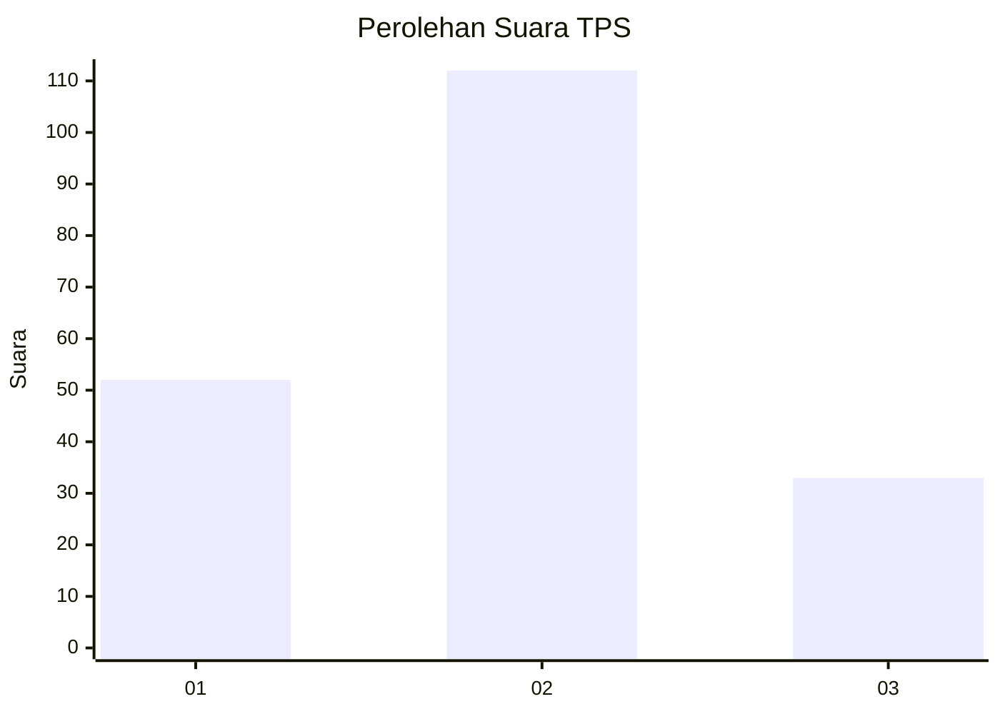
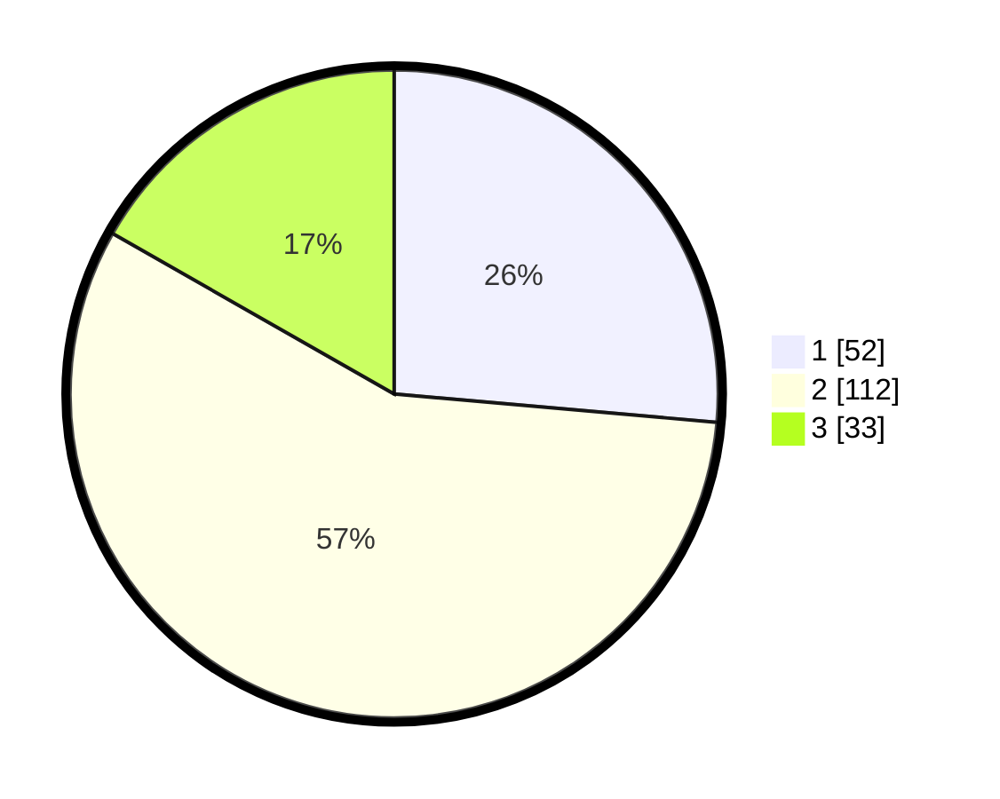

# Hasil

## Grafik

## Tabel

| No. | Nama Paslon    | Suara | Suara (raw) | Persentase |
|:--- |:-------------- | -----:| -----------:| ----------:|
| 1   | ANIES MUHAIMIN | 52    | [52][p-1]   | 26,40      |
| 2   | PRABOWO GIBRAN | 112   | [112][p-2]  | 56,85      |
| 3   | GANJAR MAHFUD  | 33    | [33][p-3]   | 16,75      |

[p-1]: https://github.com/gigit-pemilu/pemilu-2024/blob/main/pilpres/hitung-suara/sub/35-jawa-timur/sub/09-jember/sub/28-ledokombo/sub/2010-sumberbulus/sub/002-tps/sub/paslon-1.txt
[p-2]: https://github.com/gigit-pemilu/pemilu-2024/blob/main/pilpres/hitung-suara/sub/35-jawa-timur/sub/09-jember/sub/28-ledokombo/sub/2010-sumberbulus/sub/002-tps/sub/paslon-2.txt
[p-3]: https://github.com/gigit-pemilu/pemilu-2024/blob/main/pilpres/hitung-suara/sub/35-jawa-timur/sub/09-jember/sub/28-ledokombo/sub/2010-sumberbulus/sub/002-tps/sub/paslon-3.txt

## Foto C Plano

https://sirekap-obj-formc.kpu.go.id/e206/pemilu/ppwp/35/09/28/20/10/3509282010002-20240214-221314--5cbb9d56-3bfe-4a85-b6ec-9e53e6441af6.jpg

https://sirekap-obj-formc.kpu.go.id/e206/pemilu/ppwp/35/09/28/20/10/3509282010002-20240214-221423--04bd9119-5b25-4d9c-9bea-2305cd549d36.jpg

https://sirekap-obj-formc.kpu.go.id/e206/pemilu/ppwp/35/09/28/20/10/3509282010002-20240214-221542--e0ea2935-d902-4d62-bd78-d838c2617daf.jpg

## Metadata

| Key        | Value               |
| ---------- | ------------------- |
| Time Stamp | 2024-02-15 15:00:29 |

