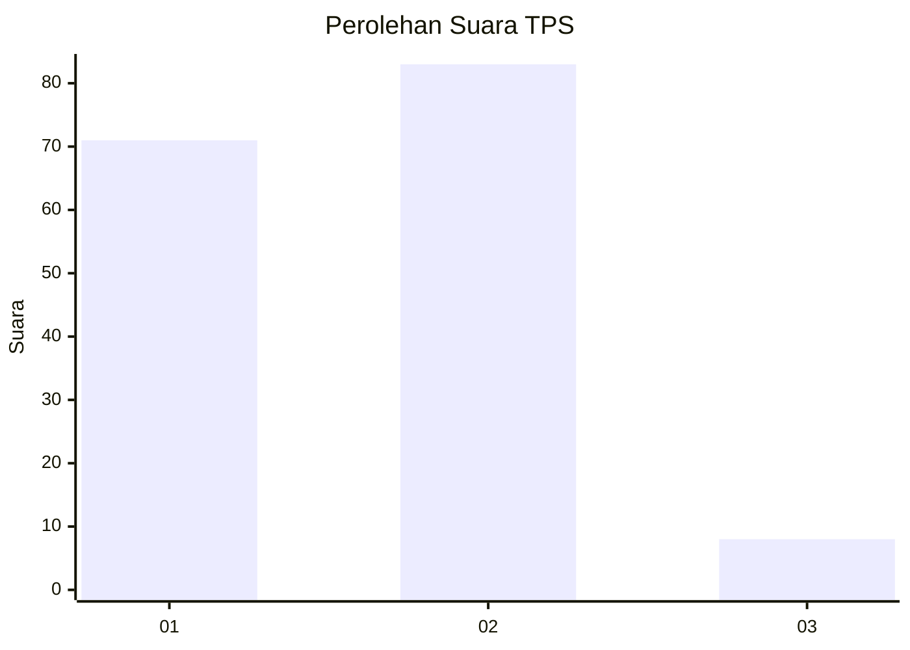
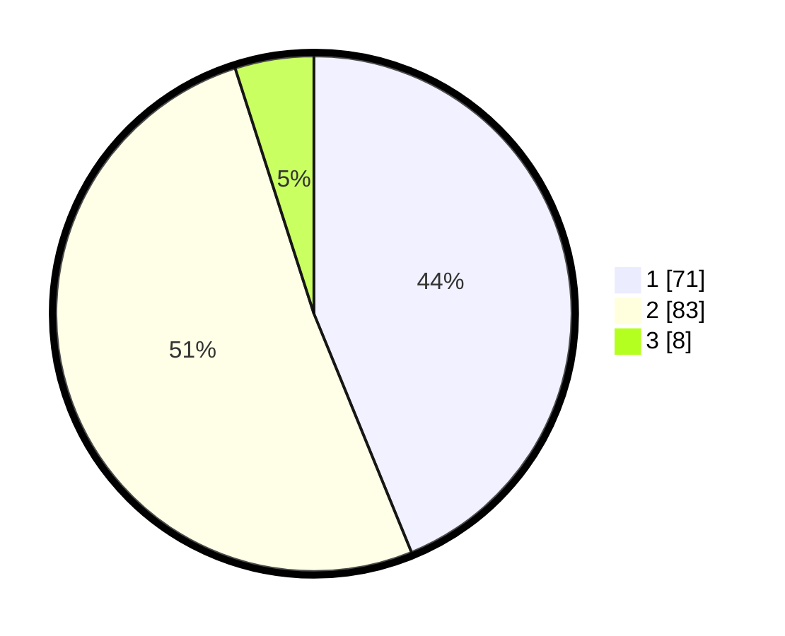

# Hasil

## Grafik

## Tabel

| No. | Nama Paslon    | Suara | Suara (raw) | Persentase |
|:--- |:-------------- | -----:| -----------:| ----------:|
| 1   | ANIES MUHAIMIN | 71    | [71][p-1]   | 43,83      |
| 2   | PRABOWO GIBRAN | 83    | [83][p-2]   | 51,23      |
| 3   | GANJAR MAHFUD  | 8     | [8][p-3]    | 4,94       |

[p-1]: https://github.com/gigit-pemilu/pemilu-2024/blob/main/pilpres/hitung-suara/sub/35-jawa-timur/sub/09-jember/sub/28-ledokombo/sub/2010-sumberbulus/sub/010-tps/sub/paslon-1.txt
[p-2]: https://github.com/gigit-pemilu/pemilu-2024/blob/main/pilpres/hitung-suara/sub/35-jawa-timur/sub/09-jember/sub/28-ledokombo/sub/2010-sumberbulus/sub/010-tps/sub/paslon-2.txt
[p-3]: https://github.com/gigit-pemilu/pemilu-2024/blob/main/pilpres/hitung-suara/sub/35-jawa-timur/sub/09-jember/sub/28-ledokombo/sub/2010-sumberbulus/sub/010-tps/sub/paslon-3.txt

## Foto C Plano

https://sirekap-obj-formc.kpu.go.id/8aab/pemilu/ppwp/35/09/28/20/10/3509282010010-20240215-020546--3c78beb1-9fac-4139-9908-1c8a65397184.jpg

https://sirekap-obj-formc.kpu.go.id/8aab/pemilu/ppwp/35/09/28/20/10/3509282010010-20240215-020741--4a53ca44-a1c6-47e4-bfc2-0a7d8485cf54.jpg

https://sirekap-obj-formc.kpu.go.id/8aab/pemilu/ppwp/35/09/28/20/10/3509282010010-20240215-020955--4edb2141-620e-4413-b2e0-fa10d69ccab5.jpg

## Metadata

| Key        | Value               |
| ---------- | ------------------- |
| Time Stamp | 2024-02-15 15:00:29 |

