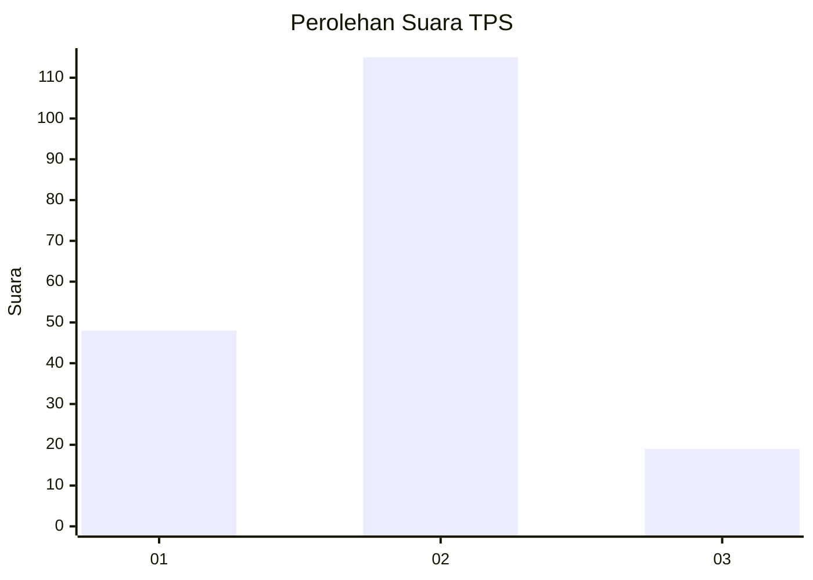
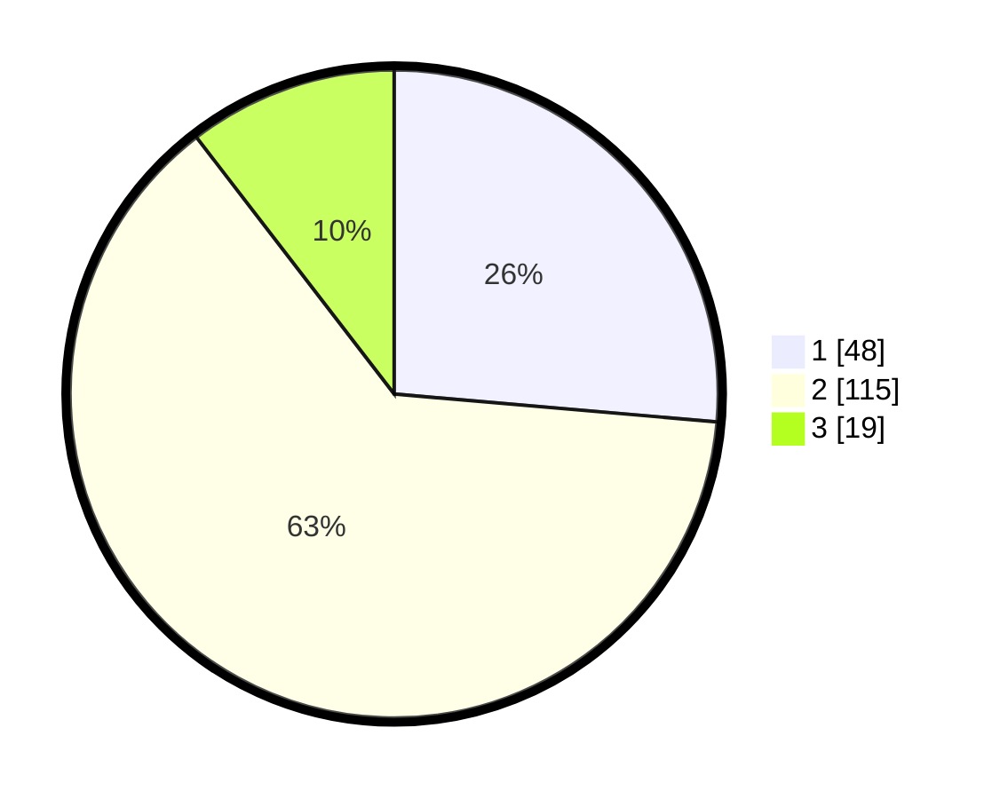

# Hasil

## Grafik

## Tabel

| No. | Nama Paslon    | Suara | Suara (raw) | Persentase |
|:--- |:-------------- | -----:| -----------:| ----------:|
| 1   | ANIES MUHAIMIN | 48    | [48][p-1]   | 26,37      |
| 2   | PRABOWO GIBRAN | 115   | [115][p-2]  | 63,19      |
| 3   | GANJAR MAHFUD  | 19    | [19][p-3]   | 10,44      |

[p-1]: https://github.com/gigit-pemilu/pemilu-2024/blob/main/pilpres/hitung-suara/sub/35-jawa-timur/sub/09-jember/sub/28-ledokombo/sub/2010-sumberbulus/sub/016-tps/sub/paslon-1.txt
[p-2]: https://github.com/gigit-pemilu/pemilu-2024/blob/main/pilpres/hitung-suara/sub/35-jawa-timur/sub/09-jember/sub/28-ledokombo/sub/2010-sumberbulus/sub/016-tps/sub/paslon-2.txt
[p-3]: https://github.com/gigit-pemilu/pemilu-2024/blob/main/pilpres/hitung-suara/sub/35-jawa-timur/sub/09-jember/sub/28-ledokombo/sub/2010-sumberbulus/sub/016-tps/sub/paslon-3.txt

## Foto C Plano

https://sirekap-obj-formc.kpu.go.id/aa08/pemilu/ppwp/35/09/28/20/10/3509282010016-20240214-234918--428a934f-b074-4db7-9fbd-4066bc55b0b0.jpg

https://sirekap-obj-formc.kpu.go.id/aa08/pemilu/ppwp/35/09/28/20/10/3509282010016-20240215-014609--bbb65600-3337-447f-8e22-4a6710bee887.jpg

https://sirekap-obj-formc.kpu.go.id/aa08/pemilu/ppwp/35/09/28/20/10/3509282010016-20240215-014652--540d55bd-b142-487f-9d3b-ff714d23a8ab.jpg

## Metadata

| Key        | Value               |
| ---------- | ------------------- |
| Time Stamp | 2024-02-15 17:30:25 |

