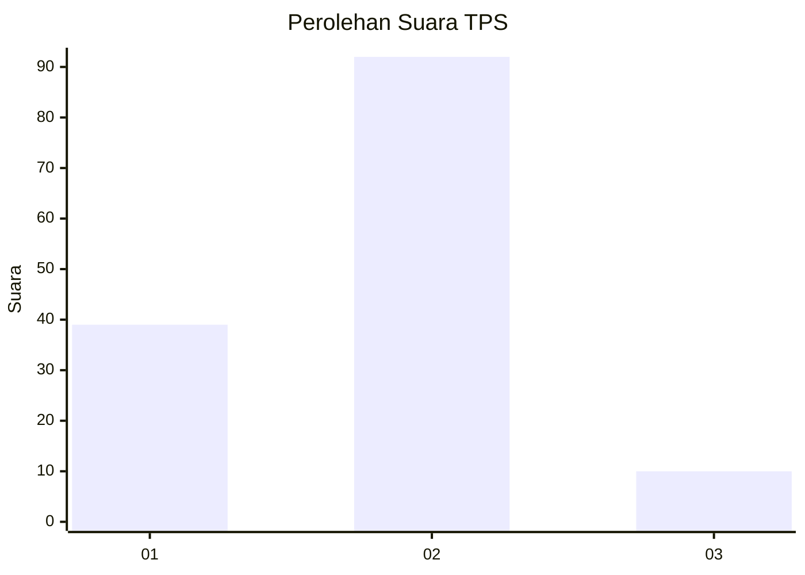
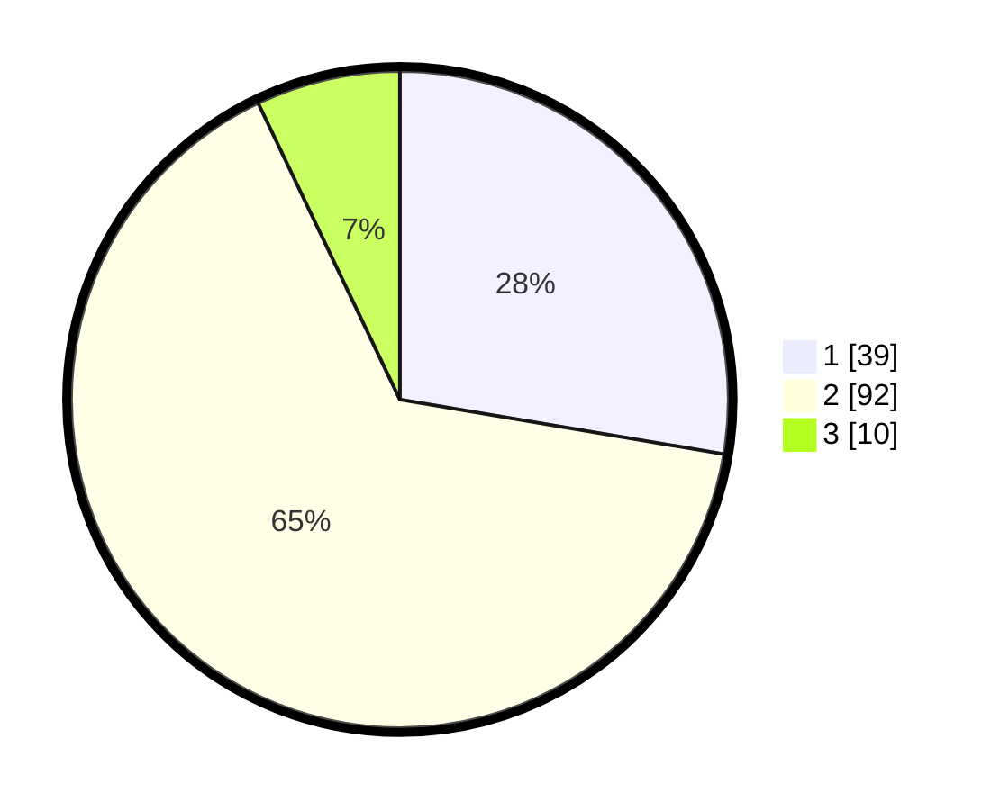

# Hasil

## Grafik

## Tabel

| No. | Nama Paslon    | Suara | Suara (raw) | Persentase |
|:--- |:-------------- | -----:| -----------:| ----------:|
| 1   | ANIES MUHAIMIN | 39    | [39][p-1]   | 27,66      |
| 2   | PRABOWO GIBRAN | 92    | [92][p-2]   | 65,25      |
| 3   | GANJAR MAHFUD  | 10    | [10][p-3]   | 7,09       |

[p-1]: https://github.com/gigit-pemilu/pemilu-2024/blob/main/pilpres/hitung-suara/sub/35-jawa-timur/sub/09-jember/sub/28-ledokombo/sub/2010-sumberbulus/sub/019-tps/sub/paslon-1.txt
[p-2]: https://github.com/gigit-pemilu/pemilu-2024/blob/main/pilpres/hitung-suara/sub/35-jawa-timur/sub/09-jember/sub/28-ledokombo/sub/2010-sumberbulus/sub/019-tps/sub/paslon-2.txt
[p-3]: https://github.com/gigit-pemilu/pemilu-2024/blob/main/pilpres/hitung-suara/sub/35-jawa-timur/sub/09-jember/sub/28-ledokombo/sub/2010-sumberbulus/sub/019-tps/sub/paslon-3.txt

## Foto C Plano

https://sirekap-obj-formc.kpu.go.id/1bac/pemilu/ppwp/35/09/28/20/10/3509282010019-20240221-110957--baebfe8f-9a0c-4355-8b88-d4ec7b65019f.jpg

https://sirekap-obj-formc.kpu.go.id/1bac/pemilu/ppwp/35/09/28/20/10/3509282010019-20240221-111046--4745fcfc-783c-4b2e-b214-a3a81ac222b0.jpg

https://sirekap-obj-formc.kpu.go.id/1bac/pemilu/ppwp/35/09/28/20/10/3509282010019-20240221-111122--28920c28-7cc2-4c57-aff2-2498c82fffb2.jpg

## Metadata

| Key        | Value               |
| ---------- | ------------------- |
| Time Stamp | 2024-02-24 22:31:28 |

