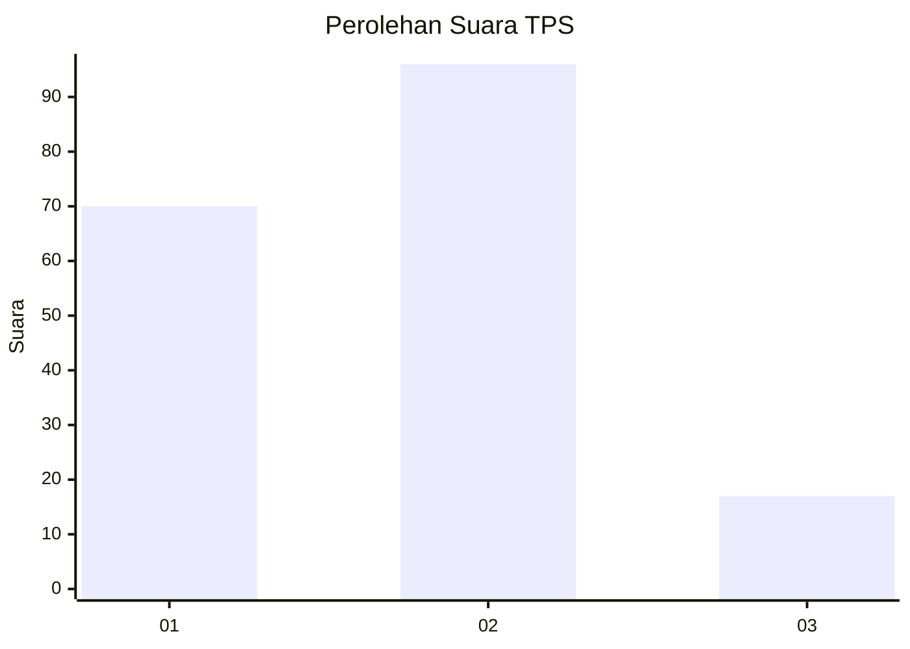
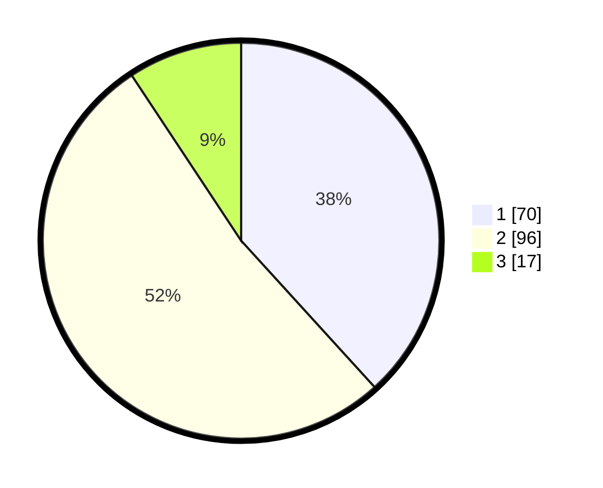

# Hasil

## Grafik

## Tabel

| No. | Nama Paslon    | Suara | Suara (raw) | Persentase |
|:--- |:-------------- | -----:| -----------:| ----------:|
| 1   | ANIES MUHAIMIN | 70    | [70][p-1]   | 38,25      |
| 2   | PRABOWO GIBRAN | 96    | [96][p-2]   | 52,46      |
| 3   | GANJAR MAHFUD  | 17    | [17][p-3]   | 9,29       |

[p-1]: https://github.com/gigit-pemilu/pemilu-2024/blob/main/pilpres/hitung-suara/sub/35-jawa-timur/sub/09-jember/sub/28-ledokombo/sub/2010-sumberbulus/sub/020-tps/sub/paslon-1.txt
[p-2]: https://github.com/gigit-pemilu/pemilu-2024/blob/main/pilpres/hitung-suara/sub/35-jawa-timur/sub/09-jember/sub/28-ledokombo/sub/2010-sumberbulus/sub/020-tps/sub/paslon-2.txt
[p-3]: https://github.com/gigit-pemilu/pemilu-2024/blob/main/pilpres/hitung-suara/sub/35-jawa-timur/sub/09-jember/sub/28-ledokombo/sub/2010-sumberbulus/sub/020-tps/sub/paslon-3.txt

## Foto C Plano

https://sirekap-obj-formc.kpu.go.id/5520/pemilu/ppwp/35/09/28/20/10/3509282010020-20240214-232137--1b844818-be20-45fe-8388-a7671d8b173a.jpg

https://sirekap-obj-formc.kpu.go.id/5520/pemilu/ppwp/35/09/28/20/10/3509282010020-20240214-232237--6fe0dd72-4bfd-4464-b28c-b48217b57050.jpg

https://sirekap-obj-formc.kpu.go.id/5520/pemilu/ppwp/35/09/28/20/10/3509282010020-20240215-015939--ecabfc96-6577-45bf-9a73-571f0591039c.jpg

## Metadata

| Key        | Value               |
| ---------- | ------------------- |
| Time Stamp | 2024-02-15 21:01:18 |

