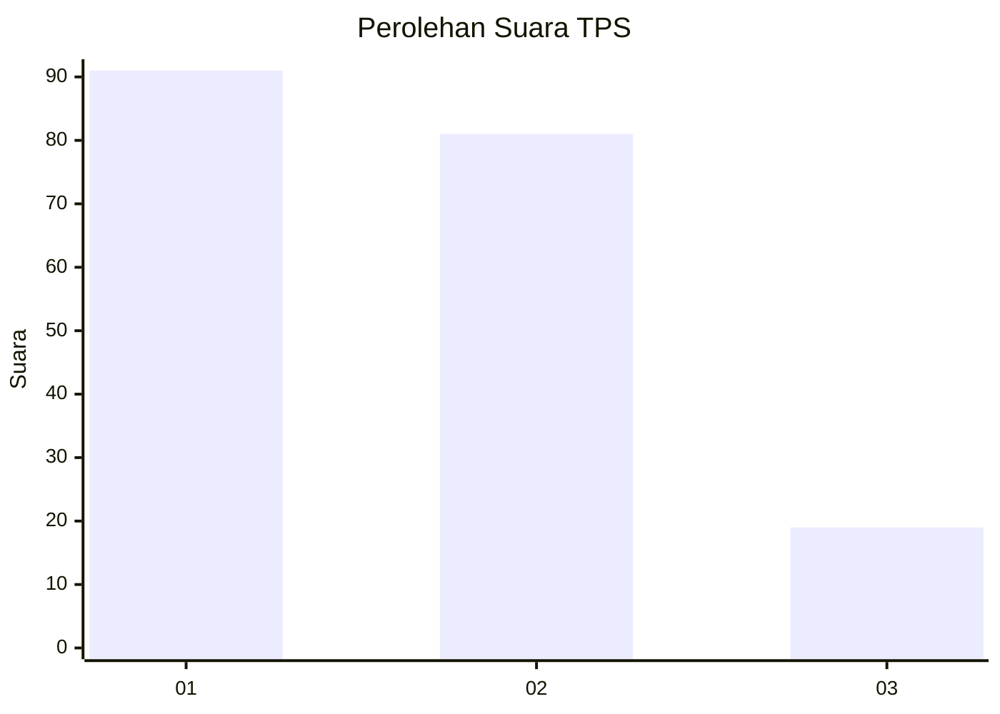
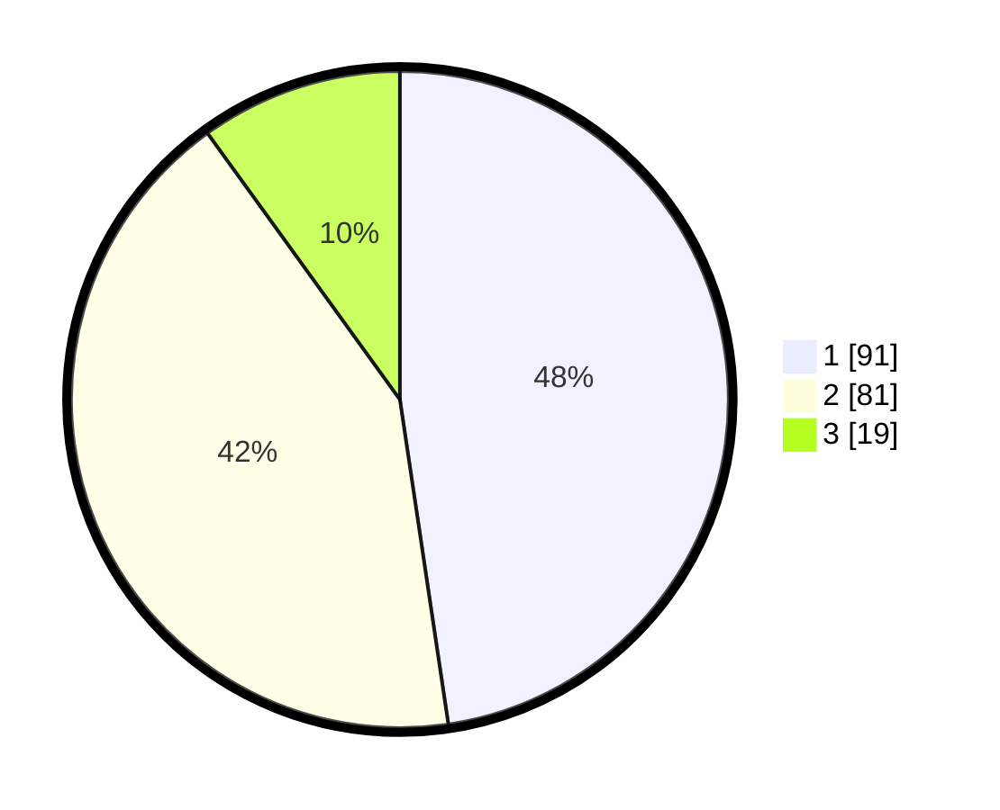

# Hasil

## Grafik

## Tabel

| No. | Nama Paslon    | Suara | Suara (raw) | Persentase |
|:--- |:-------------- | -----:| -----------:| ----------:|
| 1   | ANIES MUHAIMIN | 91    | [91][p-1]   | 47,64      |
| 2   | PRABOWO GIBRAN | 81    | [81][p-2]   | 42,41      |
| 3   | GANJAR MAHFUD  | 19    | [19][p-3]   | 9,95       |

[p-1]: https://github.com/gigit-pemilu/pemilu-2024-35-jawa-timur/blob/main/pilpres/hitung-suara/sub/35-jawa-timur/sub/09-jember/sub/28-ledokombo/sub/2010-sumberbulus/sub/021-tps/sub/paslon-1.txt
[p-2]: https://github.com/gigit-pemilu/pemilu-2024-35-jawa-timur/blob/main/pilpres/hitung-suara/sub/35-jawa-timur/sub/09-jember/sub/28-ledokombo/sub/2010-sumberbulus/sub/021-tps/sub/paslon-2.txt
[p-3]: https://github.com/gigit-pemilu/pemilu-2024-35-jawa-timur/blob/main/pilpres/hitung-suara/sub/35-jawa-timur/sub/09-jember/sub/28-ledokombo/sub/2010-sumberbulus/sub/021-tps/sub/paslon-3.txt

## Foto C Plano

https://sirekap-obj-formc.kpu.go.id/c30b/pemilu/ppwp/35/09/28/20/10/3509282010021-20240214-231219--2c0c4c91-c8d7-4433-beb7-3fbfa73134d9.jpg

https://sirekap-obj-formc.kpu.go.id/c30b/pemilu/ppwp/35/09/28/20/10/3509282010021-20240214-231431--1211a880-e952-4393-a356-53fae6747689.jpg

https://sirekap-obj-formc.kpu.go.id/c30b/pemilu/ppwp/35/09/28/20/10/3509282010021-20240214-231559--6d4f9e98-1bcb-45b9-aa7b-4f0648ca882e.jpg

## Metadata

| Key        | Value               |
| ---------- | ------------------- |
| Time Stamp | 2024-02-15 15:00:29 |

