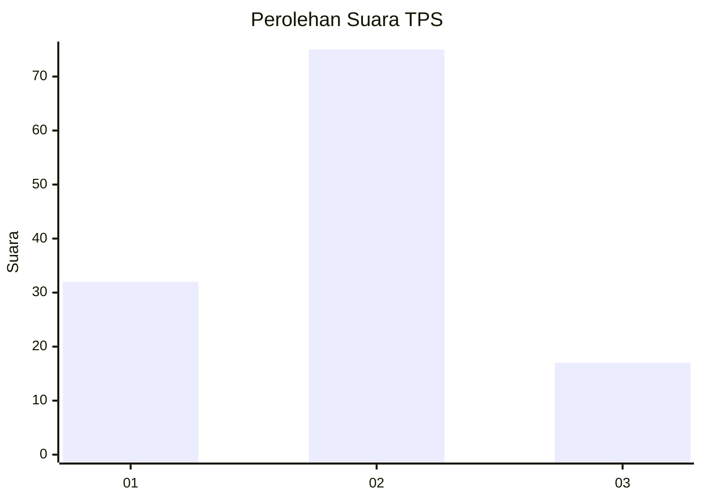
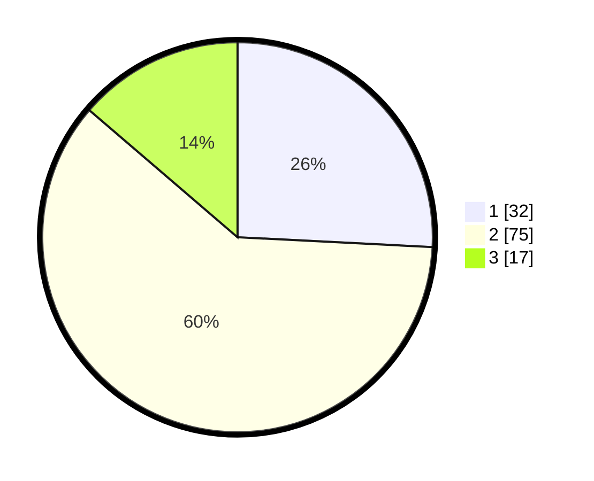

# Hasil

## Grafik

## Tabel

| No. | Nama Paslon    | Suara | Suara (raw) | Persentase |
|:--- |:-------------- | -----:| -----------:| ----------:|
| 1   | ANIES MUHAIMIN | 32    | [32][p-1]   | 25,81      |
| 2   | PRABOWO GIBRAN | 75    | [75][p-2]   | 60,48      |
| 3   | GANJAR MAHFUD  | 17    | [17][p-3]   | 13,71      |

[p-1]: https://github.com/gigit-pemilu/pemilu-2024/blob/main/pilpres/hitung-suara/sub/35-jawa-timur/sub/09-jember/sub/28-ledokombo/sub/2010-sumberbulus/sub/024-tps/sub/paslon-1.txt
[p-2]: https://github.com/gigit-pemilu/pemilu-2024/blob/main/pilpres/hitung-suara/sub/35-jawa-timur/sub/09-jember/sub/28-ledokombo/sub/2010-sumberbulus/sub/024-tps/sub/paslon-2.txt
[p-3]: https://github.com/gigit-pemilu/pemilu-2024/blob/main/pilpres/hitung-suara/sub/35-jawa-timur/sub/09-jember/sub/28-ledokombo/sub/2010-sumberbulus/sub/024-tps/sub/paslon-3.txt

## Foto C Plano

https://sirekap-obj-formc.kpu.go.id/b510/pemilu/ppwp/35/09/28/20/10/3509282010024-20240214-155008--968266e6-a979-4f00-b7ce-2e08bfc8497d.jpg

https://sirekap-obj-formc.kpu.go.id/b510/pemilu/ppwp/35/09/28/20/10/3509282010024-20240214-155912--952eaa5d-593e-48e3-a363-e95f1497cd05.jpg

https://sirekap-obj-formc.kpu.go.id/b510/pemilu/ppwp/35/09/28/20/10/3509282010024-20240214-185223--8556d53a-007e-438d-85c6-ffa263cb39c1.jpg

## Metadata

| Key        | Value               |
| ---------- | ------------------- |
| Time Stamp | 2024-02-15 18:00:26 |

