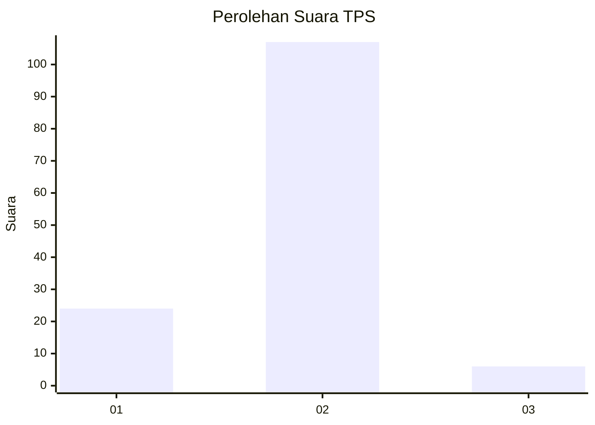
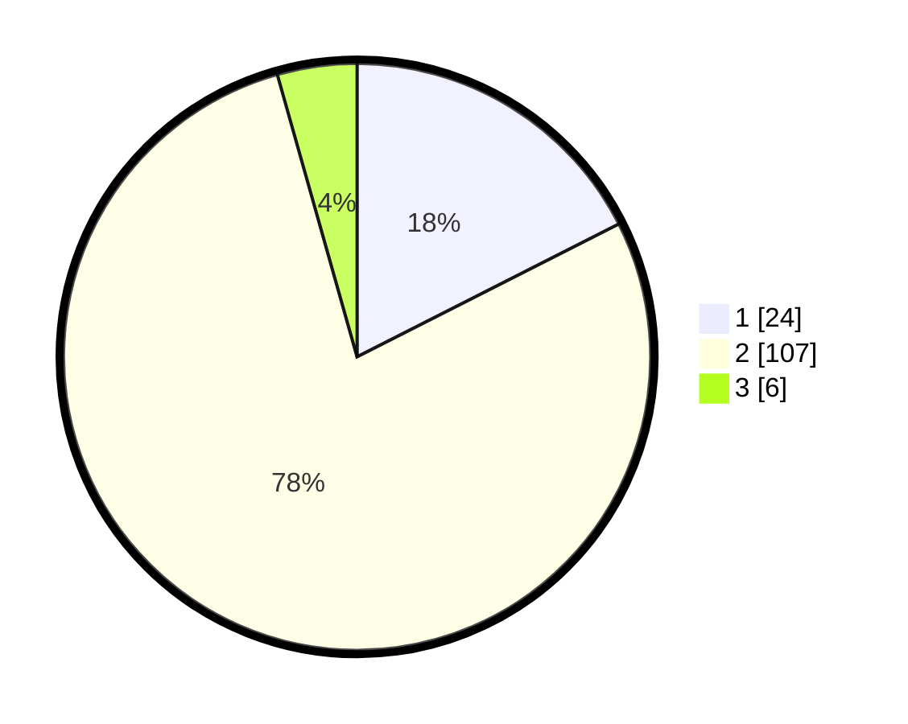

# Hasil

## Grafik

## Tabel

| No. | Nama Paslon    | Suara | Suara (raw) | Persentase |
|:--- |:-------------- | -----:| -----------:| ----------:|
| 1   | ANIES MUHAIMIN | 24    | [24][p-1]   | 17,52      |
| 2   | PRABOWO GIBRAN | 107   | [107][p-2]  | 78,10      |
| 3   | GANJAR MAHFUD  | 6     | [6][p-3]    | 4,38       |

[p-1]: https://github.com/gigit-pemilu/pemilu-2024-35-jawa-timur/blob/main/pilpres/hitung-suara/sub/35-jawa-timur/sub/09-jember/sub/28-ledokombo/sub/2010-sumberbulus/sub/025-tps/sub/paslon-1.txt
[p-2]: https://github.com/gigit-pemilu/pemilu-2024-35-jawa-timur/blob/main/pilpres/hitung-suara/sub/35-jawa-timur/sub/09-jember/sub/28-ledokombo/sub/2010-sumberbulus/sub/025-tps/sub/paslon-2.txt
[p-3]: https://github.com/gigit-pemilu/pemilu-2024-35-jawa-timur/blob/main/pilpres/hitung-suara/sub/35-jawa-timur/sub/09-jember/sub/28-ledokombo/sub/2010-sumberbulus/sub/025-tps/sub/paslon-3.txt

## Foto C Plano

https://sirekap-obj-formc.kpu.go.id/0149/pemilu/ppwp/35/09/28/20/10/3509282010025-20240221-110509--5b2e1b31-2bd0-4de7-99df-c8d2e6aeb7f9.jpg

https://sirekap-obj-formc.kpu.go.id/0149/pemilu/ppwp/35/09/28/20/10/3509282010025-20240221-110621--7bafed88-3c9e-4b32-9ebc-fd010bd682d6.jpg

https://sirekap-obj-formc.kpu.go.id/0149/pemilu/ppwp/35/09/28/20/10/3509282010025-20240221-110707--83c19a2c-2370-496e-9bf0-4bda8bfd5f3a.jpg

## Metadata

| Key        | Value               |
| ---------- | ------------------- |
| Time Stamp | 2024-02-25 16:00:00 |

