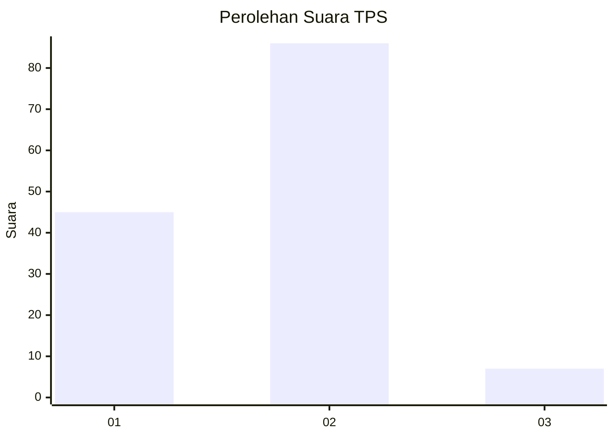
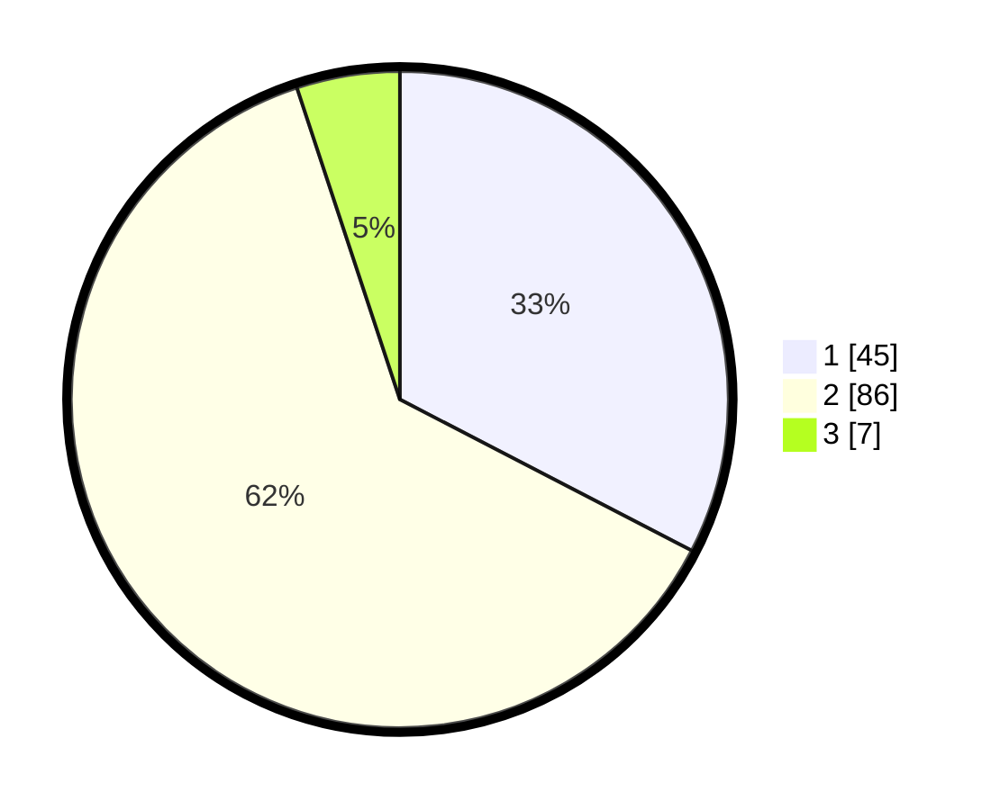

# Hasil

## Grafik

## Tabel

| No. | Nama Paslon    | Suara | Suara (raw) | Persentase |
|:--- |:-------------- | -----:| -----------:| ----------:|
| 1   | ANIES MUHAIMIN | 45    | [45][p-1]   | 32,61      |
| 2   | PRABOWO GIBRAN | 86    | [86][p-2]   | 62,32      |
| 3   | GANJAR MAHFUD  | 7     | [7][p-3]    | 5,07       |

[p-1]: https://github.com/gigit-pemilu/pemilu-2024/blob/main/pilpres/hitung-suara/sub/35-jawa-timur/sub/09-jember/sub/28-ledokombo/sub/2010-sumberbulus/sub/028-tps/sub/paslon-1.txt
[p-2]: https://github.com/gigit-pemilu/pemilu-2024/blob/main/pilpres/hitung-suara/sub/35-jawa-timur/sub/09-jember/sub/28-ledokombo/sub/2010-sumberbulus/sub/028-tps/sub/paslon-2.txt
[p-3]: https://github.com/gigit-pemilu/pemilu-2024/blob/main/pilpres/hitung-suara/sub/35-jawa-timur/sub/09-jember/sub/28-ledokombo/sub/2010-sumberbulus/sub/028-tps/sub/paslon-3.txt

## Foto C Plano

https://sirekap-obj-formc.kpu.go.id/215b/pemilu/ppwp/35/09/28/20/10/3509282010028-20240221-111253--e1a241e6-7da6-4341-bd5f-073f9142f2e5.jpg

https://sirekap-obj-formc.kpu.go.id/215b/pemilu/ppwp/35/09/28/20/10/3509282010028-20240221-111331--178d1700-ef52-43d6-aa48-71326e10de7e.jpg

https://sirekap-obj-formc.kpu.go.id/215b/pemilu/ppwp/35/09/28/20/10/3509282010028-20240221-111412--eb206d27-7b15-4d25-a617-65150e52e479.jpg

## Metadata

| Key        | Value               |
| ---------- | ------------------- |
| Time Stamp | 2024-02-24 22:31:28 |

