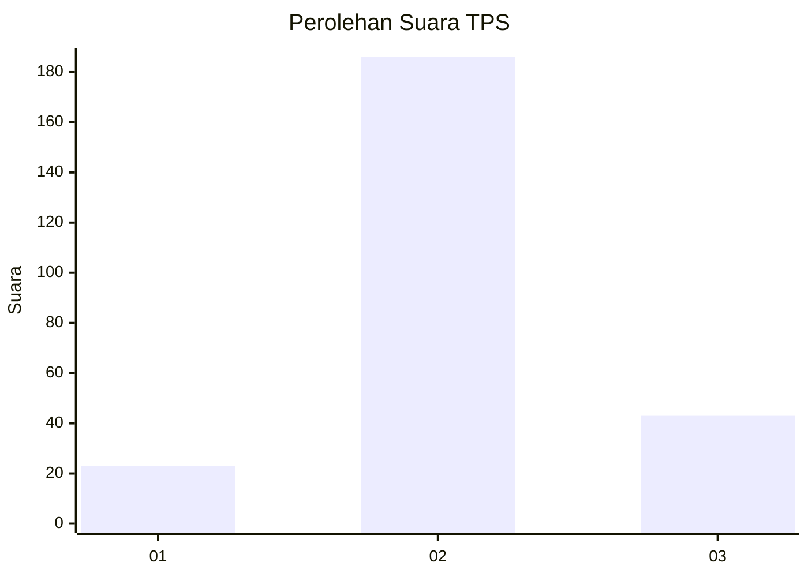
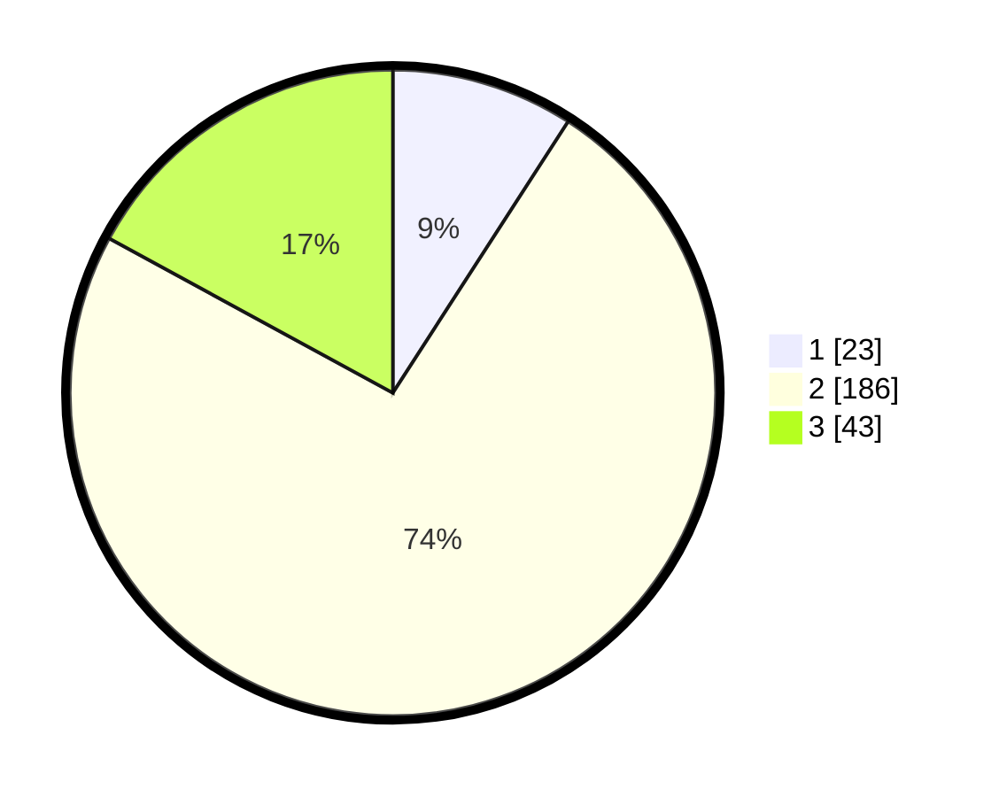

# Hasil

## Grafik

## Tabel

| No. | Nama Paslon    | Suara | Suara (raw) | Persentase |
|:--- |:-------------- | -----:| -----------:| ----------:|
| 1   | ANIES MUHAIMIN | 23    | [23][p-1]   | 9,13       |
| 2   | PRABOWO GIBRAN | 186   | [186][p-2]  | 73,81      |
| 3   | GANJAR MAHFUD  | 43    | [43][p-3]   | 17,06      |

[p-1]: https://github.com/gigit-pemilu/pemilu-2024/blob/main/pilpres/hitung-suara/sub/35-jawa-timur/sub/09-jember/sub/29-sukowono/sub/2001-sumberwringin/sub/002-tps/sub/paslon-1.txt
[p-2]: https://github.com/gigit-pemilu/pemilu-2024/blob/main/pilpres/hitung-suara/sub/35-jawa-timur/sub/09-jember/sub/29-sukowono/sub/2001-sumberwringin/sub/002-tps/sub/paslon-2.txt
[p-3]: https://github.com/gigit-pemilu/pemilu-2024/blob/main/pilpres/hitung-suara/sub/35-jawa-timur/sub/09-jember/sub/29-sukowono/sub/2001-sumberwringin/sub/002-tps/sub/paslon-3.txt

## Foto C Plano

https://sirekap-obj-formc.kpu.go.id/3059/pemilu/ppwp/35/09/29/20/01/3509292001002-20240215-051903--a74c09a2-3f0f-423e-90e1-0b20c91a1900.jpg

https://sirekap-obj-formc.kpu.go.id/3059/pemilu/ppwp/35/09/29/20/01/3509292001002-20240215-052052--d4c0d43e-7a36-4cb1-8d89-697612a349ce.jpg

https://sirekap-obj-formc.kpu.go.id/3059/pemilu/ppwp/35/09/29/20/01/3509292001002-20240215-012248--251c05fb-fd12-4c49-934e-2ff9b0142ccb.jpg

## Metadata

| Key        | Value               |
| ---------- | ------------------- |
| Time Stamp | 2024-02-15 19:30:26 |

