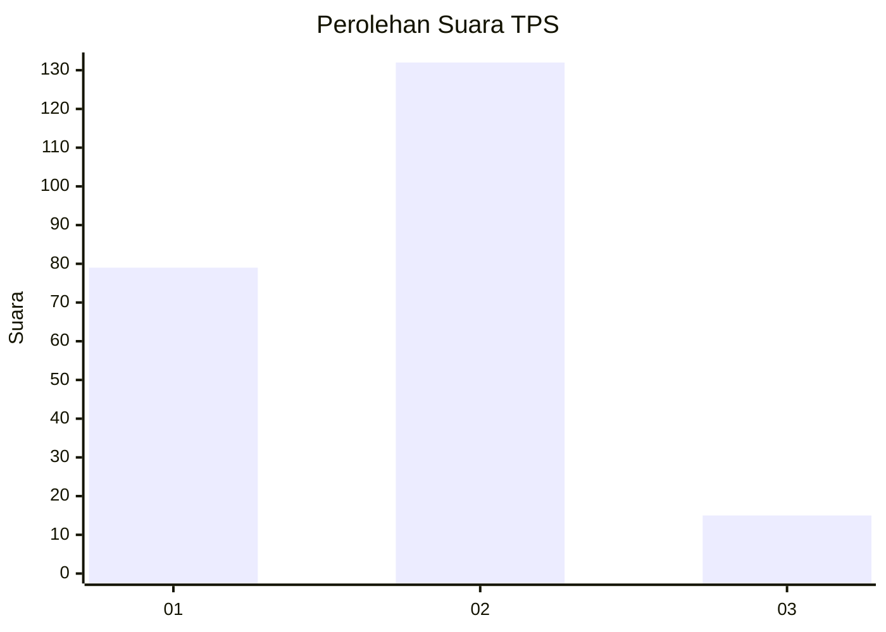
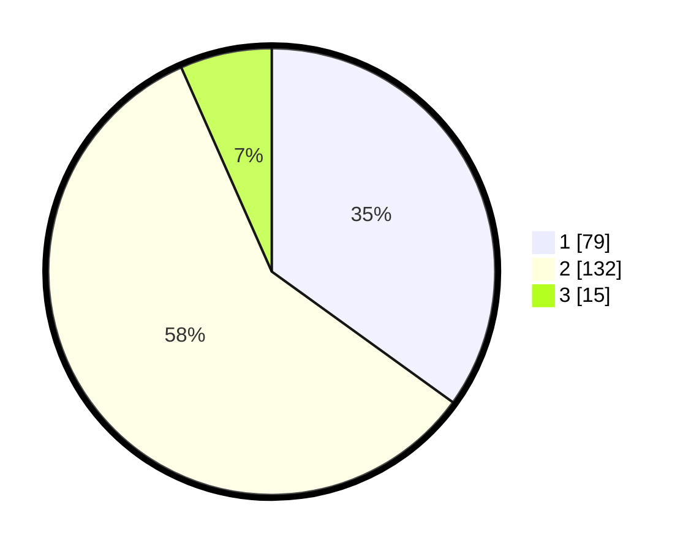

# Hasil

## Grafik

## Tabel

| No. | Nama Paslon    | Suara | Suara (raw) | Persentase |
|:--- |:-------------- | -----:| -----------:| ----------:|
| 1   | ANIES MUHAIMIN | 79    | [79][p-1]   | 34,96      |
| 2   | PRABOWO GIBRAN | 132   | [132][p-2]  | 58,41      |
| 3   | GANJAR MAHFUD  | 15    | [15][p-3]   | 6,64       |

[p-1]: https://github.com/gigit-pemilu/pemilu-2024-35-jawa-timur/blob/main/pilpres/hitung-suara/sub/35-jawa-timur/sub/09-jember/sub/29-sukowono/sub/2001-sumberwringin/sub/004-tps/sub/paslon-1.txt
[p-2]: https://github.com/gigit-pemilu/pemilu-2024-35-jawa-timur/blob/main/pilpres/hitung-suara/sub/35-jawa-timur/sub/09-jember/sub/29-sukowono/sub/2001-sumberwringin/sub/004-tps/sub/paslon-2.txt
[p-3]: https://github.com/gigit-pemilu/pemilu-2024-35-jawa-timur/blob/main/pilpres/hitung-suara/sub/35-jawa-timur/sub/09-jember/sub/29-sukowono/sub/2001-sumberwringin/sub/004-tps/sub/paslon-3.txt

## Foto C Plano

https://sirekap-obj-formc.kpu.go.id/fc6e/pemilu/ppwp/35/09/29/20/01/3509292001004-20240215-103436--66e07a9b-90e4-4c24-8d48-5ebd12b59758.jpg

https://sirekap-obj-formc.kpu.go.id/fc6e/pemilu/ppwp/35/09/29/20/01/3509292001004-20240215-103512--6af29449-f0c9-4ab1-aa48-b75f16b13433.jpg

https://sirekap-obj-formc.kpu.go.id/fc6e/pemilu/ppwp/35/09/29/20/01/3509292001004-20240215-103534--d5a9775e-2ca7-4e74-9d42-62abf82f0483.jpg

## Metadata

| Key        | Value               |
| ---------- | ------------------- |
| Time Stamp | 2024-02-15 18:00:26 |

