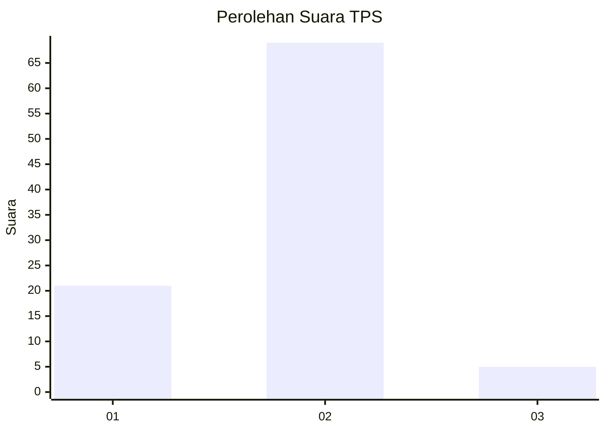
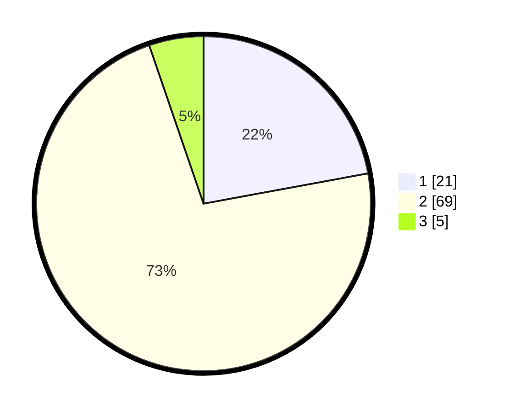

# Hasil

## Grafik

## Tabel

| No. | Nama Paslon    | Suara | Suara (raw) | Persentase |
|:--- |:-------------- | -----:| -----------:| ----------:|
| 1   | ANIES MUHAIMIN | 21    | [21][p-1]   | 22,11      |
| 2   | PRABOWO GIBRAN | 69    | [69][p-2]   | 72,63      |
| 3   | GANJAR MAHFUD  | 5     | [5][p-3]    | 5,26       |

[p-1]: https://github.com/gigit-pemilu/pemilu-2024/blob/main/pilpres/hitung-suara/sub/35-jawa-timur/sub/09-jember/sub/29-sukowono/sub/2001-sumberwringin/sub/006-tps/sub/paslon-1.txt
[p-2]: https://github.com/gigit-pemilu/pemilu-2024/blob/main/pilpres/hitung-suara/sub/35-jawa-timur/sub/09-jember/sub/29-sukowono/sub/2001-sumberwringin/sub/006-tps/sub/paslon-2.txt
[p-3]: https://github.com/gigit-pemilu/pemilu-2024/blob/main/pilpres/hitung-suara/sub/35-jawa-timur/sub/09-jember/sub/29-sukowono/sub/2001-sumberwringin/sub/006-tps/sub/paslon-3.txt

## Foto C Plano

https://sirekap-obj-formc.kpu.go.id/1c4b/pemilu/ppwp/35/09/29/20/01/3509292001006-20240216-134625--59cd39cf-8882-465d-859c-b7438f6120c4.jpg

https://sirekap-obj-formc.kpu.go.id/1c4b/pemilu/ppwp/35/09/29/20/01/3509292001006-20240216-134627--4429ba78-e402-43b8-a69d-6e446f8f7e0f.jpg

https://sirekap-obj-formc.kpu.go.id/1c4b/pemilu/ppwp/35/09/29/20/01/3509292001006-20240216-134626--fc3e214d-ca46-4b87-a8b9-389cdc51ba63.jpg

## Metadata

| Key        | Value               |
| ---------- | ------------------- |
| Time Stamp | 2024-02-24 22:31:28 |

## DATA PEMILIH TETAP

Jumlah pemilih dalam DPT: **127**.
 * L: **61**.
 * P: **66**.

## DATA PENGGUNA HAK PILIH

Jumlah pengguna hak pilih dalam DPT: **98**.
 * L: **46**.
 * P: **52**.

Jumlah pengguna hak pilih dalam DPTb: **0**.
 * L: **0**.
 * P: **0**.

Jumlah pengguna hak pilih dalam DPK: **0**.
 * L: **0**.
 * P: **0**.

Jumlah pengguna hak pilih: **98**.
 * L: **46**.
 * P: **52**.

## JUMLAH SUARA SAH DAN TIDAK SAH

JUMLAH SELURUH SUARA SAH: **95**.

JUMLAH SUARA TIDAK SAH: **3**.

JUMLAH SELURUH SUARA SAH DAN SUARA TIDAK SAH: **98**.

