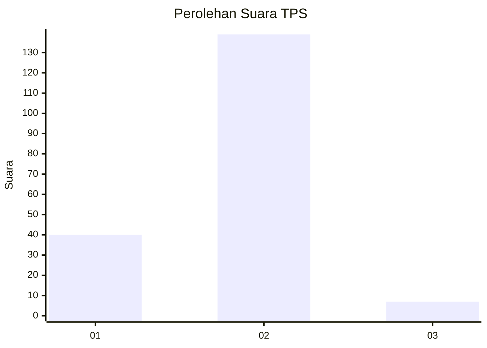

# Hasil

## Grafik

## Tabel

| No. | Nama Paslon    | Suara | Suara (raw) | Persentase |
|:--- |:-------------- | -----:| -----------:| ----------:|
| 1   | ANIES MUHAIMIN | 40    | [40][p-1]   | 21,51      |
| 2   | PRABOWO GIBRAN | 139   | [139][p-2]  | 74,73      |
| 3   | GANJAR MAHFUD  | 7     | [7][p-3]    | 3,76       |

[p-1]: https://github.com/gigit-pemilu/pemilu-2024-35-jawa-timur/blob/main/pilpres/hitung-suara/sub/35-jawa-timur/sub/09-jember/sub/29-sukowono/sub/2001-sumberwringin/sub/007-tps/sub/paslon-1.txt
[p-2]: https://github.com/gigit-pemilu/pemilu-2024-35-jawa-timur/blob/main/pilpres/hitung-suara/sub/35-jawa-timur/sub/09-jember/sub/29-sukowono/sub/2001-sumberwringin/sub/007-tps/sub/paslon-2.txt
[p-3]: https://github.com/gigit-pemilu/pemilu-2024-35-jawa-timur/blob/main/pilpres/hitung-suara/sub/35-jawa-timur/sub/09-jember/sub/29-sukowono/sub/2001-sumberwringin/sub/007-tps/sub/paslon-3.txt

## Foto C Plano

https://sirekap-obj-formc.kpu.go.id/247a/pemilu/ppwp/35/09/29/20/01/3509292001007-20240215-083345--8ef97d6b-f757-4827-a792-24d8f665481f.jpg

https://sirekap-obj-formc.kpu.go.id/247a/pemilu/ppwp/35/09/29/20/01/3509292001007-20240215-083533--4bc448fa-9faa-41c7-847a-ec0c6bcdae90.jpg

https://sirekap-obj-formc.kpu.go.id/247a/pemilu/ppwp/35/09/29/20/01/3509292001007-20240215-083704--d181b795-012d-450a-a3d8-d979dfd3f44e.jpg

## Metadata

| Key        | Value               |
| ---------- | ------------------- |
| Time Stamp | 2024-02-15 19:30:26 |

