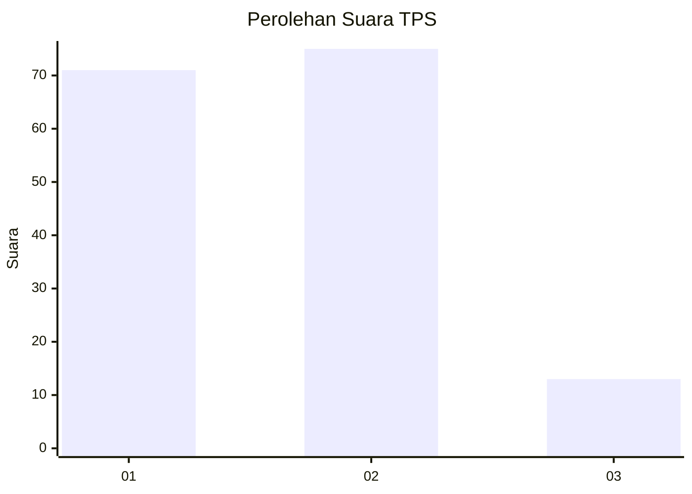
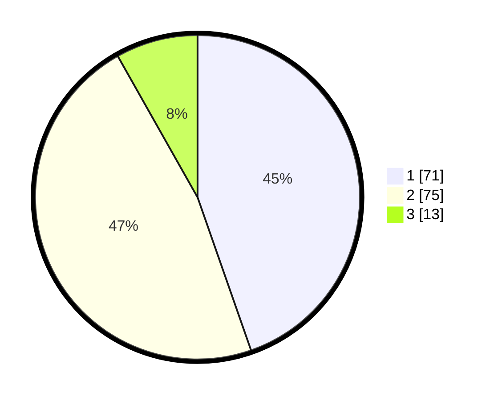

# Hasil

## Grafik

## Tabel

| No. | Nama Paslon    | Suara | Suara (raw) | Persentase |
|:--- |:-------------- | -----:| -----------:| ----------:|
| 1   | ANIES MUHAIMIN | 71    | [71][p-1]   | 44,65      |
| 2   | PRABOWO GIBRAN | 75    | [75][p-2]   | 47,17      |
| 3   | GANJAR MAHFUD  | 13    | [13][p-3]   | 8,18       |

[p-1]: https://github.com/gigit-pemilu/pemilu-2024-35-jawa-timur/blob/main/pilpres/hitung-suara/sub/35-jawa-timur/sub/09-jember/sub/29-sukowono/sub/2001-sumberwringin/sub/010-tps/sub/paslon-1.txt
[p-2]: https://github.com/gigit-pemilu/pemilu-2024-35-jawa-timur/blob/main/pilpres/hitung-suara/sub/35-jawa-timur/sub/09-jember/sub/29-sukowono/sub/2001-sumberwringin/sub/010-tps/sub/paslon-2.txt
[p-3]: https://github.com/gigit-pemilu/pemilu-2024-35-jawa-timur/blob/main/pilpres/hitung-suara/sub/35-jawa-timur/sub/09-jember/sub/29-sukowono/sub/2001-sumberwringin/sub/010-tps/sub/paslon-3.txt

## Foto C Plano

https://sirekap-obj-formc.kpu.go.id/e10c/pemilu/ppwp/35/09/29/20/01/3509292001010-20240214-215258--3eae4b8e-c8f0-4b39-a33e-d13d7baad976.jpg

https://sirekap-obj-formc.kpu.go.id/e10c/pemilu/ppwp/35/09/29/20/01/3509292001010-20240214-215536--6acc6ffc-bfc2-4324-b0f4-23a9dd2f6e2f.jpg

https://sirekap-obj-formc.kpu.go.id/e10c/pemilu/ppwp/35/09/29/20/01/3509292001010-20240214-215719--e20e7064-f67c-43fe-b480-a3d7fd46d964.jpg

## Metadata

| Key        | Value               |
| ---------- | ------------------- |
| Time Stamp | 2024-02-15 19:30:26 |

