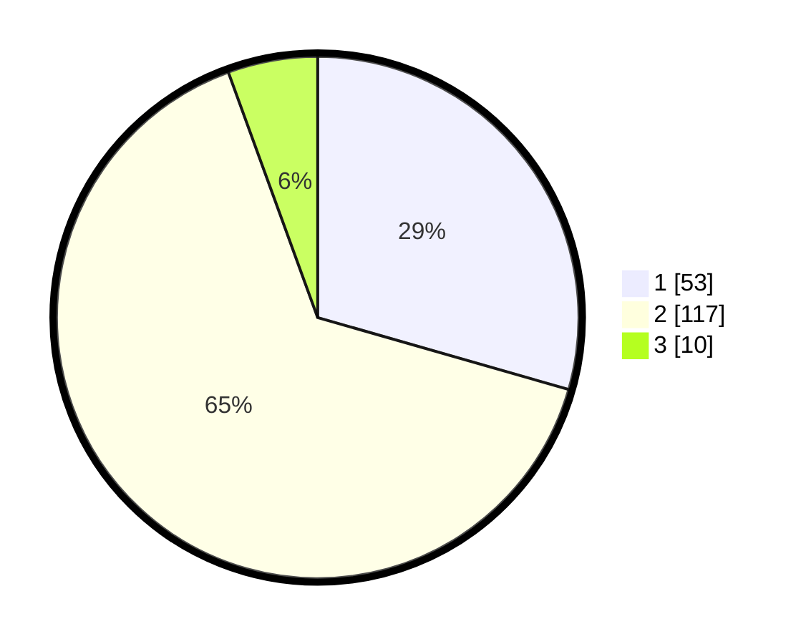

# Hasil

## Grafik

## Tabel

| No. | Nama Paslon    | Suara | Suara (raw) | Persentase |
|:--- |:-------------- | -----:| -----------:| ----------:|
| 1   | ANIES MUHAIMIN | 53    | [53][p-1]   | 29,44      |
| 2   | PRABOWO GIBRAN | 117   | [117][p-2]  | 65,00      |
| 3   | GANJAR MAHFUD  | 10    | [10][p-3]   | 5,56       |

[p-1]: https://github.com/gigit-pemilu/pemilu-2024/blob/main/pilpres/hitung-suara/sub/35-jawa-timur/sub/09-jember/sub/29-sukowono/sub/2001-sumberwringin/sub/015-tps/sub/paslon-1.txt
[p-2]: https://github.com/gigit-pemilu/pemilu-2024/blob/main/pilpres/hitung-suara/sub/35-jawa-timur/sub/09-jember/sub/29-sukowono/sub/2001-sumberwringin/sub/015-tps/sub/paslon-2.txt
[p-3]: https://github.com/gigit-pemilu/pemilu-2024/blob/main/pilpres/hitung-suara/sub/35-jawa-timur/sub/09-jember/sub/29-sukowono/sub/2001-sumberwringin/sub/015-tps/sub/paslon-3.txt

## Foto C Plano

https://sirekap-obj-formc.kpu.go.id/3a24/pemilu/ppwp/35/09/29/20/01/3509292001015-20240214-193234--051fc698-fdba-4476-94c7-dc281fac6a96.jpg

https://sirekap-obj-formc.kpu.go.id/3a24/pemilu/ppwp/35/09/29/20/01/3509292001015-20240214-192930--35fe3c5c-a2da-41b0-bc85-319d10346952.jpg

https://sirekap-obj-formc.kpu.go.id/3a24/pemilu/ppwp/35/09/29/20/01/3509292001015-20240214-193059--27a6d796-888c-40d3-960e-20867f2d84df.jpg

## Metadata

| Key        | Value               |
| ---------- | ------------------- |
| Time Stamp | 2024-02-15 18:00:26 |

