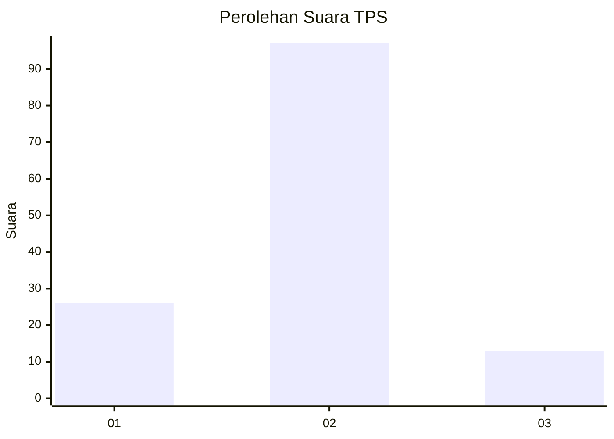
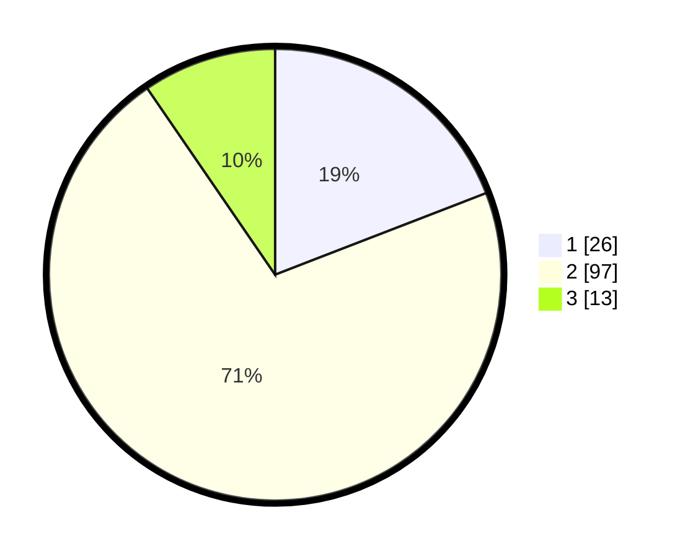

# Hasil

## Grafik

## Tabel

| No. | Nama Paslon    | Suara | Suara (raw) | Persentase |
|:--- |:-------------- | -----:| -----------:| ----------:|
| 1   | ANIES MUHAIMIN | 26    | [26][p-1]   | 19,12      |
| 2   | PRABOWO GIBRAN | 97    | [97][p-2]   | 71,32      |
| 3   | GANJAR MAHFUD  | 13    | [13][p-3]   | 9,56       |

[p-1]: https://github.com/gigit-pemilu/pemilu-2024-35-jawa-timur/blob/main/pilpres/hitung-suara/sub/35-jawa-timur/sub/09-jember/sub/29-sukowono/sub/2001-sumberwringin/sub/021-tps/sub/paslon-1.txt
[p-2]: https://github.com/gigit-pemilu/pemilu-2024-35-jawa-timur/blob/main/pilpres/hitung-suara/sub/35-jawa-timur/sub/09-jember/sub/29-sukowono/sub/2001-sumberwringin/sub/021-tps/sub/paslon-2.txt
[p-3]: https://github.com/gigit-pemilu/pemilu-2024-35-jawa-timur/blob/main/pilpres/hitung-suara/sub/35-jawa-timur/sub/09-jember/sub/29-sukowono/sub/2001-sumberwringin/sub/021-tps/sub/paslon-3.txt

## Foto C Plano

https://sirekap-obj-formc.kpu.go.id/3a35/pemilu/ppwp/35/09/29/20/01/3509292001021-20240214-221020--978c054a-55f3-43a2-a2a7-cd0f747d78fd.jpg

https://sirekap-obj-formc.kpu.go.id/3a35/pemilu/ppwp/35/09/29/20/01/3509292001021-20240214-221025--05f04ad3-997b-45f7-b22d-86b8f14f4349.jpg

https://sirekap-obj-formc.kpu.go.id/3a35/pemilu/ppwp/35/09/29/20/01/3509292001021-20240214-221029--2dce4672-e3ae-4bac-bee2-1a92bd44b5b6.jpg

## Metadata

| Key        | Value               |
| ---------- | ------------------- |
| Time Stamp | 2024-02-15 21:01:18 |

