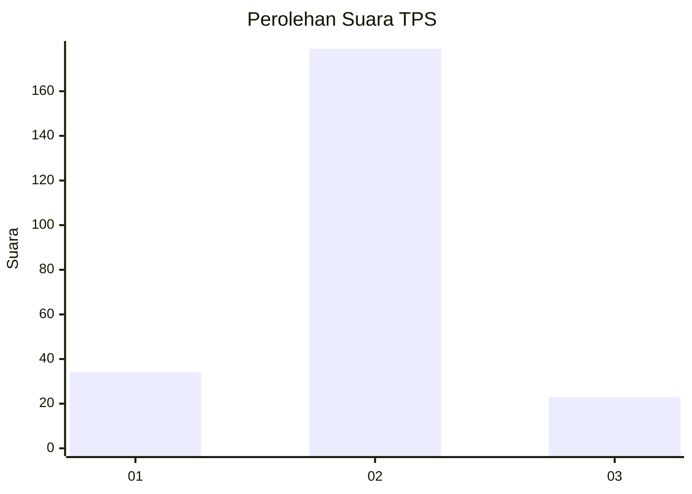
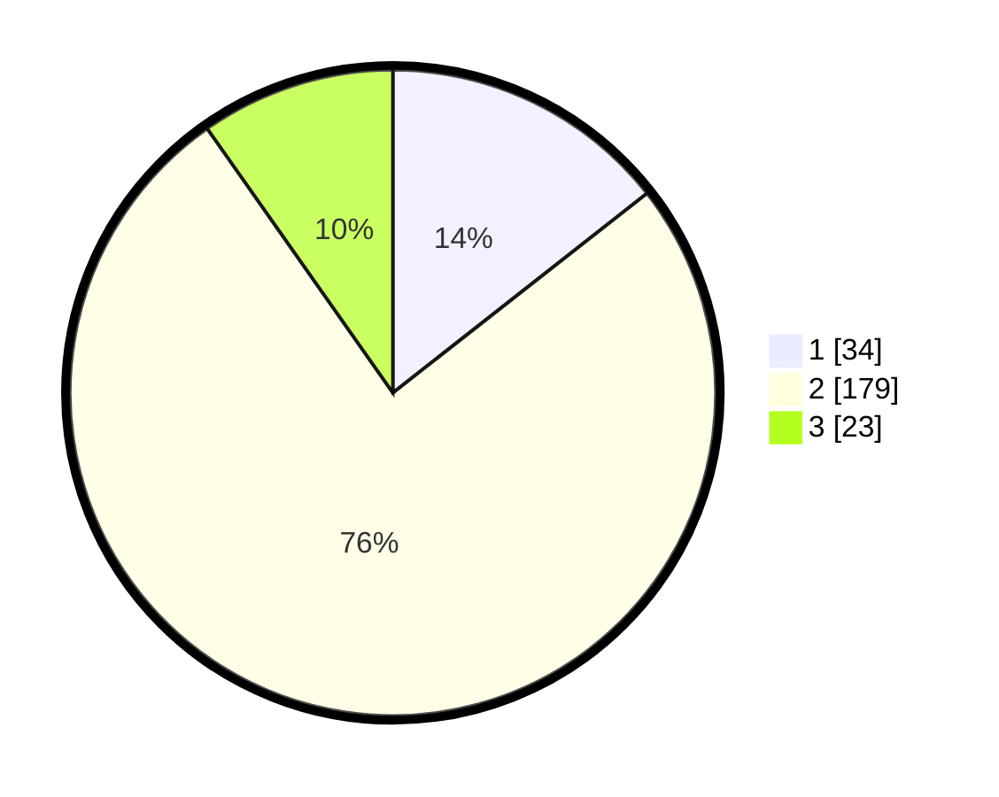

# Hasil

## Grafik

## Tabel

| No. | Nama Paslon    | Suara | Suara (raw) | Persentase |
|:--- |:-------------- | -----:| -----------:| ----------:|
| 1   | ANIES MUHAIMIN | 34    | [34][p-1]   | 14,41      |
| 2   | PRABOWO GIBRAN | 179   | [179][p-2]  | 75,85      |
| 3   | GANJAR MAHFUD  | 23    | [23][p-3]   | 9,75       |

[p-1]: https://github.com/gigit-pemilu/pemilu-2024/blob/main/pilpres/hitung-suara/sub/35-jawa-timur/sub/09-jember/sub/29-sukowono/sub/2002-sukokerto/sub/006-tps/sub/paslon-1.txt
[p-2]: https://github.com/gigit-pemilu/pemilu-2024/blob/main/pilpres/hitung-suara/sub/35-jawa-timur/sub/09-jember/sub/29-sukowono/sub/2002-sukokerto/sub/006-tps/sub/paslon-2.txt
[p-3]: https://github.com/gigit-pemilu/pemilu-2024/blob/main/pilpres/hitung-suara/sub/35-jawa-timur/sub/09-jember/sub/29-sukowono/sub/2002-sukokerto/sub/006-tps/sub/paslon-3.txt

## Foto C Plano

https://sirekap-obj-formc.kpu.go.id/222d/pemilu/ppwp/35/09/29/20/02/3509292002006-20240215-062509--efc9d7d4-b3db-4b4a-9b9e-fb46fba3a4f2.jpg

https://sirekap-obj-formc.kpu.go.id/222d/pemilu/ppwp/35/09/29/20/02/3509292002006-20240215-030319--be64ee08-e36f-47d9-8e9b-c9ed0490f421.jpg

https://sirekap-obj-formc.kpu.go.id/222d/pemilu/ppwp/35/09/29/20/02/3509292002006-20240215-030511--c1854f97-f9e1-471a-9032-11f47a8fa723.jpg

## Metadata

| Key        | Value               |
| ---------- | ------------------- |
| Time Stamp | 2024-02-15 19:30:26 |

