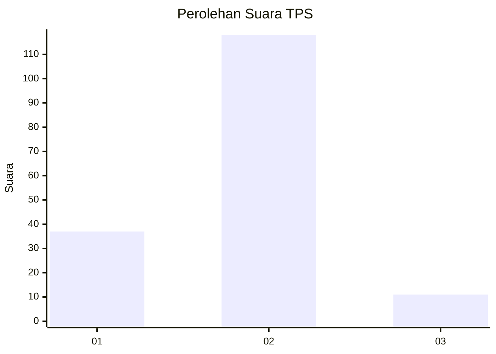

# Hasil

## Grafik

## Tabel

| No. | Nama Paslon    | Suara | Suara (raw) | Persentase |
|:--- |:-------------- | -----:| -----------:| ----------:|
| 1   | ANIES MUHAIMIN | 37    | [37][p-1]   | 22,29      |
| 2   | PRABOWO GIBRAN | 118   | [118][p-2]  | 71,08      |
| 3   | GANJAR MAHFUD  | 11    | [11][p-3]   | 6,63       |

[p-1]: https://github.com/gigit-pemilu/pemilu-2024-35-jawa-timur/blob/main/pilpres/hitung-suara/sub/35-jawa-timur/sub/09-jember/sub/29-sukowono/sub/2002-sukokerto/sub/011-tps/sub/paslon-1.txt
[p-2]: https://github.com/gigit-pemilu/pemilu-2024-35-jawa-timur/blob/main/pilpres/hitung-suara/sub/35-jawa-timur/sub/09-jember/sub/29-sukowono/sub/2002-sukokerto/sub/011-tps/sub/paslon-2.txt
[p-3]: https://github.com/gigit-pemilu/pemilu-2024-35-jawa-timur/blob/main/pilpres/hitung-suara/sub/35-jawa-timur/sub/09-jember/sub/29-sukowono/sub/2002-sukokerto/sub/011-tps/sub/paslon-3.txt

## Foto C Plano

https://sirekap-obj-formc.kpu.go.id/5ba9/pemilu/ppwp/35/09/29/20/02/3509292002011-20240214-222313--3f702764-3ff5-4483-8c0f-f141467b2145.jpg

https://sirekap-obj-formc.kpu.go.id/5ba9/pemilu/ppwp/35/09/29/20/02/3509292002011-20240214-222550--50a45241-2875-4c3a-9946-fbcdc9199550.jpg

https://sirekap-obj-formc.kpu.go.id/5ba9/pemilu/ppwp/35/09/29/20/02/3509292002011-20240214-223155--ca00bf31-8bfd-41f7-8bb9-effba522918a.jpg

## Metadata

| Key        | Value               |
| ---------- | ------------------- |
| Time Stamp | 2024-02-17 16:00:02 |

