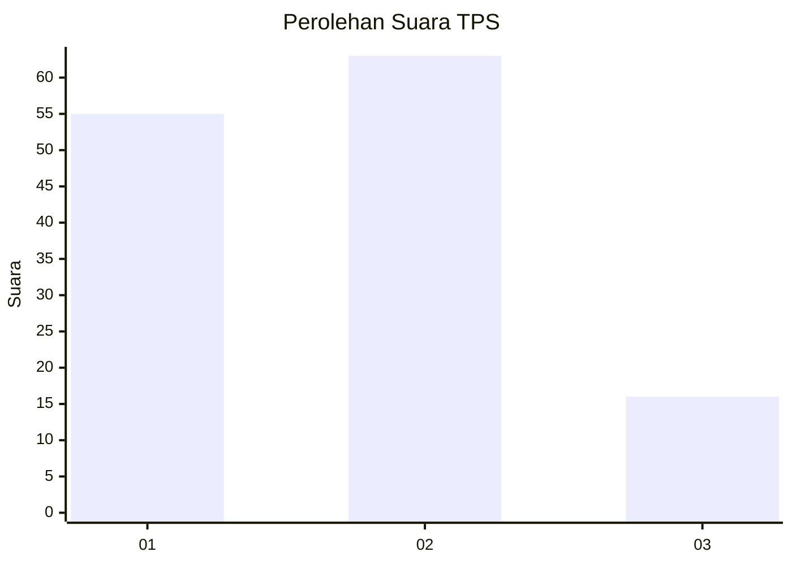
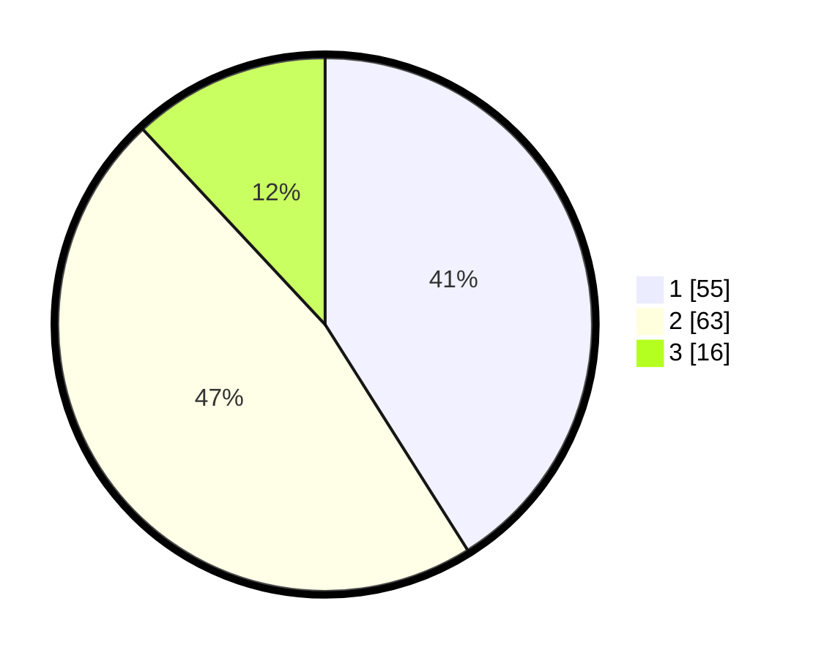

# Hasil

## Grafik

## Tabel

| No. | Nama Paslon    | Suara | Suara (raw) | Persentase |
|:--- |:-------------- | -----:| -----------:| ----------:|
| 1   | ANIES MUHAIMIN | 55    | [55][p-1]   | 41,04      |
| 2   | PRABOWO GIBRAN | 63    | [63][p-2]   | 47,01      |
| 3   | GANJAR MAHFUD  | 16    | [16][p-3]   | 11,94      |

[p-1]: https://github.com/gigit-pemilu/pemilu-2024/blob/main/pilpres/hitung-suara/sub/35-jawa-timur/sub/09-jember/sub/29-sukowono/sub/2002-sukokerto/sub/013-tps/sub/paslon-1.txt
[p-2]: https://github.com/gigit-pemilu/pemilu-2024/blob/main/pilpres/hitung-suara/sub/35-jawa-timur/sub/09-jember/sub/29-sukowono/sub/2002-sukokerto/sub/013-tps/sub/paslon-2.txt
[p-3]: https://github.com/gigit-pemilu/pemilu-2024/blob/main/pilpres/hitung-suara/sub/35-jawa-timur/sub/09-jember/sub/29-sukowono/sub/2002-sukokerto/sub/013-tps/sub/paslon-3.txt

## Foto C Plano

https://sirekap-obj-formc.kpu.go.id/7b99/pemilu/ppwp/35/09/29/20/02/3509292002013-20240215-000828--c1243ed9-d266-4955-a119-fed9dbe7d740.jpg

https://sirekap-obj-formc.kpu.go.id/7b99/pemilu/ppwp/35/09/29/20/02/3509292002013-20240215-000940--6ca28ab3-1f62-4c13-80f9-75a79c70fcf3.jpg

https://sirekap-obj-formc.kpu.go.id/7b99/pemilu/ppwp/35/09/29/20/02/3509292002013-20240215-001046--a9ee62c0-1220-439e-8ef6-f3ee717d309c.jpg

## Metadata

| Key        | Value               |
| ---------- | ------------------- |
| Time Stamp | 2024-02-15 20:00:44 |

