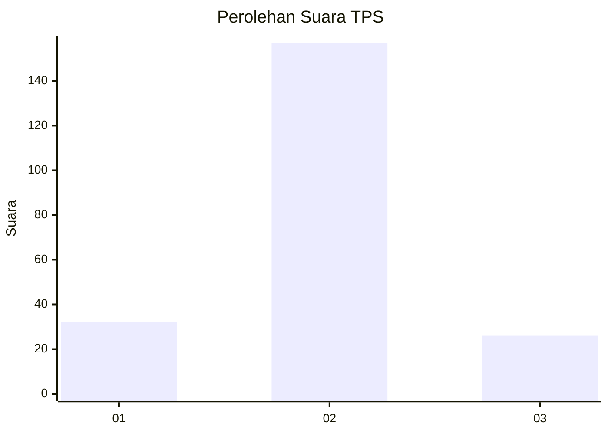
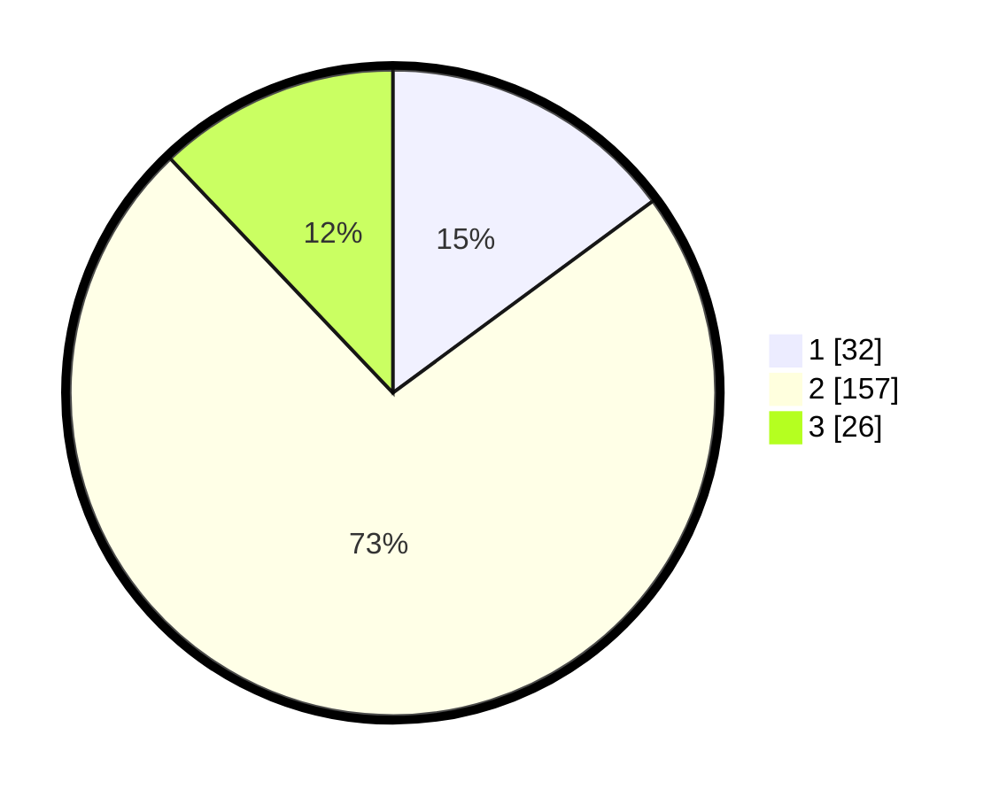

# Hasil

## Grafik

## Tabel

| No. | Nama Paslon    | Suara | Suara (raw) | Persentase |
|:--- |:-------------- | -----:| -----------:| ----------:|
| 1   | ANIES MUHAIMIN | 32    | [32][p-1]   | 14,88      |
| 2   | PRABOWO GIBRAN | 157   | [157][p-2]  | 73,02      |
| 3   | GANJAR MAHFUD  | 26    | [26][p-3]   | 12,09      |

[p-1]: https://github.com/gigit-pemilu/pemilu-2024/blob/main/pilpres/hitung-suara/sub/35-jawa-timur/sub/09-jember/sub/29-sukowono/sub/2003-sumberwaru/sub/003-tps/sub/paslon-1.txt
[p-2]: https://github.com/gigit-pemilu/pemilu-2024/blob/main/pilpres/hitung-suara/sub/35-jawa-timur/sub/09-jember/sub/29-sukowono/sub/2003-sumberwaru/sub/003-tps/sub/paslon-2.txt
[p-3]: https://github.com/gigit-pemilu/pemilu-2024/blob/main/pilpres/hitung-suara/sub/35-jawa-timur/sub/09-jember/sub/29-sukowono/sub/2003-sumberwaru/sub/003-tps/sub/paslon-3.txt

## Foto C Plano

https://sirekap-obj-formc.kpu.go.id/6ed9/pemilu/ppwp/35/09/29/20/03/3509292003003-20240215-002229--22ea95fc-1164-40b4-bf28-b65b5f076a75.jpg

https://sirekap-obj-formc.kpu.go.id/6ed9/pemilu/ppwp/35/09/29/20/03/3509292003003-20240215-002324--7c2753e7-3ad1-4c1a-8b85-7c27712c65b9.jpg

https://sirekap-obj-formc.kpu.go.id/6ed9/pemilu/ppwp/35/09/29/20/03/3509292003003-20240215-002406--26998f39-21fe-4e9d-9c1a-8117bccc641a.jpg

## Metadata

| Key        | Value               |
| ---------- | ------------------- |
| Time Stamp | 2024-02-15 20:00:44 |

