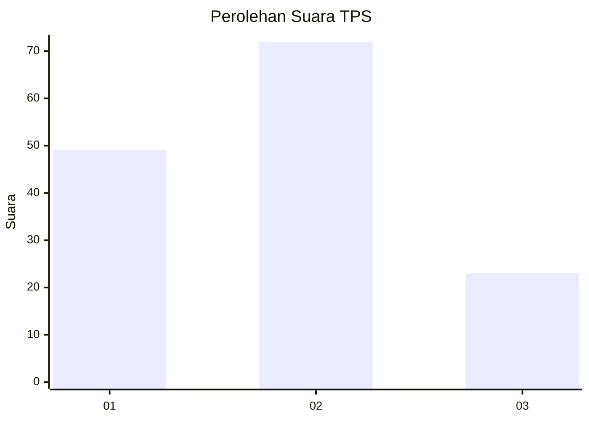
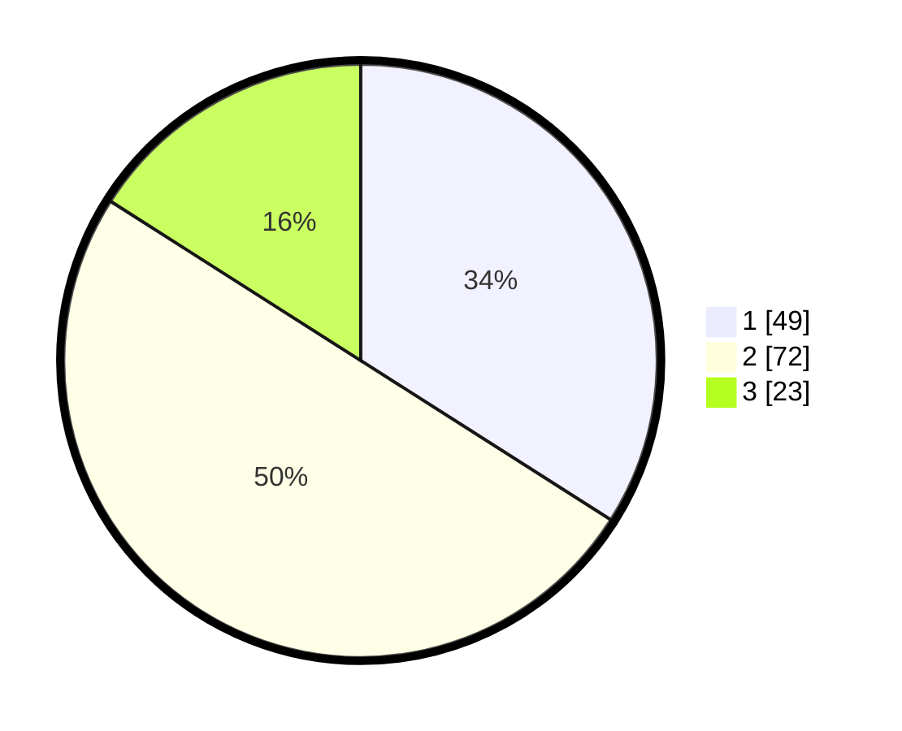

# Hasil

## Grafik

## Tabel

| No. | Nama Paslon    | Suara | Suara (raw) | Persentase |
|:--- |:-------------- | -----:| -----------:| ----------:|
| 1   | ANIES MUHAIMIN | 49    | [49][p-1]   | 34,03      |
| 2   | PRABOWO GIBRAN | 72    | [72][p-2]   | 50,00      |
| 3   | GANJAR MAHFUD  | 23    | [23][p-3]   | 15,97      |

[p-1]: https://github.com/gigit-pemilu/pemilu-2024/blob/main/pilpres/hitung-suara/sub/35-jawa-timur/sub/09-jember/sub/29-sukowono/sub/2003-sumberwaru/sub/008-tps/sub/paslon-1.txt
[p-2]: https://github.com/gigit-pemilu/pemilu-2024/blob/main/pilpres/hitung-suara/sub/35-jawa-timur/sub/09-jember/sub/29-sukowono/sub/2003-sumberwaru/sub/008-tps/sub/paslon-2.txt
[p-3]: https://github.com/gigit-pemilu/pemilu-2024/blob/main/pilpres/hitung-suara/sub/35-jawa-timur/sub/09-jember/sub/29-sukowono/sub/2003-sumberwaru/sub/008-tps/sub/paslon-3.txt

## Foto C Plano

https://sirekap-obj-formc.kpu.go.id/fa1c/pemilu/ppwp/35/09/29/20/03/3509292003008-20240215-024356--7d5b8108-c301-471f-a199-20c0e8c7e9a4.jpg

https://sirekap-obj-formc.kpu.go.id/fa1c/pemilu/ppwp/35/09/29/20/03/3509292003008-20240215-024442--b6de998c-9e1b-403e-a1d8-d08153a87765.jpg

https://sirekap-obj-formc.kpu.go.id/fa1c/pemilu/ppwp/35/09/29/20/03/3509292003008-20240215-024525--81218e36-6848-483d-aa13-cc74d5ae9081.jpg

## Metadata

| Key        | Value               |
| ---------- | ------------------- |
| Time Stamp | 2024-02-15 20:00:44 |

