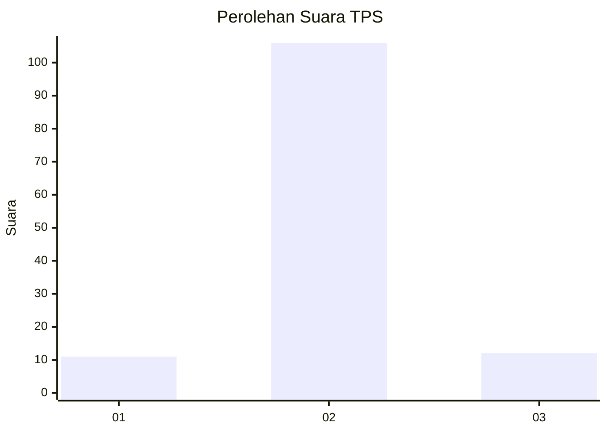
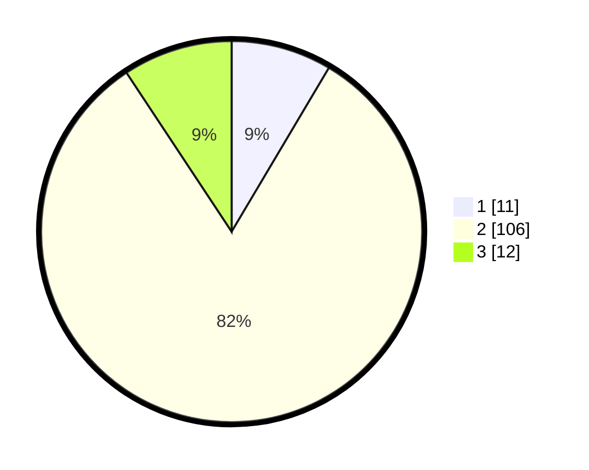

# Hasil

## Grafik

## Tabel

| No. | Nama Paslon    | Suara | Suara (raw) | Persentase |
|:--- |:-------------- | -----:| -----------:| ----------:|
| 1   | ANIES MUHAIMIN | 11    | [11][p-1]   | 8,53       |
| 2   | PRABOWO GIBRAN | 106   | [106][p-2]  | 82,17      |
| 3   | GANJAR MAHFUD  | 12    | [12][p-3]   | 9,30       |

[p-1]: https://github.com/gigit-pemilu/pemilu-2024/blob/main/pilpres/hitung-suara/sub/35-jawa-timur/sub/09-jember/sub/29-sukowono/sub/2003-sumberwaru/sub/011-tps/sub/paslon-1.txt
[p-2]: https://github.com/gigit-pemilu/pemilu-2024/blob/main/pilpres/hitung-suara/sub/35-jawa-timur/sub/09-jember/sub/29-sukowono/sub/2003-sumberwaru/sub/011-tps/sub/paslon-2.txt
[p-3]: https://github.com/gigit-pemilu/pemilu-2024/blob/main/pilpres/hitung-suara/sub/35-jawa-timur/sub/09-jember/sub/29-sukowono/sub/2003-sumberwaru/sub/011-tps/sub/paslon-3.txt

## Foto C Plano

https://sirekap-obj-formc.kpu.go.id/15f0/pemilu/ppwp/35/09/29/20/03/3509292003011-20240214-203723--04aab632-56d1-4f23-9c10-da8ef3dd4b98.jpg

https://sirekap-obj-formc.kpu.go.id/15f0/pemilu/ppwp/35/09/29/20/03/3509292003011-20240214-203820--945c20e0-0d17-4761-b6e0-3da8fd81b78e.jpg

https://sirekap-obj-formc.kpu.go.id/15f0/pemilu/ppwp/35/09/29/20/03/3509292003011-20240214-203937--3741f03b-5053-4614-9529-ddc1ff8732a9.jpg

## Metadata

| Key        | Value               |
| ---------- | ------------------- |
| Time Stamp | 2024-02-15 18:00:26 |

