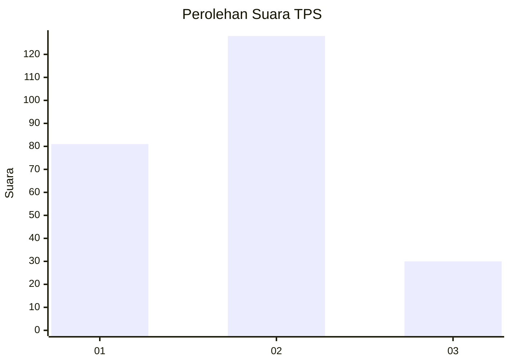
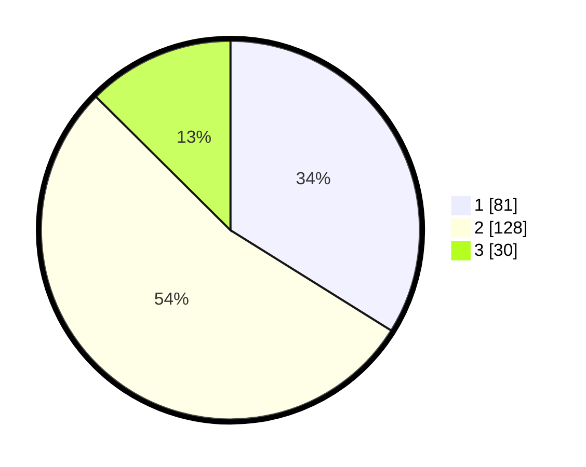

# Hasil

## Grafik

## Tabel

| No. | Nama Paslon    | Suara | Suara (raw) | Persentase |
|:--- |:-------------- | -----:| -----------:| ----------:|
| 1   | ANIES MUHAIMIN | 81    | [81][p-1]   | 33,89      |
| 2   | PRABOWO GIBRAN | 128   | [128][p-2]  | 53,56      |
| 3   | GANJAR MAHFUD  | 30    | [30][p-3]   | 12,55      |

[p-1]: https://github.com/gigit-pemilu/pemilu-2024/blob/main/pilpres/hitung-suara/sub/35-jawa-timur/sub/09-jember/sub/29-sukowono/sub/2003-sumberwaru/sub/014-tps/sub/paslon-1.txt
[p-2]: https://github.com/gigit-pemilu/pemilu-2024/blob/main/pilpres/hitung-suara/sub/35-jawa-timur/sub/09-jember/sub/29-sukowono/sub/2003-sumberwaru/sub/014-tps/sub/paslon-2.txt
[p-3]: https://github.com/gigit-pemilu/pemilu-2024/blob/main/pilpres/hitung-suara/sub/35-jawa-timur/sub/09-jember/sub/29-sukowono/sub/2003-sumberwaru/sub/014-tps/sub/paslon-3.txt

## Foto C Plano

https://sirekap-obj-formc.kpu.go.id/2576/pemilu/ppwp/35/09/29/20/03/3509292003014-20240214-231340--0854b03c-6171-40ea-824b-ef0f9b01446b.jpg

https://sirekap-obj-formc.kpu.go.id/2576/pemilu/ppwp/35/09/29/20/03/3509292003014-20240214-231512--c6a6cd05-eb5f-4dca-acf7-bd4d38a0f2d0.jpg

https://sirekap-obj-formc.kpu.go.id/2576/pemilu/ppwp/35/09/29/20/03/3509292003014-20240214-231740--b20481f1-6e09-48f1-abc3-78506e2567ac.jpg

## Metadata

| Key        | Value               |
| ---------- | ------------------- |
| Time Stamp | 2024-02-15 18:30:25 |

