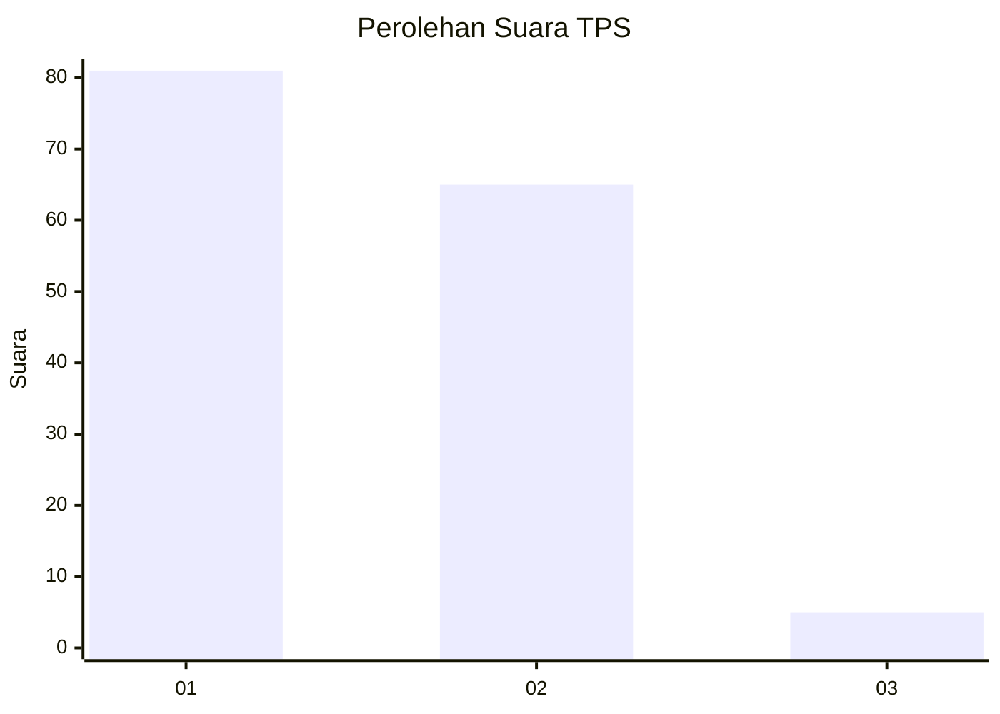
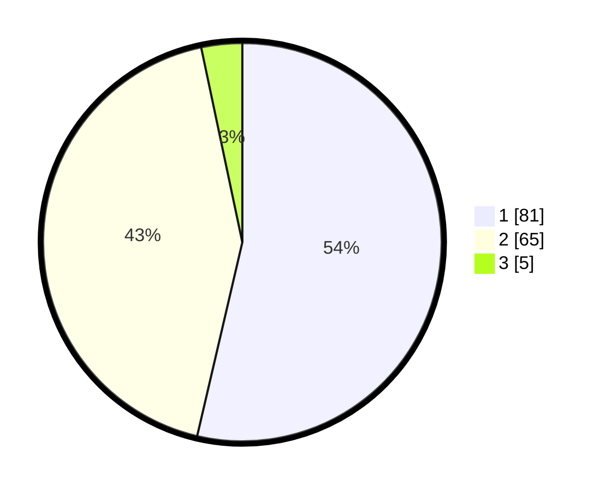

# Hasil

## Grafik

## Tabel

| No. | Nama Paslon    | Suara | Suara (raw) | Persentase |
|:--- |:-------------- | -----:| -----------:| ----------:|
| 1   | ANIES MUHAIMIN | 81    | [81][p-1]   | 53,64      |
| 2   | PRABOWO GIBRAN | 65    | [65][p-2]   | 43,05      |
| 3   | GANJAR MAHFUD  | 5     | [5][p-3]    | 3,31       |

[p-1]: https://github.com/gigit-pemilu/pemilu-2024-35-jawa-timur/blob/main/pilpres/hitung-suara/sub/35-jawa-timur/sub/09-jember/sub/29-sukowono/sub/2003-sumberwaru/sub/016-tps/sub/paslon-1.txt
[p-2]: https://github.com/gigit-pemilu/pemilu-2024-35-jawa-timur/blob/main/pilpres/hitung-suara/sub/35-jawa-timur/sub/09-jember/sub/29-sukowono/sub/2003-sumberwaru/sub/016-tps/sub/paslon-2.txt
[p-3]: https://github.com/gigit-pemilu/pemilu-2024-35-jawa-timur/blob/main/pilpres/hitung-suara/sub/35-jawa-timur/sub/09-jember/sub/29-sukowono/sub/2003-sumberwaru/sub/016-tps/sub/paslon-3.txt

## Foto C Plano

https://sirekap-obj-formc.kpu.go.id/3456/pemilu/ppwp/35/09/29/20/03/3509292003016-20240214-224511--ba322cd8-c202-4b93-84ba-9f8612188c2c.jpg

https://sirekap-obj-formc.kpu.go.id/3456/pemilu/ppwp/35/09/29/20/03/3509292003016-20240214-224632--ac756f24-ae68-48fc-aac0-3d3ceefad117.jpg

https://sirekap-obj-formc.kpu.go.id/3456/pemilu/ppwp/35/09/29/20/03/3509292003016-20240214-224710--39adb080-69dd-4b45-b413-8acf823c50af.jpg

## Metadata

| Key        | Value               |
| ---------- | ------------------- |
| Time Stamp | 2024-02-15 20:00:44 |

