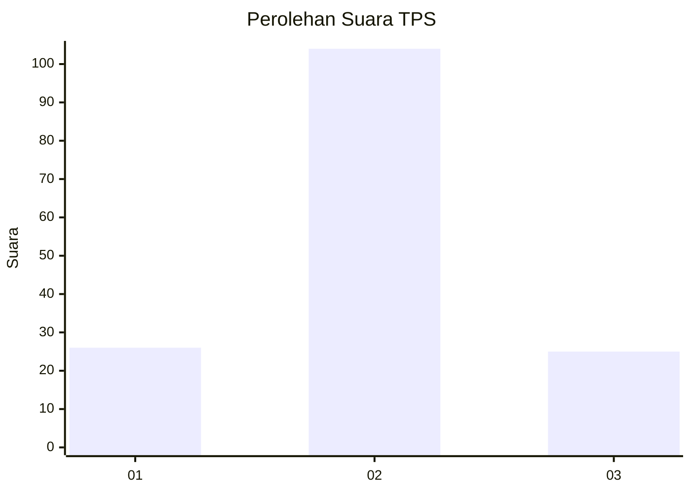
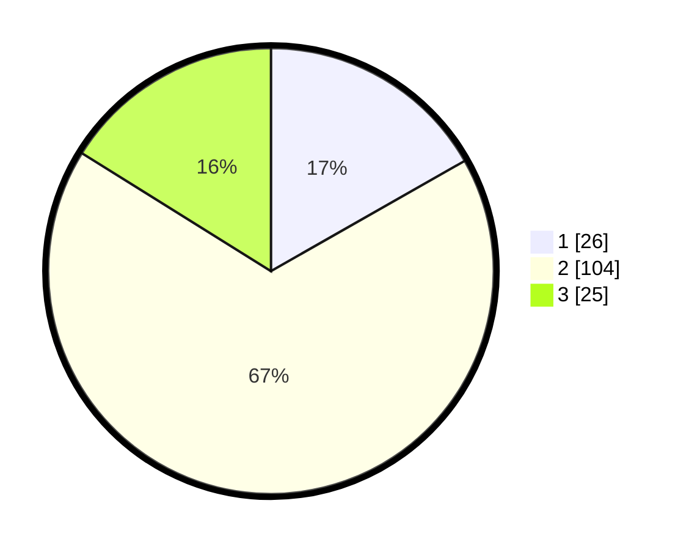

# Hasil

## Grafik

## Tabel

| No. | Nama Paslon    | Suara | Suara (raw) | Persentase |
|:--- |:-------------- | -----:| -----------:| ----------:|
| 1   | ANIES MUHAIMIN | 26    | [26][p-1]   | 16,77      |
| 2   | PRABOWO GIBRAN | 104   | [104][p-2]  | 67,10      |
| 3   | GANJAR MAHFUD  | 25    | [25][p-3]   | 16,13      |

[p-1]: https://github.com/gigit-pemilu/pemilu-2024/blob/main/pilpres/hitung-suara/sub/35-jawa-timur/sub/09-jember/sub/29-sukowono/sub/2003-sumberwaru/sub/017-tps/sub/paslon-1.txt
[p-2]: https://github.com/gigit-pemilu/pemilu-2024/blob/main/pilpres/hitung-suara/sub/35-jawa-timur/sub/09-jember/sub/29-sukowono/sub/2003-sumberwaru/sub/017-tps/sub/paslon-2.txt
[p-3]: https://github.com/gigit-pemilu/pemilu-2024/blob/main/pilpres/hitung-suara/sub/35-jawa-timur/sub/09-jember/sub/29-sukowono/sub/2003-sumberwaru/sub/017-tps/sub/paslon-3.txt

## Foto C Plano

https://sirekap-obj-formc.kpu.go.id/5f8d/pemilu/ppwp/35/09/29/20/03/3509292003017-20240214-221450--68cb59af-87fa-4a08-893d-fd66c4a303d6.jpg

https://sirekap-obj-formc.kpu.go.id/5f8d/pemilu/ppwp/35/09/29/20/03/3509292003017-20240214-223103--9d493185-84f3-4ae6-a175-7778415c29a9.jpg

https://sirekap-obj-formc.kpu.go.id/5f8d/pemilu/ppwp/35/09/29/20/03/3509292003017-20240214-223521--13adec3f-15ec-4f2d-8bb5-00dc0d3959b5.jpg

## Metadata

| Key        | Value               |
| ---------- | ------------------- |
| Time Stamp | 2024-02-15 18:30:25 |

