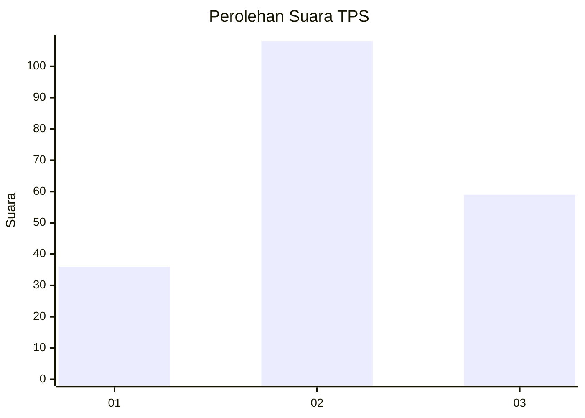
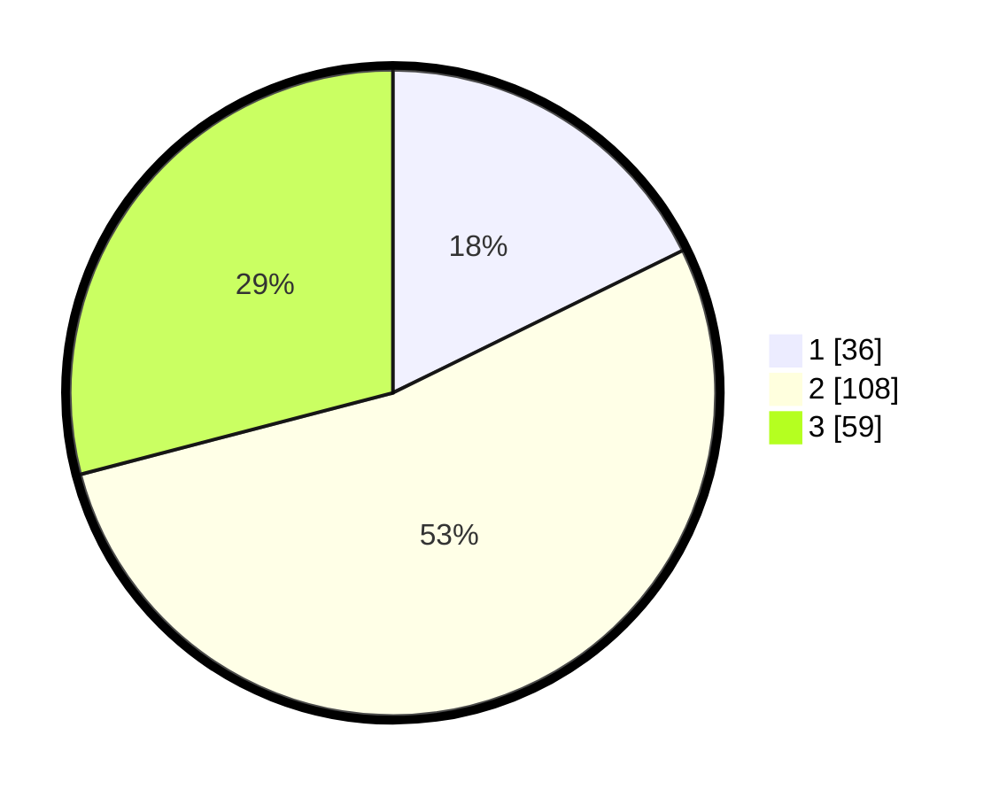

# Hasil

## Grafik

## Tabel

| No. | Nama Paslon    | Suara | Suara (raw) | Persentase |
|:--- |:-------------- | -----:| -----------:| ----------:|
| 1   | ANIES MUHAIMIN | 36    | [36][p-1]   | 17,73      |
| 2   | PRABOWO GIBRAN | 108   | [108][p-2]  | 53,20      |
| 3   | GANJAR MAHFUD  | 59    | [59][p-3]   | 29,06      |

[p-1]: https://github.com/gigit-pemilu/pemilu-2024/blob/main/pilpres/hitung-suara/sub/35-jawa-timur/sub/09-jember/sub/29-sukowono/sub/2004-sukowono/sub/004-tps/sub/paslon-1.txt
[p-2]: https://github.com/gigit-pemilu/pemilu-2024/blob/main/pilpres/hitung-suara/sub/35-jawa-timur/sub/09-jember/sub/29-sukowono/sub/2004-sukowono/sub/004-tps/sub/paslon-2.txt
[p-3]: https://github.com/gigit-pemilu/pemilu-2024/blob/main/pilpres/hitung-suara/sub/35-jawa-timur/sub/09-jember/sub/29-sukowono/sub/2004-sukowono/sub/004-tps/sub/paslon-3.txt

## Foto C Plano

https://sirekap-obj-formc.kpu.go.id/b26f/pemilu/ppwp/35/09/29/20/04/3509292004004-20240214-230705--c4938d66-dab2-4e8f-bdbc-d3ee482f7093.jpg

https://sirekap-obj-formc.kpu.go.id/b26f/pemilu/ppwp/35/09/29/20/04/3509292004004-20240214-230816--7747ad2d-b1d4-457b-b4d1-f91cbfb07231.jpg

https://sirekap-obj-formc.kpu.go.id/b26f/pemilu/ppwp/35/09/29/20/04/3509292004004-20240214-231139--96628636-ab9d-4065-8686-fc978b2a44df.jpg

## Metadata

| Key        | Value               |
| ---------- | ------------------- |
| Time Stamp | 2024-02-15 20:00:44 |

