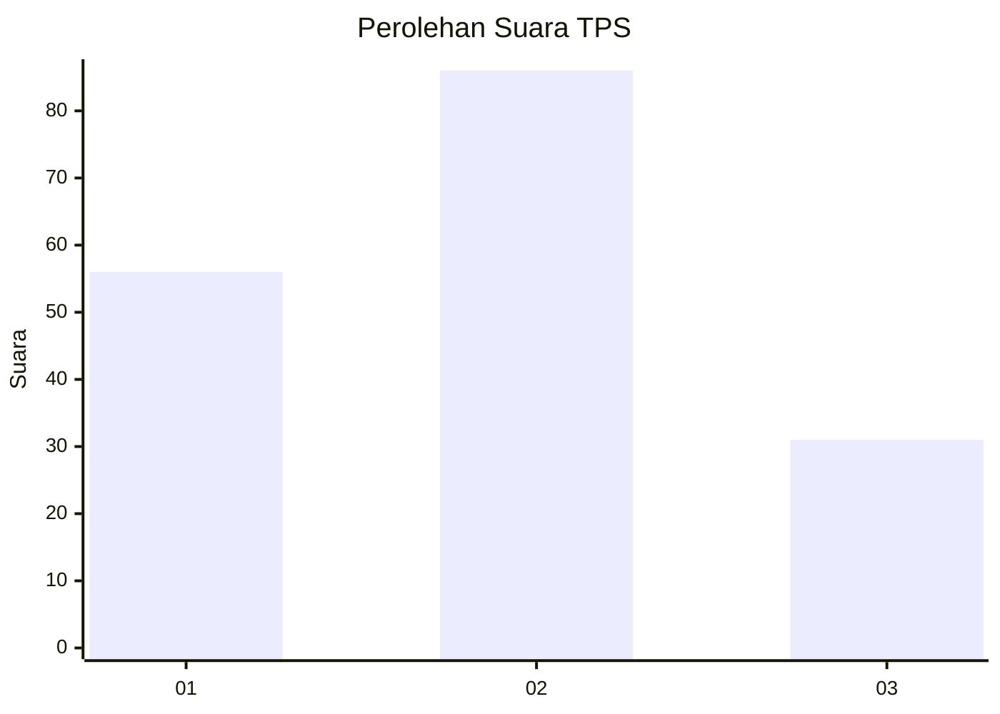
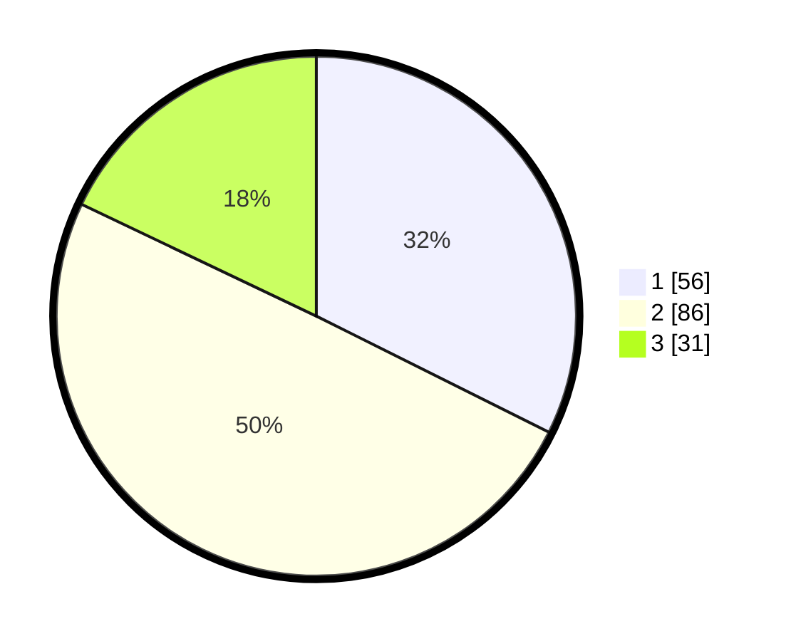

# Hasil

## Grafik

## Tabel

| No. | Nama Paslon    | Suara | Suara (raw) | Persentase |
|:--- |:-------------- | -----:| -----------:| ----------:|
| 1   | ANIES MUHAIMIN | 56    | [56][p-1]   | 32,37      |
| 2   | PRABOWO GIBRAN | 86    | [86][p-2]   | 49,71      |
| 3   | GANJAR MAHFUD  | 31    | [31][p-3]   | 17,92      |

[p-1]: https://github.com/gigit-pemilu/pemilu-2024/blob/main/pilpres/hitung-suara/sub/35-jawa-timur/sub/09-jember/sub/29-sukowono/sub/2004-sukowono/sub/017-tps/sub/paslon-1.txt
[p-2]: https://github.com/gigit-pemilu/pemilu-2024/blob/main/pilpres/hitung-suara/sub/35-jawa-timur/sub/09-jember/sub/29-sukowono/sub/2004-sukowono/sub/017-tps/sub/paslon-2.txt
[p-3]: https://github.com/gigit-pemilu/pemilu-2024/blob/main/pilpres/hitung-suara/sub/35-jawa-timur/sub/09-jember/sub/29-sukowono/sub/2004-sukowono/sub/017-tps/sub/paslon-3.txt

## Foto C Plano

https://sirekap-obj-formc.kpu.go.id/4776/pemilu/ppwp/35/09/29/20/04/3509292004017-20240216-185724--90a4e944-ac5b-4177-bb4d-eaba390bcce1.jpg

https://sirekap-obj-formc.kpu.go.id/4776/pemilu/ppwp/35/09/29/20/04/3509292004017-20240214-194207--5299cf4c-8858-46b6-89cc-a7648f827621.jpg

https://sirekap-obj-formc.kpu.go.id/4776/pemilu/ppwp/35/09/29/20/04/3509292004017-20240214-141636--e6f9f797-da6c-480b-aaa1-71d90ad0a595.jpg

## Metadata

| Key        | Value               |
| ---------- | ------------------- |
| Time Stamp | 2024-02-16 21:01:00 |

