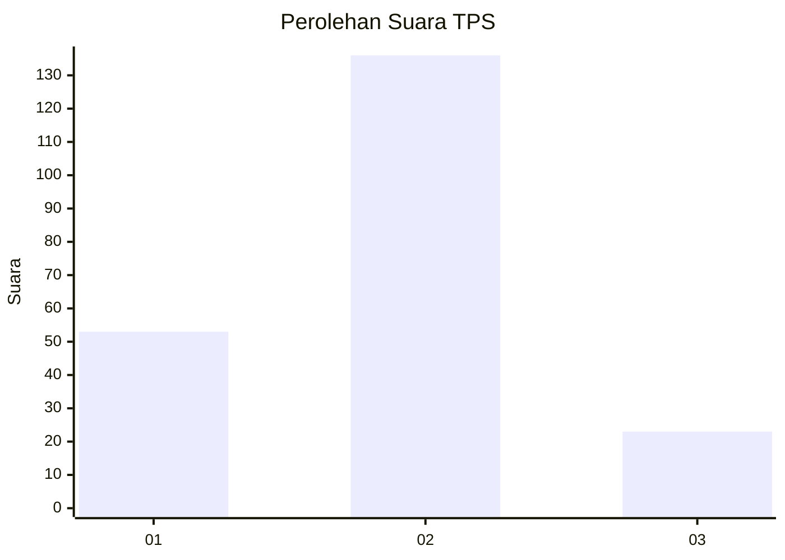
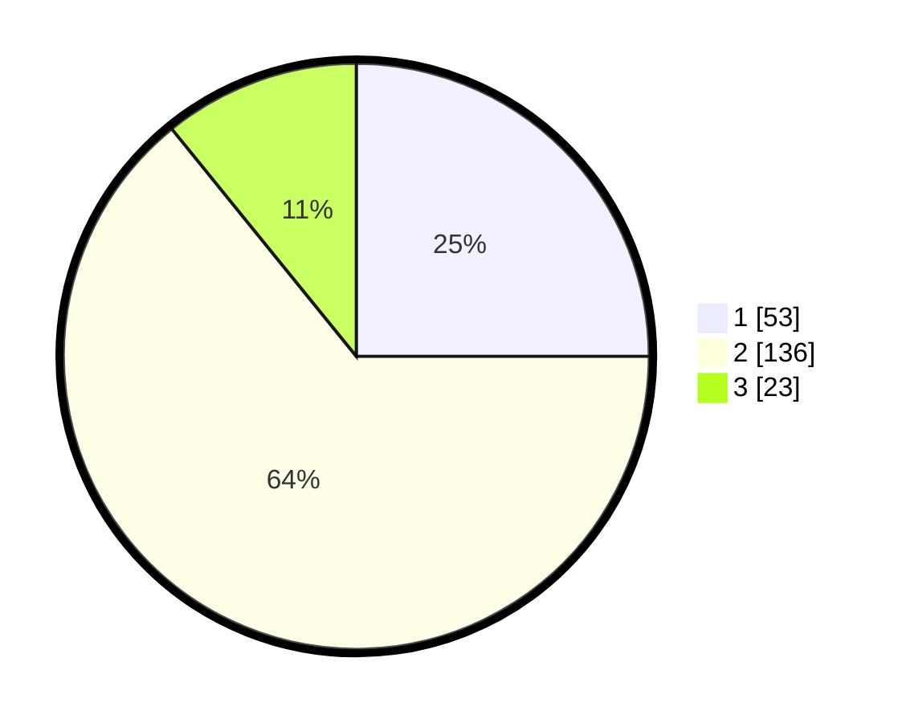

# Hasil

## Grafik

## Tabel

| No. | Nama Paslon    | Suara | Suara (raw) | Persentase |
|:--- |:-------------- | -----:| -----------:| ----------:|
| 1   | ANIES MUHAIMIN | 53    | [53][p-1]   | 25,00      |
| 2   | PRABOWO GIBRAN | 136   | [136][p-2]  | 64,15      |
| 3   | GANJAR MAHFUD  | 23    | [23][p-3]   | 10,85      |

[p-1]: https://github.com/gigit-pemilu/pemilu-2024/blob/main/pilpres/hitung-suara/sub/35-jawa-timur/sub/09-jember/sub/29-sukowono/sub/2004-sukowono/sub/021-tps/sub/paslon-1.txt
[p-2]: https://github.com/gigit-pemilu/pemilu-2024/blob/main/pilpres/hitung-suara/sub/35-jawa-timur/sub/09-jember/sub/29-sukowono/sub/2004-sukowono/sub/021-tps/sub/paslon-2.txt
[p-3]: https://github.com/gigit-pemilu/pemilu-2024/blob/main/pilpres/hitung-suara/sub/35-jawa-timur/sub/09-jember/sub/29-sukowono/sub/2004-sukowono/sub/021-tps/sub/paslon-3.txt

## Foto C Plano

https://sirekap-obj-formc.kpu.go.id/fc6d/pemilu/ppwp/35/09/29/20/04/3509292004021-20240214-223444--888bec15-0e85-4607-b4d5-ae8a73f43b7f.jpg

https://sirekap-obj-formc.kpu.go.id/fc6d/pemilu/ppwp/35/09/29/20/04/3509292004021-20240214-223531--9fc493fb-32d0-44e8-a324-8fcfe28124ac.jpg

https://sirekap-obj-formc.kpu.go.id/fc6d/pemilu/ppwp/35/09/29/20/04/3509292004021-20240217-002021--a4e75e70-6cf0-4211-8e83-268fbad7cb5e.jpg

## Metadata

| Key        | Value               |
| ---------- | ------------------- |
| Time Stamp | 2024-02-17 00:28:35 |

