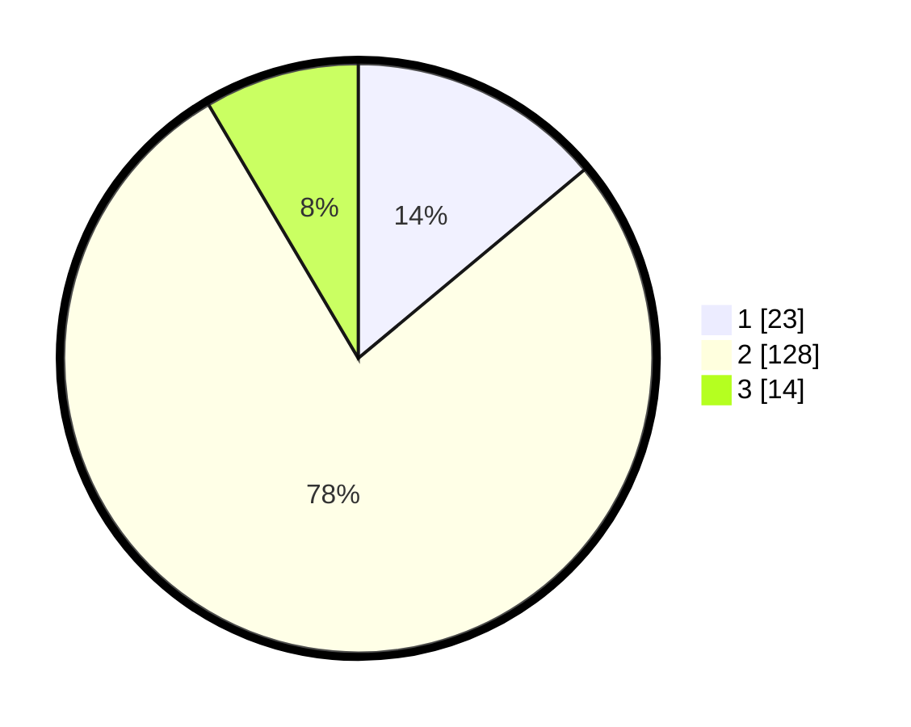

# Hasil

## Grafik

## Tabel

| No. | Nama Paslon    | Suara | Suara (raw) | Persentase |
|:--- |:-------------- | -----:| -----------:| ----------:|
| 1   | ANIES MUHAIMIN | 23    | [23][p-1]   | 13,94      |
| 2   | PRABOWO GIBRAN | 128   | [128][p-2]  | 77,58      |
| 3   | GANJAR MAHFUD  | 14    | [14][p-3]   | 8,48       |

[p-1]: https://github.com/gigit-pemilu/pemilu-2024/blob/main/pilpres/hitung-suara/sub/35-jawa-timur/sub/09-jember/sub/29-sukowono/sub/2004-sukowono/sub/024-tps/sub/paslon-1.txt
[p-2]: https://github.com/gigit-pemilu/pemilu-2024/blob/main/pilpres/hitung-suara/sub/35-jawa-timur/sub/09-jember/sub/29-sukowono/sub/2004-sukowono/sub/024-tps/sub/paslon-2.txt
[p-3]: https://github.com/gigit-pemilu/pemilu-2024/blob/main/pilpres/hitung-suara/sub/35-jawa-timur/sub/09-jember/sub/29-sukowono/sub/2004-sukowono/sub/024-tps/sub/paslon-3.txt

## Foto C Plano

https://sirekap-obj-formc.kpu.go.id/5664/pemilu/ppwp/35/09/29/20/04/3509292004024-20240214-193635--fa01e45c-8733-40dc-aff3-fc53d3280c1a.jpg

https://sirekap-obj-formc.kpu.go.id/5664/pemilu/ppwp/35/09/29/20/04/3509292004024-20240214-193638--b3ef9b65-541d-48ac-9ae8-d3fc9913848c.jpg

https://sirekap-obj-formc.kpu.go.id/5664/pemilu/ppwp/35/09/29/20/04/3509292004024-20240214-193641--71ce3aaa-1dfb-4b41-8597-9250c8bb197c.jpg

## Metadata

| Key        | Value               |
| ---------- | ------------------- |
| Time Stamp | 2024-02-15 20:00:44 |

