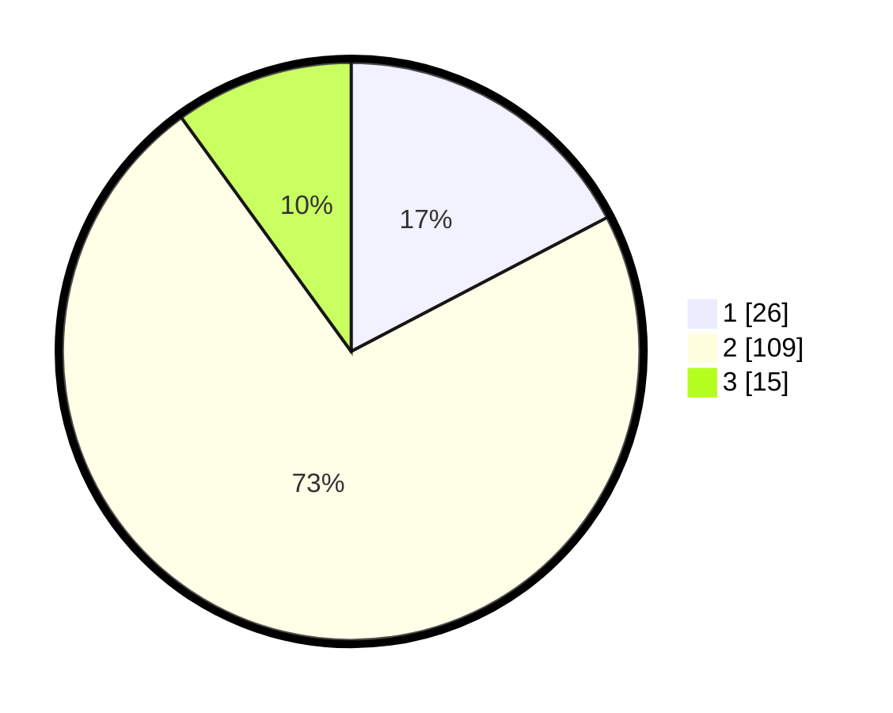

# Hasil

## Grafik

## Tabel

| No. | Nama Paslon    | Suara | Suara (raw) | Persentase |
|:--- |:-------------- | -----:| -----------:| ----------:|
| 1   | ANIES MUHAIMIN | 26    | [26][p-1]   | 17,33      |
| 2   | PRABOWO GIBRAN | 109   | [109][p-2]  | 72,67      |
| 3   | GANJAR MAHFUD  | 15    | [15][p-3]   | 10,00      |

[p-1]: https://github.com/gigit-pemilu/pemilu-2024/blob/main/pilpres/hitung-suara/sub/35-jawa-timur/sub/09-jember/sub/29-sukowono/sub/2004-sukowono/sub/025-tps/sub/paslon-1.txt
[p-2]: https://github.com/gigit-pemilu/pemilu-2024/blob/main/pilpres/hitung-suara/sub/35-jawa-timur/sub/09-jember/sub/29-sukowono/sub/2004-sukowono/sub/025-tps/sub/paslon-2.txt
[p-3]: https://github.com/gigit-pemilu/pemilu-2024/blob/main/pilpres/hitung-suara/sub/35-jawa-timur/sub/09-jember/sub/29-sukowono/sub/2004-sukowono/sub/025-tps/sub/paslon-3.txt

## Foto C Plano

https://sirekap-obj-formc.kpu.go.id/b7d9/pemilu/ppwp/35/09/29/20/04/3509292004025-20240214-141316--66afaaa3-8809-49e5-a97e-2c69e66fb97c.jpg

https://sirekap-obj-formc.kpu.go.id/b7d9/pemilu/ppwp/35/09/29/20/04/3509292004025-20240214-141459--15b4f1f4-345e-47b9-83bf-accc18d1ea10.jpg

https://sirekap-obj-formc.kpu.go.id/b7d9/pemilu/ppwp/35/09/29/20/04/3509292004025-20240214-141645--861dd912-8a8d-4555-b01e-23d3e62afc1b.jpg

## Metadata

| Key        | Value               |
| ---------- | ------------------- |
| Time Stamp | 2024-02-15 18:30:25 |

