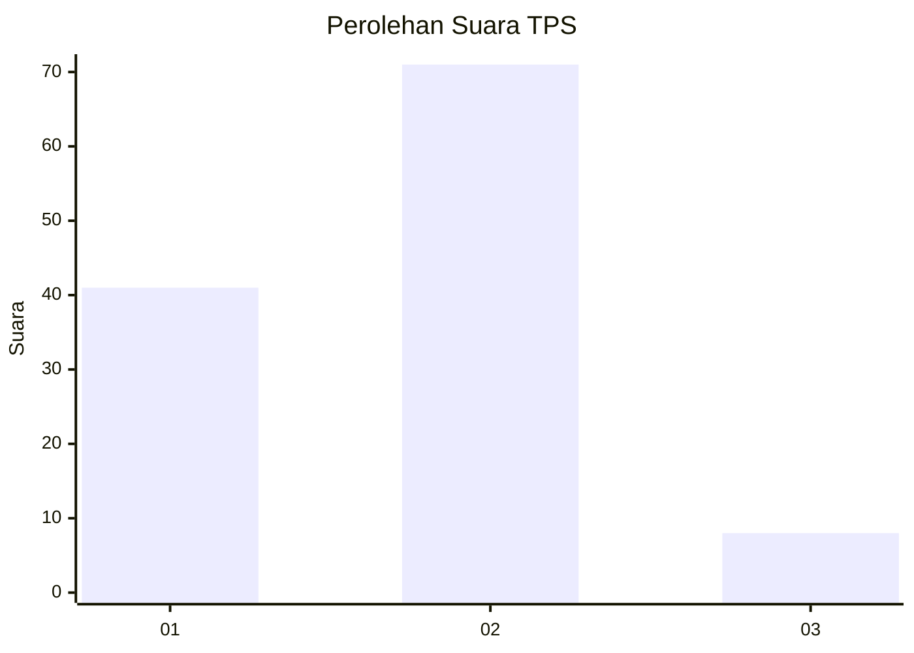
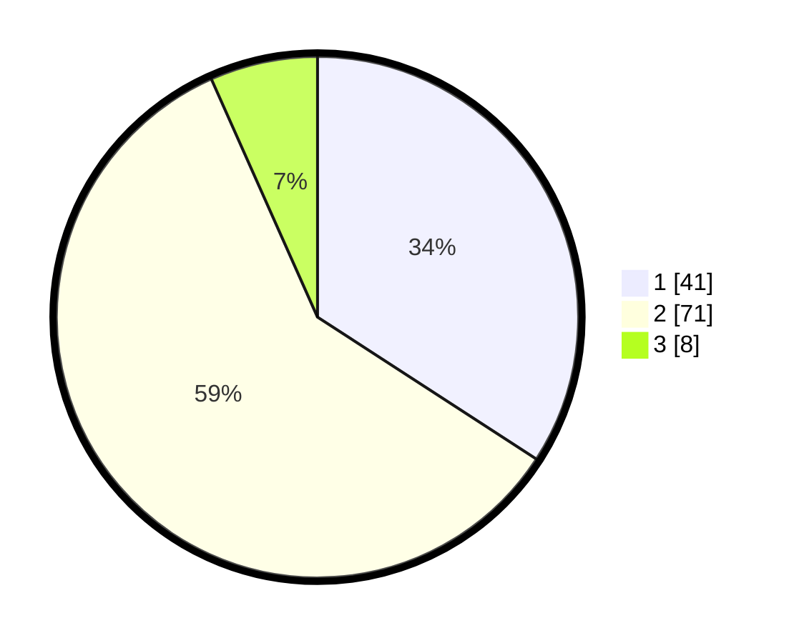

# Hasil

## Grafik

## Tabel

| No. | Nama Paslon    | Suara | Suara (raw) | Persentase |
|:--- |:-------------- | -----:| -----------:| ----------:|
| 1   | ANIES MUHAIMIN | 41    | [41][p-1]   | 34,17      |
| 2   | PRABOWO GIBRAN | 71    | [71][p-2]   | 59,17      |
| 3   | GANJAR MAHFUD  | 8     | [8][p-3]    | 6,67       |

[p-1]: https://github.com/gigit-pemilu/pemilu-2024/blob/main/pilpres/hitung-suara/sub/35-jawa-timur/sub/09-jember/sub/29-sukowono/sub/2004-sukowono/sub/027-tps/sub/paslon-1.txt
[p-2]: https://github.com/gigit-pemilu/pemilu-2024/blob/main/pilpres/hitung-suara/sub/35-jawa-timur/sub/09-jember/sub/29-sukowono/sub/2004-sukowono/sub/027-tps/sub/paslon-2.txt
[p-3]: https://github.com/gigit-pemilu/pemilu-2024/blob/main/pilpres/hitung-suara/sub/35-jawa-timur/sub/09-jember/sub/29-sukowono/sub/2004-sukowono/sub/027-tps/sub/paslon-3.txt

## Foto C Plano

https://sirekap-obj-formc.kpu.go.id/eeb7/pemilu/ppwp/35/09/29/20/04/3509292004027-20240215-043508--4214cd25-4870-46a9-af4c-c56d37b76285.jpg

https://sirekap-obj-formc.kpu.go.id/eeb7/pemilu/ppwp/35/09/29/20/04/3509292004027-20240214-230832--ad8deed7-f995-4c52-8b06-8ad486450ff7.jpg

https://sirekap-obj-formc.kpu.go.id/eeb7/pemilu/ppwp/35/09/29/20/04/3509292004027-20240214-230913--94cf26a7-b25d-4ceb-843b-78f220418d46.jpg

## Metadata

| Key        | Value               |
| ---------- | ------------------- |
| Time Stamp | 2024-02-15 18:30:25 |

