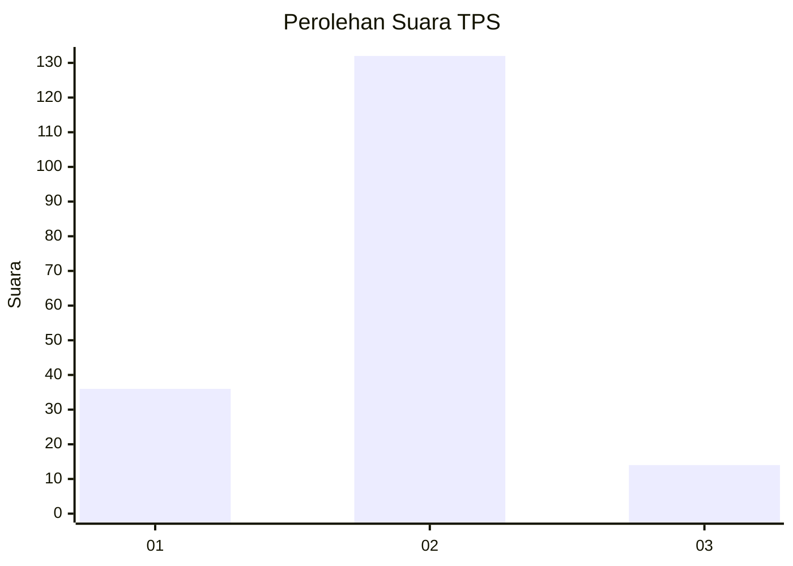
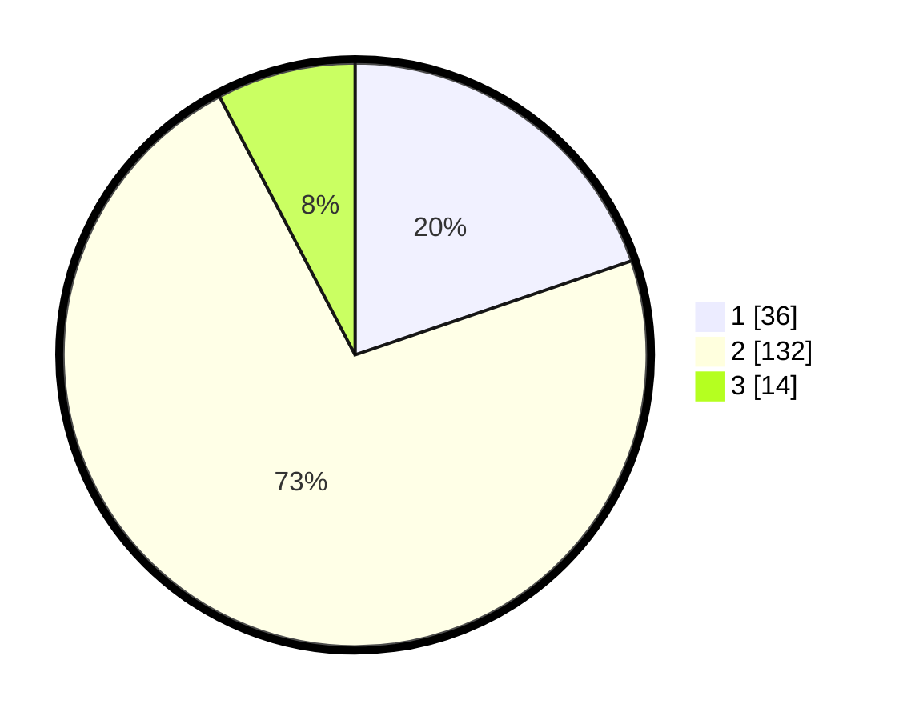

# Hasil

## Grafik

## Tabel

| No. | Nama Paslon    | Suara | Suara (raw) | Persentase |
|:--- |:-------------- | -----:| -----------:| ----------:|
| 1   | ANIES MUHAIMIN | 36    | [36][p-1]   | 19,78      |
| 2   | PRABOWO GIBRAN | 132   | [132][p-2]  | 72,53      |
| 3   | GANJAR MAHFUD  | 14    | [14][p-3]   | 7,69       |

[p-1]: https://github.com/gigit-pemilu/pemilu-2024/blob/main/pilpres/hitung-suara/sub/35-jawa-timur/sub/09-jember/sub/29-sukowono/sub/2005-baletbaru/sub/004-tps/sub/paslon-1.txt
[p-2]: https://github.com/gigit-pemilu/pemilu-2024/blob/main/pilpres/hitung-suara/sub/35-jawa-timur/sub/09-jember/sub/29-sukowono/sub/2005-baletbaru/sub/004-tps/sub/paslon-2.txt
[p-3]: https://github.com/gigit-pemilu/pemilu-2024/blob/main/pilpres/hitung-suara/sub/35-jawa-timur/sub/09-jember/sub/29-sukowono/sub/2005-baletbaru/sub/004-tps/sub/paslon-3.txt

## Foto C Plano

https://sirekap-obj-formc.kpu.go.id/e799/pemilu/ppwp/35/09/29/20/05/3509292005004-20240215-001759--07f3a2ca-5d62-4116-8b0c-2e08d962471b.jpg

https://sirekap-obj-formc.kpu.go.id/e799/pemilu/ppwp/35/09/29/20/05/3509292005004-20240215-001801--44a8a5be-c82b-46e4-b4de-e49f42a77a9a.jpg

https://sirekap-obj-formc.kpu.go.id/e799/pemilu/ppwp/35/09/29/20/05/3509292005004-20240215-001805--e3fe061d-3305-48db-b743-a981fc112d0c.jpg

## Metadata

| Key        | Value               |
| ---------- | ------------------- |
| Time Stamp | 2024-02-15 18:30:25 |

