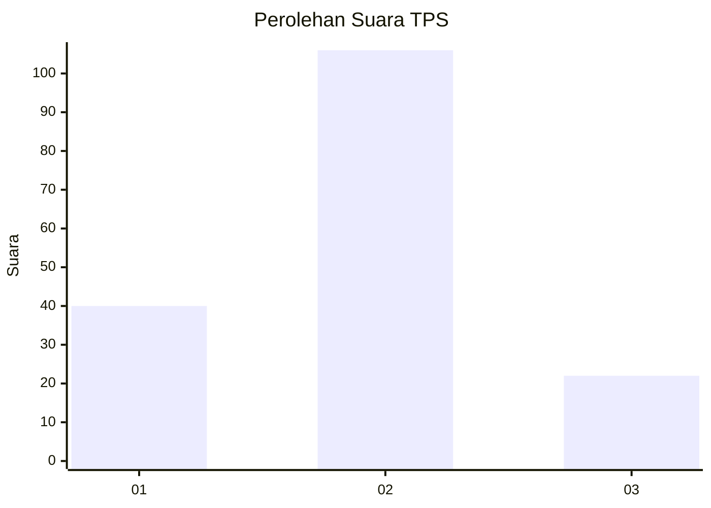
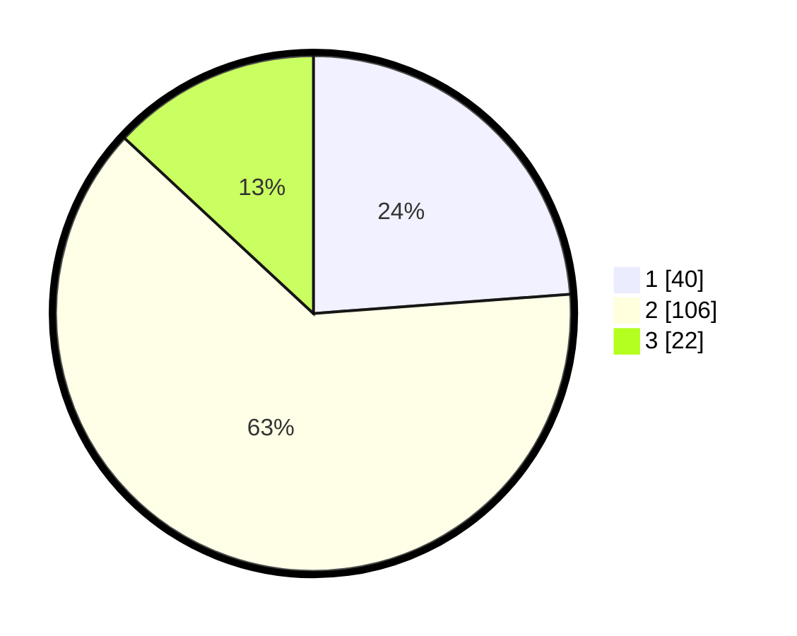

# Hasil

## Grafik

## Tabel

| No. | Nama Paslon    | Suara | Suara (raw) | Persentase |
|:--- |:-------------- | -----:| -----------:| ----------:|
| 1   | ANIES MUHAIMIN | 40    | [40][p-1]   | 23,81      |
| 2   | PRABOWO GIBRAN | 106   | [106][p-2]  | 63,10      |
| 3   | GANJAR MAHFUD  | 22    | [22][p-3]   | 13,10      |

[p-1]: https://github.com/gigit-pemilu/pemilu-2024-35-jawa-timur/blob/main/pilpres/hitung-suara/sub/35-jawa-timur/sub/09-jember/sub/29-sukowono/sub/2005-baletbaru/sub/005-tps/sub/paslon-1.txt
[p-2]: https://github.com/gigit-pemilu/pemilu-2024-35-jawa-timur/blob/main/pilpres/hitung-suara/sub/35-jawa-timur/sub/09-jember/sub/29-sukowono/sub/2005-baletbaru/sub/005-tps/sub/paslon-2.txt
[p-3]: https://github.com/gigit-pemilu/pemilu-2024-35-jawa-timur/blob/main/pilpres/hitung-suara/sub/35-jawa-timur/sub/09-jember/sub/29-sukowono/sub/2005-baletbaru/sub/005-tps/sub/paslon-3.txt

## Foto C Plano

https://sirekap-obj-formc.kpu.go.id/21b4/pemilu/ppwp/35/09/29/20/05/3509292005005-20240214-193940--8c6550ee-2c00-4e95-af99-46e0c151341b.jpg

https://sirekap-obj-formc.kpu.go.id/21b4/pemilu/ppwp/35/09/29/20/05/3509292005005-20240214-194327--ab0a0edc-93d3-44f6-b3c5-48389c8525ed.jpg

https://sirekap-obj-formc.kpu.go.id/21b4/pemilu/ppwp/35/09/29/20/05/3509292005005-20240214-190654--6d55f501-58c1-4738-b300-5e245964ff33.jpg

## Metadata

| Key        | Value               |
| ---------- | ------------------- |
| Time Stamp | 2024-02-15 18:30:25 |

