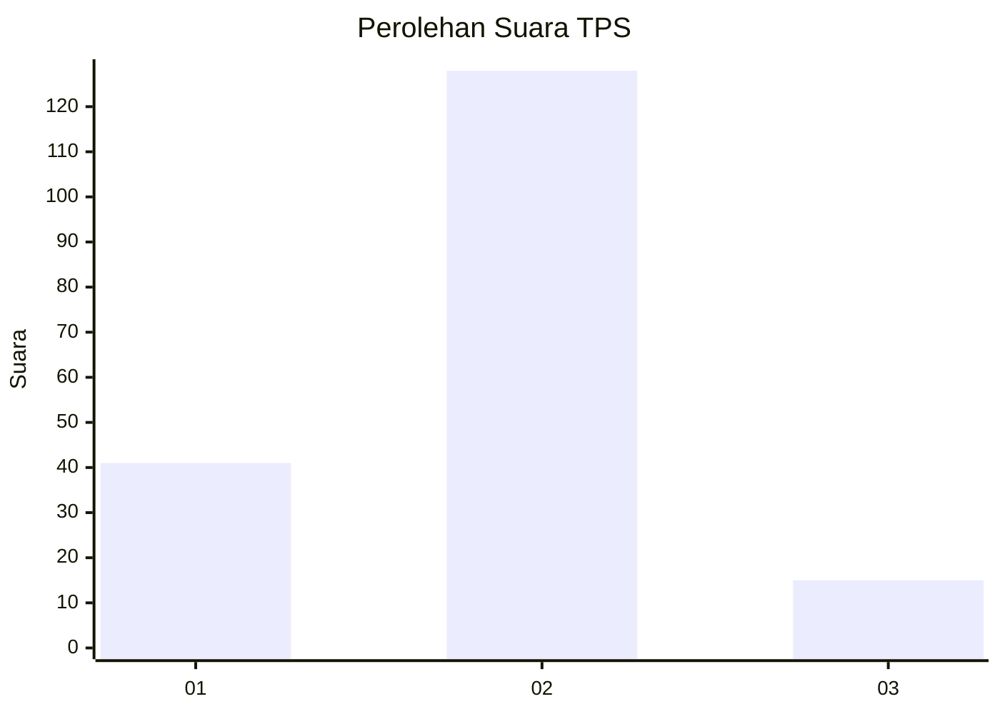
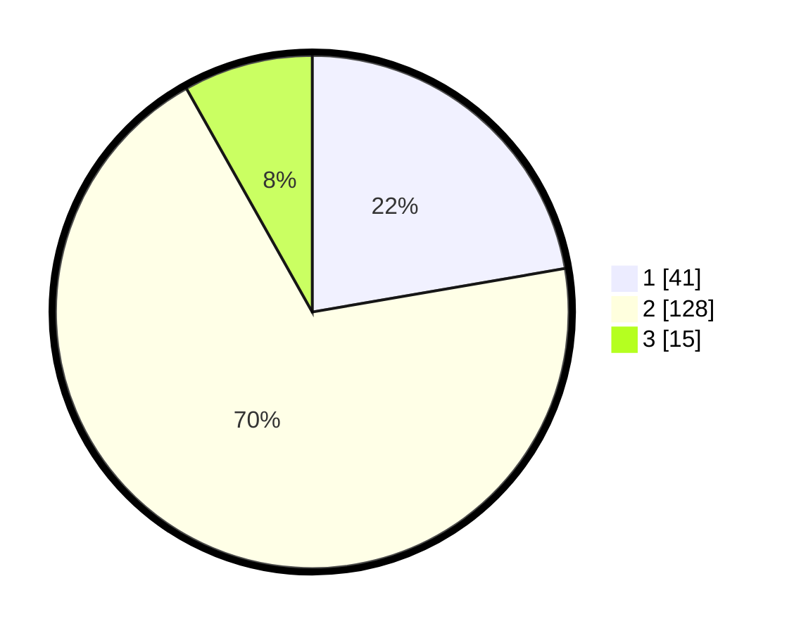

# Hasil

## Grafik

## Tabel

| No. | Nama Paslon    | Suara | Suara (raw) | Persentase |
|:--- |:-------------- | -----:| -----------:| ----------:|
| 1   | ANIES MUHAIMIN | 41    | [41][p-1]   | 22,28      |
| 2   | PRABOWO GIBRAN | 128   | [128][p-2]  | 69,57      |
| 3   | GANJAR MAHFUD  | 15    | [15][p-3]   | 8,15       |

[p-1]: https://github.com/gigit-pemilu/pemilu-2024/blob/main/pilpres/hitung-suara/sub/35-jawa-timur/sub/09-jember/sub/29-sukowono/sub/2005-baletbaru/sub/014-tps/sub/paslon-1.txt
[p-2]: https://github.com/gigit-pemilu/pemilu-2024/blob/main/pilpres/hitung-suara/sub/35-jawa-timur/sub/09-jember/sub/29-sukowono/sub/2005-baletbaru/sub/014-tps/sub/paslon-2.txt
[p-3]: https://github.com/gigit-pemilu/pemilu-2024/blob/main/pilpres/hitung-suara/sub/35-jawa-timur/sub/09-jember/sub/29-sukowono/sub/2005-baletbaru/sub/014-tps/sub/paslon-3.txt

## Foto C Plano

https://sirekap-obj-formc.kpu.go.id/2fa0/pemilu/ppwp/35/09/29/20/05/3509292005014-20240214-214642--51d5c1d5-6139-49c1-8cb1-efd012d3c8da.jpg

https://sirekap-obj-formc.kpu.go.id/2fa0/pemilu/ppwp/35/09/29/20/05/3509292005014-20240215-005044--f1d39ccc-a9ad-493f-a913-8f0fc6c0690d.jpg

https://sirekap-obj-formc.kpu.go.id/2fa0/pemilu/ppwp/35/09/29/20/05/3509292005014-20240215-005238--f0021a40-b6e6-4b31-b8cd-1d48583a1b49.jpg

## Metadata

| Key        | Value               |
| ---------- | ------------------- |
| Time Stamp | 2024-02-15 18:30:25 |

