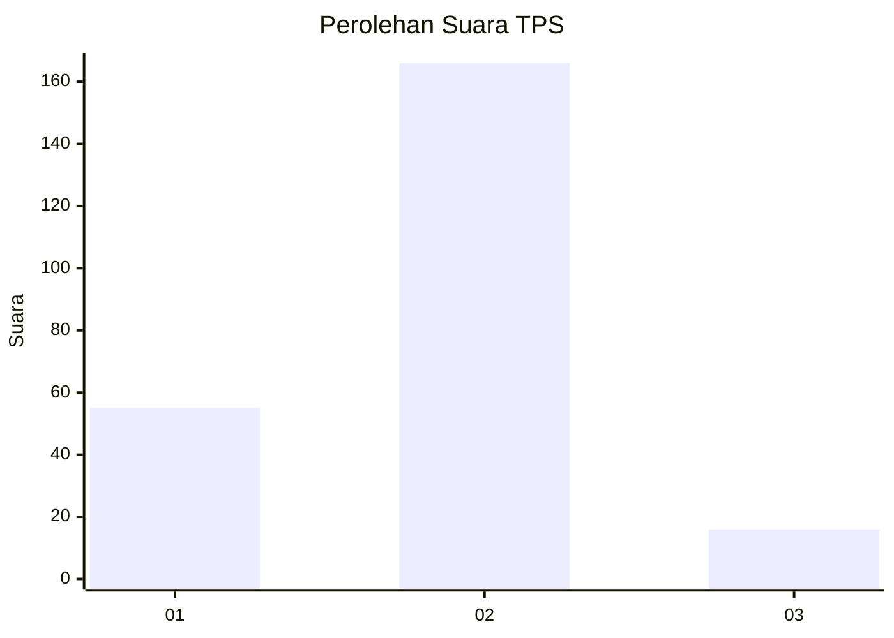

# Hasil

## Grafik

## Tabel

| No. | Nama Paslon    | Suara | Suara (raw) | Persentase |
|:--- |:-------------- | -----:| -----------:| ----------:|
| 1   | ANIES MUHAIMIN | 55    | [55][p-1]   | 23,21      |
| 2   | PRABOWO GIBRAN | 166   | [166][p-2]  | 70,04      |
| 3   | GANJAR MAHFUD  | 16    | [16][p-3]   | 6,75       |

[p-1]: https://github.com/gigit-pemilu/pemilu-2024-35-jawa-timur/blob/main/pilpres/hitung-suara/sub/35-jawa-timur/sub/09-jember/sub/29-sukowono/sub/2005-baletbaru/sub/017-tps/sub/paslon-1.txt
[p-2]: https://github.com/gigit-pemilu/pemilu-2024-35-jawa-timur/blob/main/pilpres/hitung-suara/sub/35-jawa-timur/sub/09-jember/sub/29-sukowono/sub/2005-baletbaru/sub/017-tps/sub/paslon-2.txt
[p-3]: https://github.com/gigit-pemilu/pemilu-2024-35-jawa-timur/blob/main/pilpres/hitung-suara/sub/35-jawa-timur/sub/09-jember/sub/29-sukowono/sub/2005-baletbaru/sub/017-tps/sub/paslon-3.txt

## Foto C Plano

https://sirekap-obj-formc.kpu.go.id/abe6/pemilu/ppwp/35/09/29/20/05/3509292005017-20240215-014610--67015b0d-d7ef-408c-931d-059b39d6db2e.jpg

https://sirekap-obj-formc.kpu.go.id/abe6/pemilu/ppwp/35/09/29/20/05/3509292005017-20240215-013016--28624c6c-da62-4f11-a59f-1510a0013b42.jpg

https://sirekap-obj-formc.kpu.go.id/abe6/pemilu/ppwp/35/09/29/20/05/3509292005017-20240215-014905--beb8298e-b478-4875-82cf-1888cceffc58.jpg

## Metadata

| Key        | Value               |
| ---------- | ------------------- |
| Time Stamp | 2024-02-15 20:00:44 |

