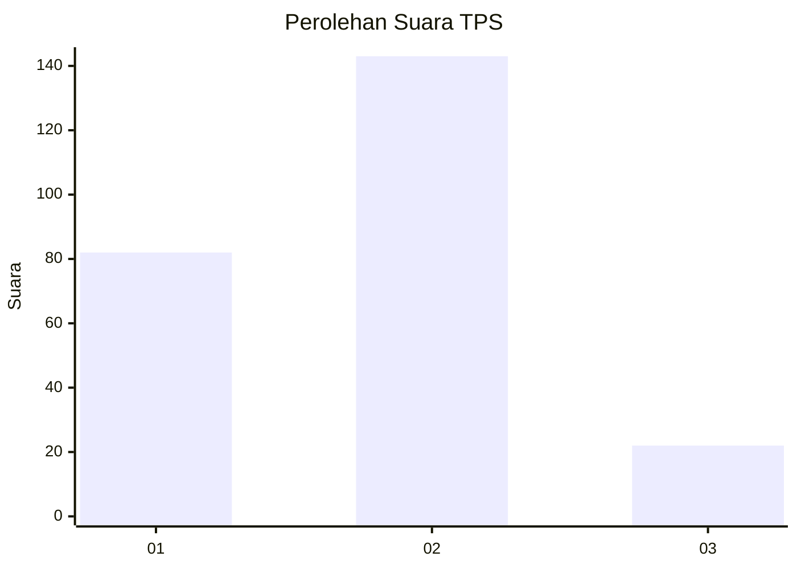
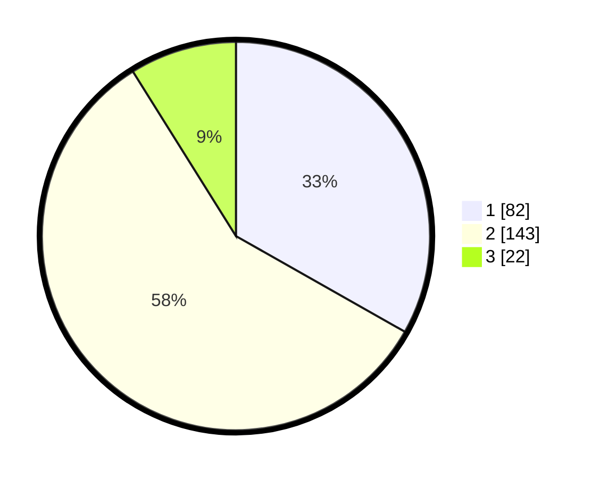

# Hasil

## Grafik

## Tabel

| No. | Nama Paslon    | Suara | Suara (raw) | Persentase |
|:--- |:-------------- | -----:| -----------:| ----------:|
| 1   | ANIES MUHAIMIN | 82    | [82][p-1]   | 33,20      |
| 2   | PRABOWO GIBRAN | 143   | [143][p-2]  | 57,89      |
| 3   | GANJAR MAHFUD  | 22    | [22][p-3]   | 8,91       |

[p-1]: https://github.com/gigit-pemilu/pemilu-2024-35-jawa-timur/blob/main/pilpres/hitung-suara/sub/35-jawa-timur/sub/09-jember/sub/29-sukowono/sub/2006-sukorejo/sub/001-tps/sub/paslon-1.txt
[p-2]: https://github.com/gigit-pemilu/pemilu-2024-35-jawa-timur/blob/main/pilpres/hitung-suara/sub/35-jawa-timur/sub/09-jember/sub/29-sukowono/sub/2006-sukorejo/sub/001-tps/sub/paslon-2.txt
[p-3]: https://github.com/gigit-pemilu/pemilu-2024-35-jawa-timur/blob/main/pilpres/hitung-suara/sub/35-jawa-timur/sub/09-jember/sub/29-sukowono/sub/2006-sukorejo/sub/001-tps/sub/paslon-3.txt

## Foto C Plano

https://sirekap-obj-formc.kpu.go.id/7ecf/pemilu/ppwp/35/09/29/20/06/3509292006001-20240214-192233--67872257-e54e-463b-8174-09189649d699.jpg

https://sirekap-obj-formc.kpu.go.id/7ecf/pemilu/ppwp/35/09/29/20/06/3509292006001-20240214-192407--0bc071ef-c85a-4dc3-a5b1-d7b6c340993c.jpg

https://sirekap-obj-formc.kpu.go.id/7ecf/pemilu/ppwp/35/09/29/20/06/3509292006001-20240214-192533--165264e3-809f-4365-ab66-458b2d90e463.jpg

## Metadata

| Key        | Value               |
| ---------- | ------------------- |
| Time Stamp | 2024-02-15 20:00:44 |

