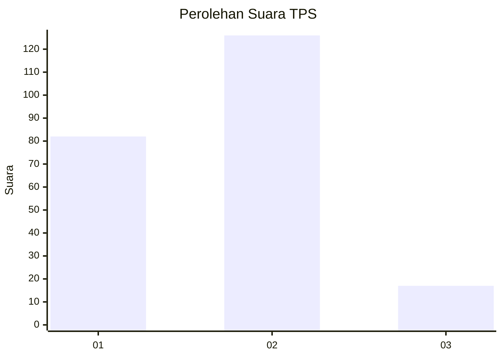

# Hasil

## Grafik

## Tabel

| No. | Nama Paslon    | Suara | Suara (raw) | Persentase |
|:--- |:-------------- | -----:| -----------:| ----------:|
| 1   | ANIES MUHAIMIN | 82    | [82][p-1]   | 36,44      |
| 2   | PRABOWO GIBRAN | 126   | [126][p-2]  | 56,00      |
| 3   | GANJAR MAHFUD  | 17    | [17][p-3]   | 7,56       |

[p-1]: https://github.com/gigit-pemilu/pemilu-2024-35-jawa-timur/blob/main/pilpres/hitung-suara/sub/35-jawa-timur/sub/09-jember/sub/29-sukowono/sub/2006-sukorejo/sub/002-tps/sub/paslon-1.txt
[p-2]: https://github.com/gigit-pemilu/pemilu-2024-35-jawa-timur/blob/main/pilpres/hitung-suara/sub/35-jawa-timur/sub/09-jember/sub/29-sukowono/sub/2006-sukorejo/sub/002-tps/sub/paslon-2.txt
[p-3]: https://github.com/gigit-pemilu/pemilu-2024-35-jawa-timur/blob/main/pilpres/hitung-suara/sub/35-jawa-timur/sub/09-jember/sub/29-sukowono/sub/2006-sukorejo/sub/002-tps/sub/paslon-3.txt

## Foto C Plano

https://sirekap-obj-formc.kpu.go.id/8ffd/pemilu/ppwp/35/09/29/20/06/3509292006002-20240215-013046--3d9c14fd-3c0c-4baa-9251-7ae58a9b0f6d.jpg

https://sirekap-obj-formc.kpu.go.id/8ffd/pemilu/ppwp/35/09/29/20/06/3509292006002-20240215-013226--842fd856-58db-4a26-b7bc-8d4ebc43e0c1.jpg

https://sirekap-obj-formc.kpu.go.id/8ffd/pemilu/ppwp/35/09/29/20/06/3509292006002-20240215-013401--e39bfde4-7abc-4de7-9442-7b8f3204f7d8.jpg

## Metadata

| Key        | Value               |
| ---------- | ------------------- |
| Time Stamp | 2024-02-15 18:30:25 |

