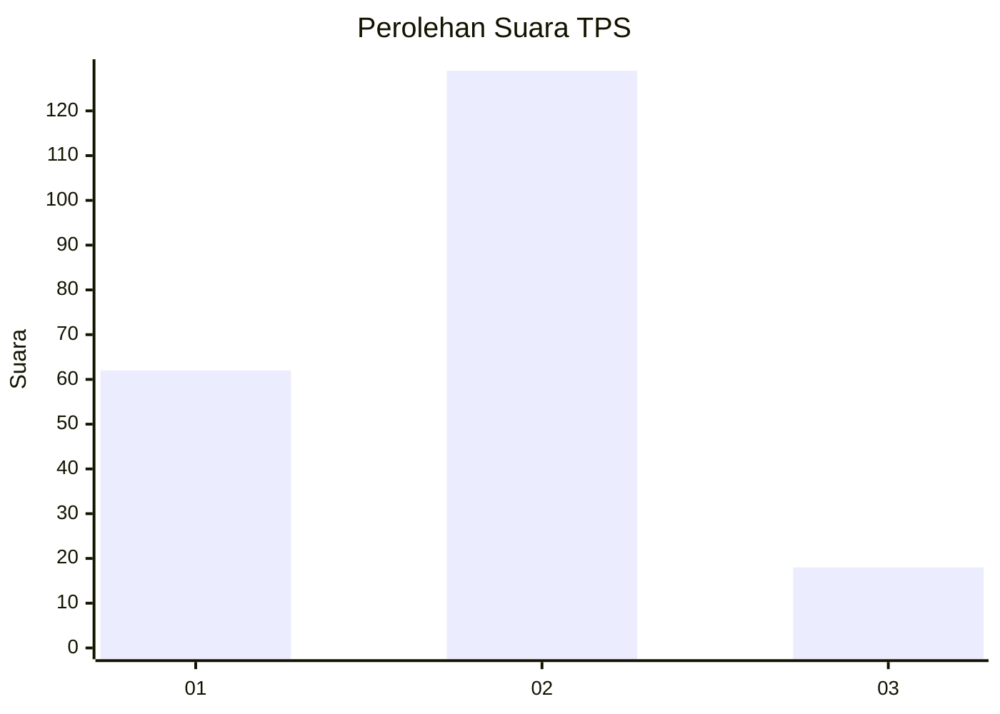
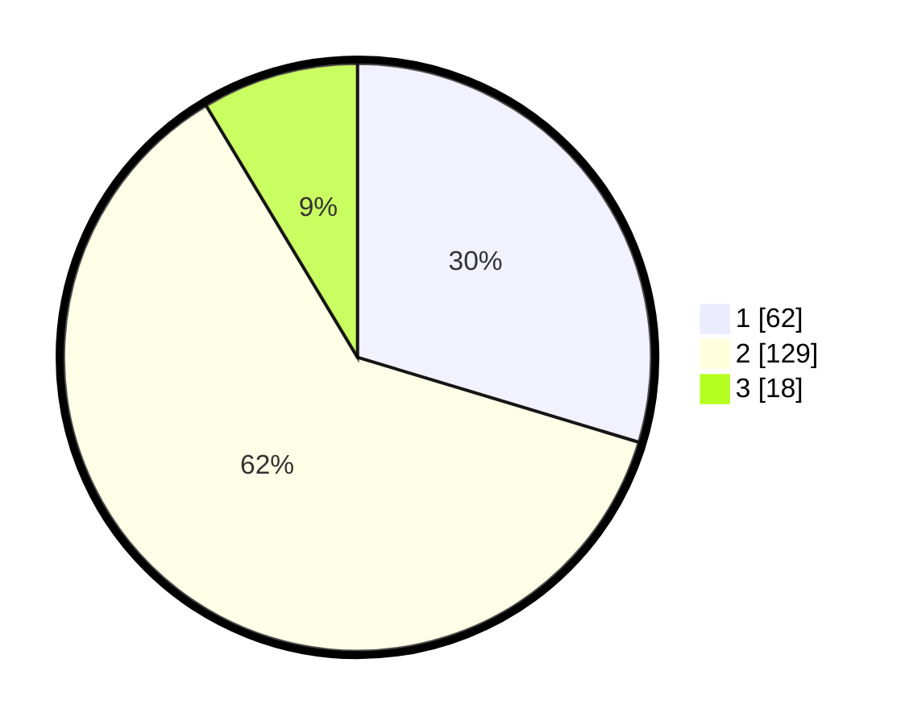

# Hasil

## Grafik

## Tabel

| No. | Nama Paslon    | Suara | Suara (raw) | Persentase |
|:--- |:-------------- | -----:| -----------:| ----------:|
| 1   | ANIES MUHAIMIN | 62    | [62][p-1]   | 29,67      |
| 2   | PRABOWO GIBRAN | 129   | [129][p-2]  | 61,72      |
| 3   | GANJAR MAHFUD  | 18    | [18][p-3]   | 8,61       |

[p-1]: https://github.com/gigit-pemilu/pemilu-2024/blob/main/pilpres/hitung-suara/sub/35-jawa-timur/sub/09-jember/sub/29-sukowono/sub/2006-sukorejo/sub/003-tps/sub/paslon-1.txt
[p-2]: https://github.com/gigit-pemilu/pemilu-2024/blob/main/pilpres/hitung-suara/sub/35-jawa-timur/sub/09-jember/sub/29-sukowono/sub/2006-sukorejo/sub/003-tps/sub/paslon-2.txt
[p-3]: https://github.com/gigit-pemilu/pemilu-2024/blob/main/pilpres/hitung-suara/sub/35-jawa-timur/sub/09-jember/sub/29-sukowono/sub/2006-sukorejo/sub/003-tps/sub/paslon-3.txt

## Foto C Plano

https://sirekap-obj-formc.kpu.go.id/15f4/pemilu/ppwp/35/09/29/20/06/3509292006003-20240215-054212--b9235085-93fb-48a9-b608-af46e502ecfa.jpg

https://sirekap-obj-formc.kpu.go.id/15f4/pemilu/ppwp/35/09/29/20/06/3509292006003-20240215-054401--32aec503-20a5-4284-bf73-1b3c8b8c6d6e.jpg

https://sirekap-obj-formc.kpu.go.id/15f4/pemilu/ppwp/35/09/29/20/06/3509292006003-20240215-054559--cf61864a-1f26-4223-9fd8-9053e94a2416.jpg

## Metadata

| Key        | Value               |
| ---------- | ------------------- |
| Time Stamp | 2024-02-15 20:00:44 |

