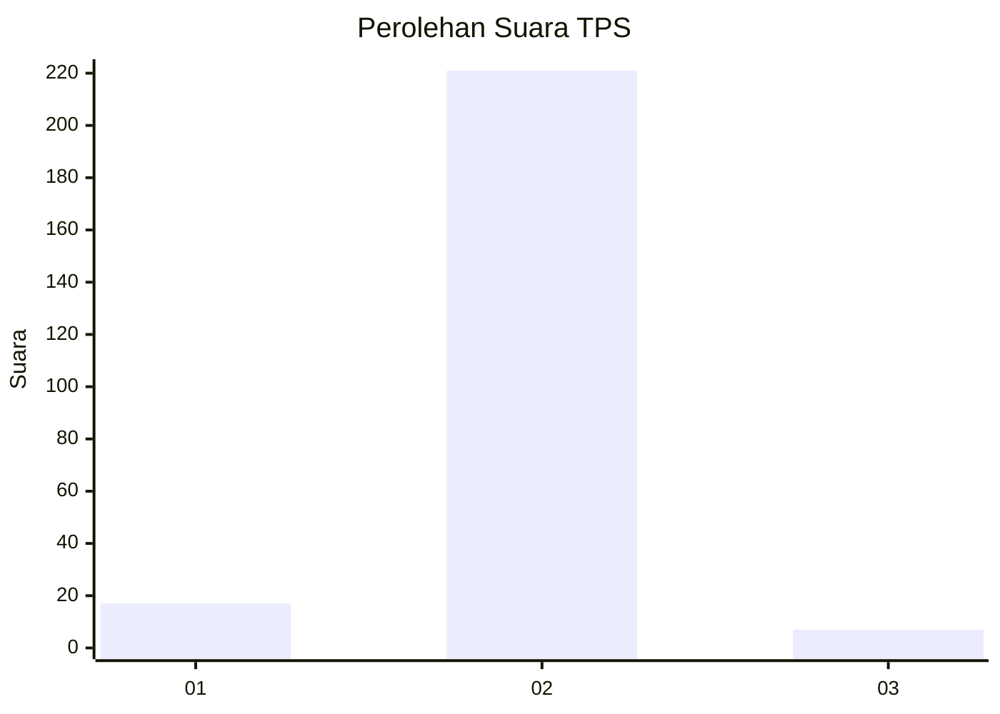
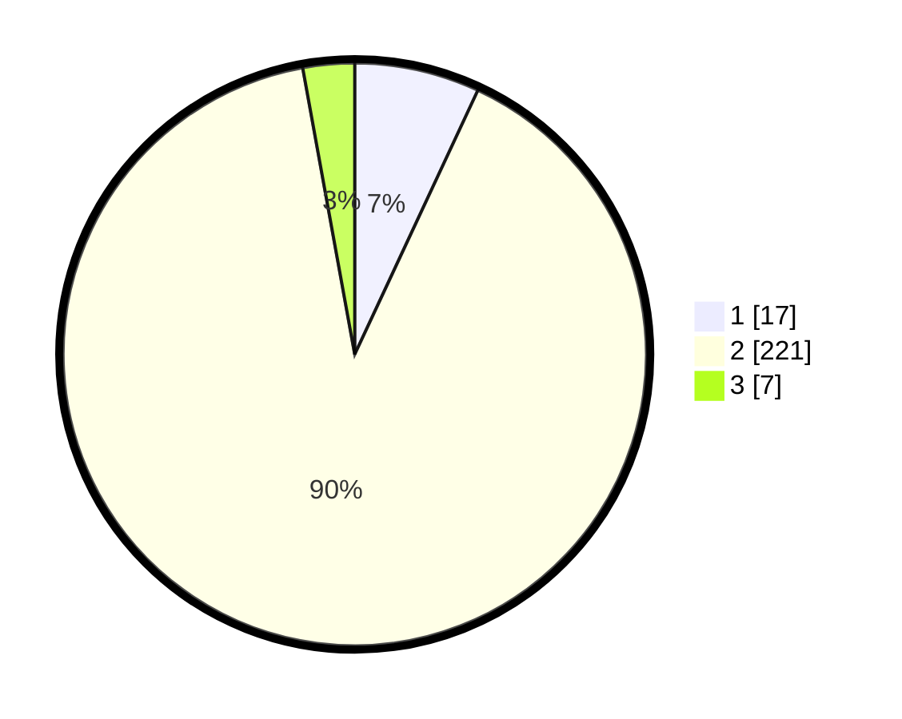

# Hasil

## Grafik

## Tabel

| No. | Nama Paslon    | Suara | Suara (raw) | Persentase |
|:--- |:-------------- | -----:| -----------:| ----------:|
| 1   | ANIES MUHAIMIN | 17    | [17][p-1]   | 6,94       |
| 2   | PRABOWO GIBRAN | 221   | [221][p-2]  | 90,20      |
| 3   | GANJAR MAHFUD  | 7     | [7][p-3]    | 2,86       |

[p-1]: https://github.com/gigit-pemilu/pemilu-2024/blob/main/pilpres/hitung-suara/sub/35-jawa-timur/sub/09-jember/sub/29-sukowono/sub/2006-sukorejo/sub/010-tps/sub/paslon-1.txt
[p-2]: https://github.com/gigit-pemilu/pemilu-2024/blob/main/pilpres/hitung-suara/sub/35-jawa-timur/sub/09-jember/sub/29-sukowono/sub/2006-sukorejo/sub/010-tps/sub/paslon-2.txt
[p-3]: https://github.com/gigit-pemilu/pemilu-2024/blob/main/pilpres/hitung-suara/sub/35-jawa-timur/sub/09-jember/sub/29-sukowono/sub/2006-sukorejo/sub/010-tps/sub/paslon-3.txt

## Foto C Plano

https://sirekap-obj-formc.kpu.go.id/8ea3/pemilu/ppwp/35/09/29/20/06/3509292006010-20240214-201657--3f62b70b-30ef-4a8f-aa84-4869bb8a04c9.jpg

https://sirekap-obj-formc.kpu.go.id/8ea3/pemilu/ppwp/35/09/29/20/06/3509292006010-20240214-214750--95d06abc-57b1-45e5-bd81-c84efffbc911.jpg

https://sirekap-obj-formc.kpu.go.id/8ea3/pemilu/ppwp/35/09/29/20/06/3509292006010-20240214-214357--aad3020d-9222-44b1-8382-a50b3379731b.jpg

## Metadata

| Key        | Value               |
| ---------- | ------------------- |
| Time Stamp | 2024-02-15 18:30:25 |

